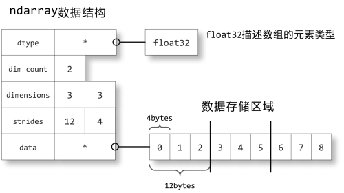

# numpy 学习笔记 

* ndarray: N-dimensional array object, 存储单一数据类型的多维数组.
* ufunc: universal function object, 能够对 ndarray 进行处理的函数.

```
import numpy as np
```

## ndarray 对象

* np.array, 通过 list 对象来创建
* a.shape: 元组, 表示数组的大小 
    + (n,) 表示一维数组, 有 n 个元素
    + (n, m) 表示二维数组, 有 nxm 个元素
    + (m, m, k) 表示三维数组, 有 n x m x k 个元素
    + axis: 0 号轴, 1 号轴, 2 号轴
    + 修改 shape 只是改变每个轴的大小, 而不改变内存中元素的位置
    + 某个轴设为 -1, 则 Numpy 自动根据元素个数计算此轴的长度
* b = a.reshape 方法可以创建一个改变了形状的新数组, 但与原来的 a 共享内存
* np.arange:
* np.linspace:
* np.logspace:
* np.frombuffer:
* np.fromfromstring:
* np.fromfile: np.fromstring(s, dtype=np.int8)
    - low endian, 低位字节在前
* np.fromfunction:
* 存取方法与 Python 标准相同
* 用下标范围获取的新数组是原始数组的一个视图, 与原始数组共享内存空间
* 整数列表或数组存取数组, 不和原始数组共享内存空间
* 布尔数组(不能使用布尔列表), 不共享内存空间
    + ufunc 布尔运算产生布尔数组
* a.dtype: 表示数组存储元素的类型
* 多维数组
    + 组元 (tuble) 做为数组下标,  a[ 0, 1], 中括号中的 `0,1` 就是一个组元
    + 切片语法访问多维数组中的元素
    + 整数序列(整数列表或数组)
    + 布尔数组存取
* 结构数组
```
import numpy as np
persontype = np.dtype({
'names':['name', 'age', 'weight'],
'formats':['S32','i', 'f']})
a = np.array([("Zhang",32,75.5),("Wang",24,65.2)],
dtype=persontype)
```
* 内存结构
    
    + dtype: 如何将存储的二进制转换为可用的值
    + dim count: 表示几维数组 
    + dimensions: 每一维的维数
    + strides: 保存每个轴下标增加 1 时, 数据存储区中的指针增加的字节数
        - 连续存储
        - 非连续存储: 比如一个数组的视图就不是连续存储
        - C 语言存储格式: 第 0 轴是最上位的, 0 轴下标增加1,
            元素地址增加的字节最多
        - Fortran 语言存储格式: 第 0 轴是最下位的, 0 轴下标增加 1,
            只增加一个字节元素的地址
* ufunc 函数 
    + np.sin, 一般会创建一个新的数组保存计算结果, 但也可以覆盖原来存储空间, 如
      ```
      t = np.sin(x, x)
      id(t) == id(x)
      ```
    + math.sin  对单个数值的计算效率更高
    + ufunc 函数一般可以在输入中加一个参数做为计算结果的存储空间, 这样
        ufunc函数就存在创建新的数组
    + a+b <==> np.add(a,b), a += b <--> np.add(a, b, a)
    + 复杂的算式会产生大量中间的数组, 要尽量避免, 办法是分解算式,
        如下面两种算法
        - x = a*b+c
        - x = a*b; x +=c
    + frompyfunc(fun, nin, nout)
        ```
        def triangle_func(c, c0, hc):
            def trifunc(x):
                x = x - int(x) # 三角波的周期为1，因此只取x坐标的小数部分进行计算
                if x >= c: r = 0.0
                elif x < c0: r = x / c0 * hc
                else: r = (c-x) / (c-c0) * hc
                return r

            # 用trifunc函数创建一个ufunc函数，可以直接对数组进行计算, 不过通过此函数
            # 计算得到的是一个Object数组，需要进行类型转换
            return np.frompyfunc(trifunc, 1, 1)

        y2 = triangle_func(0.6, 0.4, 1.0)(x)
        ```
* 广播
    1. shape 最长的看齐, 不足前面补1
    1. 每个数组的轴向该轴的最大值看齐
    1. 输入数组某个轴与输出数组的对应轴的长度相同或者长度为 1 时,
       这个数组能够来计算, 否则出错(也就是说输出数组这时已经给定)
    1. 当输入数组的某个轴的长度为 1 时, 沿此轴运算时都用此轴紫气东来第一组值
* np.ogrid 对象
    + np.ogrid[0:6:2, 0:9:3] 与 np.arange(0, 6, 2), np.arange(0, 9, 3)
    + np.ogrid[0:1:4j, 0:1:3j] 与 np.linspace(0, 1, 4), np.linspace(0, 1, 3),
        默认包含end
* ufunc 函数对象的方法 
    + reduce 方法: 沿着 axis 轴对 array  操作
    + accumulate 方法: 保存所有中间计算结果
    + reduceat 方法: 
