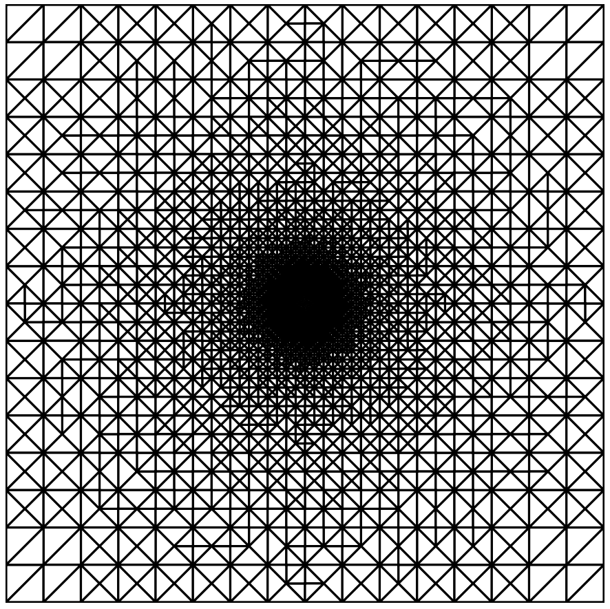
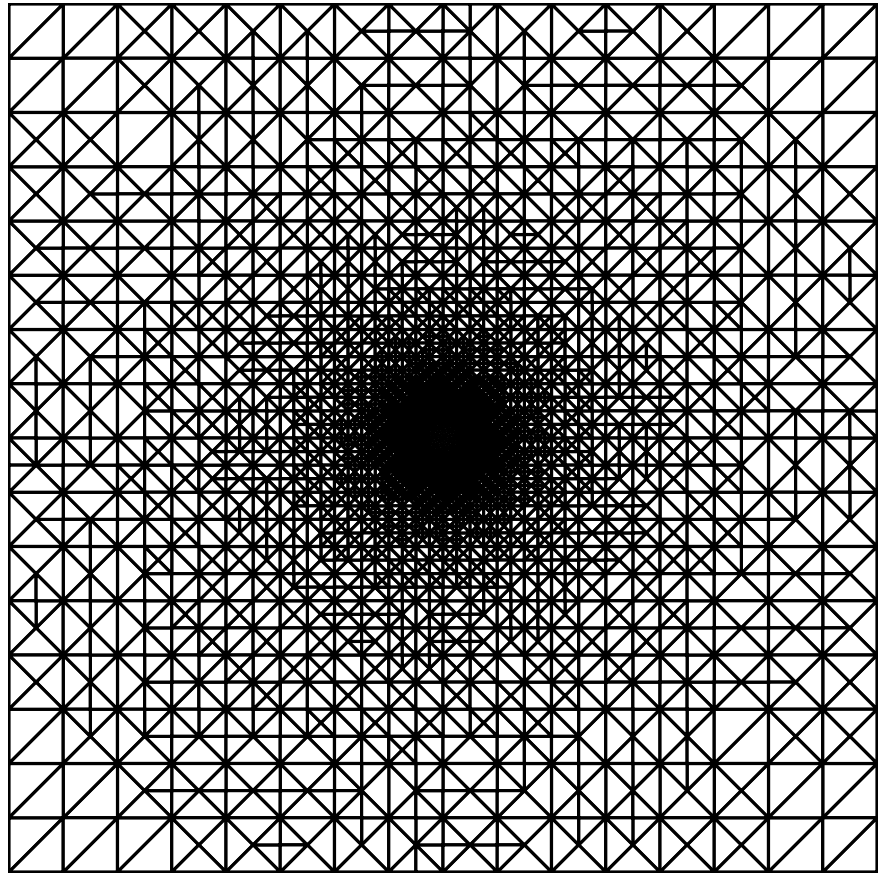
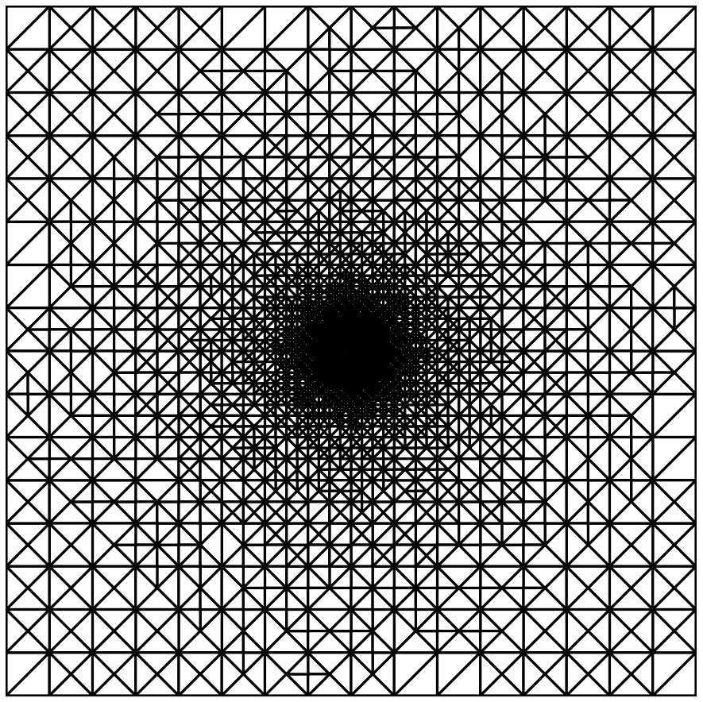
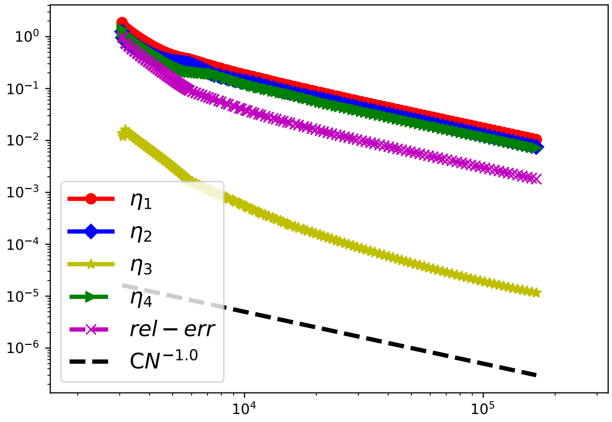
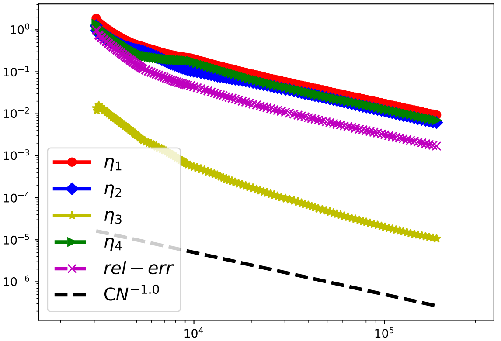

间断有限元方法 (DG)  是连续有限元方法的创新、改进和发展, 它的检验函数和试探函数采用完全不连续的多项式. 相比于连续元, DG 方法具有很多优势, 如: 允许带有悬挂点的不相容网格剖分; hp 自适应更加灵活和高效; 离散方程组具有良好的并行计算结构等. 

本文档 基于 FEALPY, 用自适应直接间断有限元方法 (DDG) 求解二阶带有间断系数的椭圆方程,  主要介绍DDG 离散格式和残量型后验误差估计子的程序实现, 并展示一个具体的数值案例, 完整的程序请参考 FEALPY/example/ADDG, 更多的理论细节请参考 [1].

# 1. 模型问题与 DDG 离散

## 1.1. PDE 模型

令 $\Omega \in \mathbb{R}^2$ 是有界多边形开区域, $\partial \Omega = \Gamma_D\cup \Gamma_N$ 且 $\Gamma_D\cap \Gamma_N = \emptyset$, $mes(\Gamma_{D})\ge 0$. 考虑如下二阶椭圆型偏微分方程:

$$
\begin{aligned}
-\nabla \cdot (a(x)\nabla u) = f, \qquad & \mathbf{x} \in \Omega, \\
u = g_D, \qquad & \mathbf{x} \in \Gamma_D,\\
\mathbf{n}\cdot(a(x)\nabla u)= g_N, \qquad & \mathbf{x} \in \Gamma_N.
\end{aligned}
$$


其中, $f \in L^2(\Omega),\,g_D\in H^{\frac{1}{2}}(\Gamma_D),\,g_N\in L^2(\Gamma_N)$ 是已知函数, $\mathbf{n}=(n_1,n_2)$ 是边上的单位外法向量, 扩散系数 $a(x)$ 在 $\Omega$ 中是正的分片常数, 即

$$
a(x) = a_i>0,\,\, x \in \Omega_i,\quad i =1,\cdots,n.
$$

其中开多边形区域 $\{\Omega_i\}_{i = 1}^n$ 是 $\Omega$ 的子域.                                                                                                                                                                                                                                                                                                                                                                                               

## 1.2. 有限元空间

令 $\mathcal{T}_h$ 是 $\Omega$ 上的三角网格剖分, 假设

(1) $\mathcal{T}_h$ 中的单元是形状正则的, 即:

$$
\forall K\in \mathcal{T}_h,\,\exists c_0>0, \quad s.t \quad h_K \rho_K \le c_0.
$$

其中 $h_K,\,\rho_K$ 分别是单元 $K$ 的网格尺寸和内接圆直径.

(2) $\mathcal{T}_h$ 是局部拟一致的, 即:

$$
\text{如果} \quad \partial \overline{K_i} \cap \partial \overline{K_j} \ne \varnothing, \,\,\text{则} \quad h_{K_i}\approx h_{K_j}.
$$

(3) 网格 $\mathcal{T}_h$ 是匹配的, 即:
界面 $I = \{\partial \Omega_i \cap \partial \Omega_j:\,i,j = 1,2,\cdots n\}$ 不出穿过 $\mathcal{T}_h$ 中任意单元 $K$.

在剖分 $$\mathcal{T}_h$$ 上定义间断有限元空间 $V_{DG}^{p}$ :

$$
\begin{aligned}
V_{DG}^{\ell} = \{v\in L^2(\Omega):v|_K\in \mathbb{P}_{\ell}(K),\, \forall \,K\in \mathcal{T}_h\}.
\end{aligned}
$$

## 1.3. 跳量和均值

令 $\mathcal{T}_h$ 上边的集合为 $\mathcal{E}$, $K \in \mathcal{T}_h$ 上边的集合为 $\mathcal{E}_K$, 对 $e \in \mathcal{E}$, $h_e$ 为其边长. 定义 $\Omega,\,\Gamma_D,\,\Gamma_N$ 上边的集合分别为:

$$
\begin{aligned}
\mathcal{E}_{I}&=\{e \in \mathcal{E} : e \subset \Omega\}, \\
\mathcal{E}_{D}&=\left\{e \in \mathcal{E} : e \subset \Gamma_{D}\right\}, \\
\mathcal{E}_{N}&=\left\{e \in \mathcal{E} : e \subset \Gamma_{N}\right\}.
\end{aligned}
$$

为了方便, 记

$$
\mathcal{E}_{ID}=\mathcal{E}_{I} \cup \mathcal{E}_{D},\,\mathcal{E}_{B}=\mathcal{E}_{D} \cup \mathcal{E}_{N}.
$$

当 $$e \in \mathcal{E}_{I}$$, 记 $K_+,\,K_-$ 为 $e$ 的左右单元, 其中 $K_+$ 是整体单元编号较大的单元, $\mathbf{n}$ 为 $e$ 由 $K_+$ 指向 $K_-$ 的单位外法向量. 当 $$e \in \mathcal{E}_{B}$$, $K_+$ 是 $e$ 上的单元, $\mathbf{n}$ 是 $e$ 的单位外法向量.

对 $v \in V_{DG}^{\ell}$, 跳量的定义为:

$$
[v] := \begin{cases}
            v_+ - v_-,\quad &e \in \mathcal{E}_{I},  \\
            v_+,\quad &e \in \mathcal{E}_{B}.
            \end{cases}
$$

均值的定义为:

$$
\begin{aligned}
\{v\}_w := \begin{cases}
 w_+v_+ + w_-v_-,\quad &e \in \mathcal{E}_{I},  \\
v_+,\quad &e \in \mathcal{E}_{B},
\end{cases}\qquad\qquad\qquad\qquad
\{v\}^w := \begin{cases}
            w_-v_+ + w_+v_-,\quad &e \in \mathcal{E}_I,  \\
            0,\quad &e \in \mathcal{E}_B,
            \end{cases}
\end{aligned}
$$

其中权重 $w_+,\,w_- \in [0,1]$, 满足: $w_+ + w_- = 1$.

对任意 $$e \in \mathcal{E}_{I},\,e = \partial K_+ \cap \partial K_-$$ , 令 $a_+,\,a_-$ 分别是 $K_+,\,K_+$ 上的扩散系数, 定义 $a$ 在 $e$ 上的加权平均为

$$
W_{e,i} = w_{+,i}\,a_+ + w_{-,i}\,a_-,\quad i = 1,2,3.
$$

$$W_{e,i}$$ 分别为算数、调和、几何平均

$$
W_{e,1} = \frac{a_+ + a_-}{2},\quad W_{e,2} = \frac{2a_+  a_-}{a_+ + a_-},\quad W_{e,3} = \sqrt{a_+  a_-},
$$

对任意 $$e \in \mathcal{E}_{B},\,e = \partial K_+\cap\partial \Omega$$, $a$ 在 $e$ 上的加权平均为

$$
W_{e,i} = a_+ .
$$

为了叙述方便, 以下我们选 $$W_e = \{a\}_w = W_{e,2}$$.

## 1.4. DDG 离散格式

定义数值通量:

$$
\widehat{a u_\mathbf{n}}|_e =
\begin{cases}
-\beta_1 h_e^{-1}W_e\,[u] + \{a\,u_\mathbf{n}\}_w - \beta_2h_eW_e\,[u_{\mathbf{n}\mathbf{n}}],\quad e \in \mathcal{E}_{I},\\
-\beta_1 h_e^{-1}W_e\,(u-g_D) + a\,u_\mathbf{n}, \qquad \qquad\qquad e \in \mathcal{E}_{D},\\
g_N, \qquad \qquad\qquad\qquad \qquad\qquad\qquad e \in \mathcal{E}_{N},
\end{cases}
$$

$$
\widehat {u}|_e =
\begin{cases}
\{u\}^w,\qquad& e \in \mathcal{E}_{I},\\
g_D,\qquad& e \in \mathcal{E}_{D},\\
u,\qquad& e \in \mathcal{E}_{N}.
\end{cases}
$$

记单元 $K$ 和 边 $e$ 上的 $L^2$ 内积分别为 $(\cdot,\cdot)_K,\,\langle \cdot,\cdot \rangle_e$. 定义 双线性型  $a_h(\cdot,\cdot)$ 和 线性型 $f_h(\cdot)$ 如下:

$$
\begin{aligned}
a_h(u,v)  &= \sum_{K \in \mathcal{T}_h}(a\nabla u,\nabla v)_K + \sum_{e \in \mathcal{E}_{ID}}\Big[\beta_1 h_e^{-1}W_e \langle [u],[v]\rangle_e-\langle \{a\,u_\mathbf{n}\}_w,[v]\rangle_e - \langle \{a\,v_\mathbf{n}\}_w,[u]\rangle_e\Big] \\
			&+ \sum_{e \in \mathcal{E}_{I} }\beta_2h_eW_e\langle[u_{\mathbf{n}\mathbf{n}}],[v]\rangle_e,\\
f_h(v) &= \sum_{K \in \mathcal{T}_h}(f,v)_K + \sum_{e \in \mathcal{E}_{N}}\langle g_N,v\rangle_e- \sum_{e \in \mathcal{E}_{D}} \langle g_D,a\,v_\mathbf{n}\rangle_e + \beta_1  h_e^{-1}W_e\sum_{e \in \mathcal{E}_{D}} \langle g_D,v\rangle_e .
\end{aligned}
$$

则模型问题相应的 DDG 离散格式为: 求 $u_h\in V_{DG}^{\ell}$, 使得

$$
a_h(u_h,v_h) = f_h(v_h) ,\quad \forall v_h \in V_{DG}^{\ell}.
$$

## 1.5. DDG 离散格式程序实现

### 1.5.1. 计算单元刚度矩阵  $$(a \nabla u_h,\nabla v_h)_K  = \int_{K}a  \nabla u_h \cdot \nabla v_h\, \mathrm{dxdy}$$

记 $n$ 为单元上自由度个数,  $N$ 为全局自由度, $NC$ 为剖分 $$\mathcal{T}_h$$ 上的单元个数,  $$\{p_j\}_{j=0}^{t_c-1}$$  为每个单元上取的高斯点,  $$\{q_j\}_{j=0}^{t_e-1}$$ 为每条边上取的高斯点.  对任意的单元 $$K \in \mathcal{T}_h$$, 令

$$
\begin{aligned}
\Phi_{K} =
\begin{bmatrix}
\phi_0 & \phi_1 & \cdots &  \phi_{n-1}
\end{bmatrix}_{1\times n},\qquad
U_{K} = \begin{bmatrix}
u_0\\
\vdots\\
u_{n-1}
\end{bmatrix}_{n\times 1}
\end{aligned}
$$

则有

$$
\begin{aligned}
u_h|_K = \sum_{j =0}^{n-1}u_j\phi_j = \Phi_{K}U_{K}
\end{aligned}
$$

故

$$
\begin{aligned}
\nabla u_h|_{K} =
\begin{bmatrix}
\nabla\phi_0 & \nabla\phi_1 & \cdots &  \nabla\phi_{n-1}
\end{bmatrix}
\begin{bmatrix}
u_0\\
\vdots\\
u_{n-1}
\end{bmatrix} = \nabla\Phi_{K}U_{K}
\end{aligned}
$$

其中

$$
\begin{aligned}
\nabla\Phi_{K}=
\begin{bmatrix}
\nabla \phi_0 & \nabla\phi_1 & \cdots &  \nabla\phi_{n-1}
\end{bmatrix}
\end{aligned}
$$

同理有：
$$
\begin{aligned}
v_h|_{K} = \Phi_{K}V_{K}, \qquad \nabla v_h|_{K} = \nabla\Phi_{K}V_{K}
\end{aligned}
$$

故

$$
\begin{align*}
(a\nabla u_h,\nabla v_h)_{K}  &= \int_{K} a\nabla u_h \cdot \nabla v_h\, \mathrm{dxdy}\\
&= V_{K}^T\int_{K}a\nabla \Phi_{K}^T\nabla\Phi_{K}\, \mathrm{dxdy}U_{K} \\
& = V_{K}^TA_{K}U_{K},
\end{align*}
$$

其中

$$
\begin{align*}
A_{K} = \int_{K}a\nabla\Phi_{K}^T\nabla\Phi_{K}\, \mathrm{dxdy} &=
\begin{bmatrix}
a\nabla \phi_0^T \\
a\nabla \phi_1^T\\
\vdots \\
a\nabla \phi_{n-1}^T
\end{bmatrix}
\begin{bmatrix}
\nabla \phi_0^T   &    \nabla \phi_1^T   &    \cdots &   \nabla \phi_{n-1}^T
\end{bmatrix}\\
&=\begin{bmatrix}
(a\nabla\phi_0,\nabla\phi_0)_{K} &(a\nabla\phi_0,\nabla\phi_1)_{K} & \cdots &(a\nabla\phi_0,\nabla\phi_{n-1})_{K}\\
(a\nabla\phi_1,\nabla\phi_0)_{K} &(a\nabla\phi_1,\nabla\phi_1)_{K} & \cdots &(a\nabla\phi_1,\nabla\phi_{n-1})_{K}\\
\vdots  & \vdots  & \vdots  & \vdots \\
(a\nabla\phi_{n-1},\nabla\phi_0)_{K} &(a\nabla\phi_{n-1},\nabla\phi_1)_{K} & \cdots &(a\nabla\phi_{n-1},\nabla\phi_{n-1})_{K}
\end{bmatrix}_{n\times n}
\end{align*}
$$

**程序实现:**

```python
def DDG_stiff_matrix(self,qf, cfun=None):
    bcs =qf.quadpts
    ws = qf.weights
    mesh = self.mesh
    GD = mesh.node.shape[1]
    NC = mesh.number_of_cells()
    pp = self.bc_to_point_cell(bcs)
    cellidx = np.arange(NC)
    ldof = self.number_of_local_dofs()
    gdof = self.number_of_global_dofs()
    G_Basis = self.Hat_Gradients(pp,cellidx)
    if cfun is not None:
        d = cfun(pp)
        dG_Basis = np.einsum('i, ...imn->...imn', d, G_Basis)
    else:
    	dG_Basis = G_Basis
    A = np.einsum('t, tmkj, tmpj,m->mkp', ws, dG_Basis, G_Basis, self.cellmeasure)

    cell2dof = self.cell_to_dof()
    I = np.einsum('k, ij->ijk', np.ones(ldof), cell2dof)
    J = I.swapaxes(-1, -2) 
    A = csr_matrix((A.flat, (I.flat, J.flat)), shape=(gdof, gdof))
    return A
```

### 1.5.2. 计算边矩阵  $P_e= \beta_1 h_e^{-1}W_e \langle [u],[v]\rangle_e$,

当 $e_i \in \mathcal{E}_{I},\,e = \partial K^+ \cap \partial K^-$ 时,  由跳量的定义 $[u] = u^+ - u^-$ 知, 令

$$
\begin{align}
Jump = [\Phi_{e_i}] = 
\begin{bmatrix}
\Phi_{K^+} & -\Phi_{K^-}
\end{bmatrix} =
\begin{bmatrix}
\phi_0^+ & \phi_1^+ & \cdots& \phi_{n-1}^+ & -\phi_0^- & -\phi_1^- & \cdots& \phi_{n-1}^- 
\end{bmatrix}_{1\times 2n}.
\end{align}
$$

当 $$e_i \in \mathcal{E}_{D},\,e = \partial K_+ \cap \partial \Omega$$ 时, 取 $$\phi_0^- = \cdots = \phi_{n-1}^- =0$$, 即:

$$
\begin{align}
Jump =
\begin{bmatrix}
\phi_0^+ &\phi_1^+ &\cdots&\phi_n^+ & 0 & 0 &\cdots & 0
\end{bmatrix}_{1\times 2n}.\label{jump2}
\end{align}
$$

令

$$
\begin{align}
U_{e_i} = \begin{bmatrix}
u_0^+\\
\vdots\\
u_n^+\\
u_0^-\\
\vdots\\
u_{n-1}^-
\end{bmatrix}_{2n\times 1},\quad
V_{e_i} = \begin{bmatrix}
v_0^+\\
\vdots\\
v_{n-1}^+\\
v_0^-\\
\vdots\\
v_{n-1}^-
\end{bmatrix}_{2n\times 1}
\end{align}
$$

由基函数跳量的定义, 当 $e_i \in \mathcal{E}$时, 有

$$
\begin{align}
[u_h]|_{e_i} = u_e^+ -u_e^-
= \sum_{i = 0}^{n-1}\phi_i^+ {u_i}^ + - \sum_{i = 0}^{n-1}\phi_i^- {u_i}^ -
= [\Phi_{e_i}]U_{e_i}\\
[v_h]|_{e_i} = v_e^+ -v_e^-
=\sum_{i = 0}^{n-1}\phi_i^+ {v_i}^ + - \sum_{i = 0}^{n-1}\phi_i^- {v_i}^ -
= [\Phi_{e_i}]V_{e_i}
\end{align}
$$

故

$$
h_{e_i}^{-1}\langle [u_h],[v_h]\rangle_{e_i} = h_e^{-1}\int_{e_i}V_{e_i}^T[\Phi_{e_i}]^T[\Phi_{e_i}]U_{e_i}\,\mathrm{ds} = V_{e_i}^Th_e^{-1}\int_{e_i} [\Phi_{e_i}]^T[\Phi_{e_i}]\,\mathrm{ds}\,U_{e_i} = V_{e_i}^T P_{e_i} U_{e_i}
$$

其中 $P_{e_i}$ 是规模为 $2n\times 2n$ 的单边上的惩罚矩阵, 即

$$
\begin{align*}
P_{e_i} = h_e^{-1}\int_{e_i}[\Phi_{e_i}]^T[\Phi_{e_i}]\,\mathrm{s}&=
h_{e_i}^{-1}\cdot
\begin{bmatrix}
\phi_0^+\\
\vdots\\
\phi_{n-1}^+\\
\phi_0^-\\
\vdots\\
\phi_{n-1}^-
\end{bmatrix}
\begin{bmatrix}
\phi_0^+   & \cdots  &\phi_{n-1}^+  &\phi_0^-   &\cdots &\phi_{n-1}^-
\end{bmatrix}_{2n\times 2n}\\
&=
h_{e_i}^{-1}\cdot\begin{bmatrix}
\langle \phi_0^+,\phi_0^+ \rangle_{e_i} & \langle \phi_0^+,\phi_1^+ \rangle_{e_i} &\cdots& \langle \phi_0^+,\phi_{n-1}^+ \rangle_{e_i} &
\langle \phi_0^+,-\phi_0^- \rangle_{e_i} & \langle \phi_0^+,-\phi_1^- \rangle_{e_i} &\cdots& \langle \phi_0^+,-\phi_{n-1}^- \rangle_{e_i}\\
\langle \phi_1^+,\phi_0^+ \rangle_{e_i} & \langle \phi_1^+,\phi_1^+ \rangle_{e_i} &\cdots & \langle \phi_1^+,\phi_{n-1}^+ \rangle_{e_i} &
\langle \phi_1^+,-\phi_0^- \rangle_{e_i} & \langle \phi_1^+,-\phi_1^- \rangle_{e_i} &\cdots& \langle \phi_1^+,-\phi_{n-1}^- \rangle_{e_i}\\
\vdots   &   \vdots       & \vdots     &\vdots       &\vdots               &\vdots       &\vdots &\vdots\\
\langle \phi_{n-1}^+,\phi_0^+ \rangle_{e_i} & \langle \phi_{n-1}^+,\phi_1^+ \rangle_{e_i} &\cdots& \langle \phi_{n-1}^+,\phi_{n-1}^+ \rangle_{e_i} &
\langle \phi_{n-1}^+,-\phi_0^- \rangle_{e_i} & \langle \phi_{n-1}^+,-\phi_1^- \rangle_{e_i} &\cdots& \langle \phi_{n-1}^+,-\phi_{n-1}^- \rangle_{e_i}\\
\langle -\phi_0^-,\phi_0^+ \rangle_{e_i} & \langle -\phi_0^-,\phi_1^+ \rangle_{e_i} &\cdots& \langle -\phi_0^-,\phi_{n-1}^+ \rangle_{e_i} &
\langle -\phi_0^-,-\phi_0^- \rangle_{e_i} & \langle -\phi_0^-,-\phi_1^- \rangle_{e_i} &\cdots& \langle -\phi_0^-,-\phi_{n-1}^- \rangle_{e_i}\\
\langle -\phi_1^-,\phi_0^+ \rangle_{e_i} & \langle -\phi_1^-,\phi_1^+ \rangle_{e_i} &\cdots& \langle -\phi_1^-,\phi_{n-1}^+ \rangle_{e_i} &
\langle -\phi_1^-,-\phi_0^- \rangle_{e_i} & \langle -\phi_1^-,-\phi_1^- \rangle_{e_i} &\cdots& \langle -\phi_1^-,-\phi_{n-1}^- \rangle_{e_i}\\
\vdots   &   \vdots       & \vdots      &\vdots      &\vdots               &\vdots       &\vdots &\vdots\\
\langle -\phi_{n-1}^-,\phi_0^+ \rangle_{e_i} & \langle -\phi_{n-1}^-,\phi_1^+ \rangle_{e_i} &\cdots& \langle -\phi_{n-1}^-,\phi_{n-1}^+ \rangle_{e_i} &
\langle -\phi_{n-1}^-,-\phi_0^- \rangle_{e_i} & \langle -\phi_{n-1}^-,-\phi_1^- \rangle_{e_i}&\cdots & \langle -\phi_{n-1}^-,-\phi_{n-1}^- \rangle_{e_i}
\end{bmatrix}_{2n\times 2n}.
\end{align*}
$$

当 $e \in \mathcal{E}_D$ 时,

$$
\begin{align}
P_{e_i} =
h_{e_i}^{-1}\cdot\begin{bmatrix}
\langle \phi_0^+,\phi_0^+ \rangle_{e_i} & \langle \phi_0^+,\phi_1^+ \rangle_{e_i} &\cdots& \langle \phi_0^+,\phi_{n-1}^+ \rangle_{e_i} &0 & 0 &\cdots& 0\\
\langle \phi_1^+,\phi_0^+ \rangle_{e_i} & \langle \phi_1^+,\phi_1^+ \rangle_{e_i} &\cdots & \langle \phi_1^+,\phi_{n-1}^+ \rangle_{e_i} &0 & 0&\cdots& 0\\
\vdots   &   \vdots       & \vdots     &\vdots       &\vdots               &\vdots       &\vdots &\vdots\\
\langle \phi_{n-1}^+,\phi_0^+ \rangle_{e_i} & \langle \phi_{n-1}^+,\phi_1^+ \rangle_{e_i} &\cdots& \langle \phi_{n-1}^+,\phi_{n-1}^+ \rangle_{e_i} &0& 0 &\cdots&0\\
0 &0 &\cdots&0 &0& 0&\cdots& 0\\
0 & 0 &\cdots& 0 &0& 0 &\cdots& 0\\
\vdots   &   \vdots       & \vdots      &\vdots      &\vdots               &\vdots       &\vdots &\vdots\\
0& 0 &\cdots& 0 &0 &0&\cdots & 0
\end{bmatrix}_{2n\times 2n}.
\end{align}
$$

### 1.5.3. 计算边矩阵  $ S_e = \langle \{a\,u_\mathbf{n}\}_w,[v]\rangle_e$

当 $e_i \in \mathcal{E}_{I},\,e = \partial K^+ \cap \partial K^-$ 上, 由均值的定义 $\{u\} = \frac{1}{2}(u^+ + u^-)$ 知,

$$
\begin{align}
Average = \{a\nabla\Phi_{e_i}\}&= \frac{1}{2} 
\begin{bmatrix}(a\nabla \Phi)_{K^+} & (a\nabla \Phi)_{K^-}
\end{bmatrix} \\
&=\begin{bmatrix}
\frac{1}{2}a^+\nabla\phi_0^+ & \frac{1}{2}a^+\nabla\phi_1^+ & \cdots &\frac{1}{2}a^+\nabla\phi_{n-1}^+ &\frac{1}{2}a^-\nabla\phi_0^- & \frac{1}{2}a^-\nabla\phi_1^- & \cdots &  \frac{1}{2}a^-\nabla\phi_{n-1}^-
\end{bmatrix}_{2 \times 2n}.
\end{align}
$$

当 $$e_i \in \mathcal{E}_{D},\,e = \partial K^+ \cap \partial \Omega$$ 时, 取 $$\nabla \phi_0^- = \cdots = \nabla\phi_{n-1}^- = 0$$, 令

$$
\begin{align}
Average =
\begin{bmatrix}
a^+\nabla\phi_0^+ & a^+\nabla\phi_1^+ &\cdots& a^+\nabla\phi_n^+ &0 & 0 &\cdots&  0
\end{bmatrix}_{2 \times 2n}.
\end{align}
$$

令 $$\mathbf{n} = [\mathbf{n}_x,\mathbf{n}_y]_{1\times 2}$$, 由基函数均值的定义的定义知

$$
\begin{align}
\{a \nabla u_h\cdot\mathbf{n}\} = \mathbf{n}\cdot\{a\nabla\Phi_{e_i}\}U_{e_i}
 \end{align}
$$

故

$$
\begin{align}
\langle \{a\nabla u_h\cdot\mathbf{n}\},[v_h]\rangle_{e_i} = \int_{e_i}V_{e_i}^T[\Phi_{e_i}]^T\mathbf{n}\cdot\{a\nabla\Phi_{e_i}\}U_{e_i}\,\mathrm{ds} = V_{e_i}^T\int_{e_i}[\Phi_{e_i}]^T\mathbf{n}\cdot \{a\nabla\Phi_{e_i}\}\,\mathrm{ds}U_{e_i} = V_{e_i}^TS_{e_i}U_{e_i},
\end{align}
$$

其中 $S_{e_i}$ 是规模为  $2n\times2n$  的单边流通矩阵.

当 $e_i \in \mathcal{E}_{I},\,e = \partial K^+ \cap \partial K^-$ 上:

$$
\begin{align}
S_{e_i} & = \int_{e_i}[\Phi_{e_i}]^T\mathbf{n}\cdot \{a\nabla\Phi_{e_i}\}\,\mathrm{ds} =
\begin{bmatrix}
\phi_0^+\\
\vdots\\
\phi_{n-1}^+\\
\phi_0^-\\
\vdots\\
\phi_{n-1}^-
\end{bmatrix}
\begin{bmatrix}
a^+\nabla\phi_0^+  & \cdots &  a^+\nabla \phi_{n-1}^+  &a^- \nabla \phi_0^-  & \cdots &a^-\nabla \phi_{n-1}^-
\end{bmatrix}
\\
&=
\frac{1}{2}\cdot\begin{bmatrix}
\langle \phi_0^+,\mathbf{n}\cdot a^+\nabla\phi_0^+ \rangle_{e_i} & 
\langle \phi_0^+,\mathbf{n}\cdot a^+\nabla\phi_1^+ \rangle_{e_i} & 
\cdots&
\langle \phi_0^+,\mathbf{n}\cdot a^+\nabla\phi_{n-1}^+ \rangle_{e_i} &
\langle \phi_0^+,\mathbf{n}\cdot a^-\nabla\phi_0^- \rangle_{e_i} &
\langle \phi_0^+,\mathbf{n}\cdot a^-\nabla\phi_1^- \rangle_{e_i} & 
\cdots&
\langle \phi_0^+,\mathbf{n}\cdot a^-\nabla\phi_{n-1}^- \rangle_{e_i}\\
\langle \phi_1^+,\mathbf{n}\cdot a^+\nabla\phi_0^+ \rangle_{e_i} & 
\langle \phi_1^+,\mathbf{n}\cdot a^+\nabla\phi_1^+ \rangle_{e_i} &
\cdots&
\langle \phi_1^+,\mathbf{n}\cdot a^+\nabla\phi_{n-1}^+ \rangle_{e_i} &
\langle \phi_1^+,\mathbf{n}\cdot a^-\nabla\phi_0^- \rangle_{e_i} &
\langle \phi_1^+,\mathbf{n}\cdot a^-\nabla\phi_1^- \rangle_{e_i} &
\cdots&
\langle \phi_1^+,\mathbf{n}\cdot a^-\nabla\phi_{n-1}^- \rangle_{e_i}\\
\vdots&
\vdots&
\cdots&
\vdots&
\vdots&
\vdots&
\cdots&
\vdots&\\
\langle \phi_{n-1}^+,\mathbf{n}\cdot a^+\nabla\phi_0^+ \rangle_{e_i} & 
\langle \phi_{n-1}^+,\mathbf{n}\cdot a^+\nabla\phi_1^+ \rangle_{e_i} & 
\cdots&
\langle \phi_{n-1}^+,\mathbf{n}\cdot a^+\nabla\phi_{n-1}^+ \rangle_{e_i} &
\langle \phi_{n-1}^+,\mathbf{n}\cdot a^-\nabla\phi_0^- \rangle_{e_i} & 
\langle \phi_{n-1}^+,\mathbf{n}\cdot a^-\nabla\phi_1^- \rangle_{e_i} &
\cdots&
\langle \phi_{n-1}^+,\mathbf{n}\cdot a^-\nabla\phi_{n-1}^- \rangle_{e_i}\\
\langle -\phi_0^-,\mathbf{n}\cdot a^+\nabla\phi_0^+ \rangle_{e_i} & 
\langle -\phi_0^-,\mathbf{n}\cdot a^+\nabla\phi_1^+ \rangle_{e_i} & 
\cdots&
\langle -\phi_0^-,\mathbf{n}\cdot a^+\nabla\phi_{n-1}^+ \rangle_{e_i} &
\langle -\phi_0^-,\mathbf{n}\cdot a^-\nabla\phi_0^- \rangle_{e_i} &
\langle -\phi_0^-,\mathbf{n}\cdot a^-\nabla\phi_1^- \rangle_{e_i} &
\cdots&
\langle -\phi_0^-,\mathbf{n}\cdot a^-\nabla\phi_{n-1}^- \rangle_{e_i}\\
\langle -\phi_1^-,\mathbf{n}\cdot a^+\nabla\phi_0^+ \rangle_{e_i} & 
\langle -\phi_1^-,\mathbf{n}\cdot a^+\nabla\phi_1^+ \rangle_{e_i} & 
\cdots&
\langle -\phi_1^-,\mathbf{n}\cdot a^+\nabla\phi_{n-1}^+ \rangle_{e_i} &
\langle -\phi_1^-,\mathbf{n}\cdot a^-\nabla\phi_0^- \rangle_{e_i} & 
\langle -\phi_1^-,\mathbf{n}\cdot a^-\nabla\phi_1^- \rangle_{e_i} & 
\cdots&
\langle -\phi_1^-,\mathbf{n}\cdot a^-\nabla\phi_{n-1}^- \rangle_{e_i}\\
\vdots&
\vdots&
\cdots&
\vdots&
\vdots&
\vdots&
\cdots&
\vdots&\\
\langle -\phi_{n-1}^-,\mathbf{n}\cdot a^+\nabla\phi_0^+ \rangle_{e_i} 
& \langle -\phi_{n-1}^-,\mathbf{n}\cdot a^+\nabla\phi_1^+ \rangle_{e_i} & 
\cdots&
\langle -\phi_{n-1}^-,\mathbf{n}\cdot a^+\nabla \phi_{n-1}^+ \rangle_{e_i} &
\langle -\phi_{n-1}^-,\mathbf{n}\cdot a^-\nabla\phi_0^- \rangle_{e_i} & 
\langle -\phi_{n-1}^-,\mathbf{n}\cdot a^-\nabla\phi_1^- \rangle_{e_i}&
\cdots&
\langle -\phi_{n-1}^-,\mathbf{n}\cdot a^-\nabla\phi_{n-1}^- \rangle_{e_i}
\end{bmatrix}_{2n\times 2n}
\end{align}
$$

当 $e_i \in \mathcal{E}_{D}$ 时, 有

$$
\begin{align}
S_{e_i} = \begin{bmatrix}
\langle \phi_0^+,\mathbf{n}\cdot a^+ \nabla\phi_0^+ \rangle_{e_i} 
& \langle \phi_0^+,\mathbf{n}\cdot a^+\nabla\phi_1^+ \rangle_{e_i}
& \cdots
&\langle \phi_0^+,\mathbf{n}\cdot a^+\nabla\phi_{n-1}^+ \rangle_{e_i} &0 & 0& \cdots & 0\\
\langle \phi_1^+,\mathbf{n}\cdot a^+\nabla\phi_0^+ \rangle_{e_i} 
& \langle \phi_1^+,\mathbf{n}\cdot a^+\nabla\phi_1^+ \rangle_{e_i} 
&\cdots
& \langle \phi_1^+,\mathbf{n}\cdot a^+\nabla\phi_{n-1}^+ \rangle_{e_i} &0 & 0& \cdots & 0\\
\vdots& \vdots&\cdots &\vdots&\vdots &\vdots&\cdots&\vdots\\
\langle \phi_{n-1}^+,\mathbf{n}\cdot a^+\nabla\phi_0^+ \rangle_{e_i} 
& \langle \phi_{n-1}^+,\mathbf{n}\cdot a^+\nabla\phi_1^+ \rangle_{e_i} 
& \cdots
&\langle \phi_{n-1}^+,\mathbf{n}\cdot a^+\nabla\phi_{n-1}^+ \rangle_{e_i} &0 & 0& \cdots & 0\\
0 & 0 & \cdots&0 &0 & 0& \cdots & 0\\
0 & 0 & \cdots&0 &0 & 0 & \cdots & 0\\
\vdots& \vdots&\cdots &\vdots&\vdots &\vdots&\cdots&\vdots\\
0 & 0 & \cdots&0 &0 & 0& \cdots & 0
\end{bmatrix}_{2n \times 2n}
\end{align}
$$

### 1.5.4. 计算边矩阵  $H_e = \beta_2h_eW_e\langle[u_{\mathbf{n}\mathbf{n}}],[v]\rangle_e $.

当 $e_i \in \mathcal{E}_{I},\,e = \partial K^+ \cap \partial K^-$ 上:

$$
\begin{align}
[\partial_{xx}\Phi_{e_i}]&=  
\begin{bmatrix}
\partial_{xx} \Phi_{K^+} & \partial_{xx} \Phi_{K^-}
\end{bmatrix} \\
&=\begin{bmatrix}
\partial_{xx}\phi_0^+ & \partial_{xx}\phi_1^+  & \cdots &\partial_{xx}\phi_{n-1}^+ &-\partial_{xx}\phi_0^- &-\partial_{xx}\phi_1^- & \cdots &  -\partial_{xx}\phi_{n-1}^-
\end{bmatrix}.
\end{align}
$$

$$
\begin{align}
[\partial_{xy}\Phi_{e_i}]&=  
\begin{bmatrix}
\partial_{xy} \Phi_{K^+} & \partial_{xy} \Phi_{K^-}
\end{bmatrix} \\
&=
\begin{bmatrix}
\partial_{xy}\phi_0^+ & \partial_{xy}\phi_1^+  & \cdots &\partial_{xy}\phi_{n-1}^+ &-\partial_{xy}\phi_0^- & -\partial_{xy}\phi_1^- & \cdots &-\partial_{xy}\phi_{n-1}^-\end{bmatrix}.
\end{align}
$$

$$
\begin{align}
[\partial_{yy}\Phi_{e_i}]&=  
\begin{bmatrix}
\partial_{yy} \Phi_{K^+} & \partial_{yy} \Phi_{K^-}
\end{bmatrix} \\
&=\begin{bmatrix}
\partial_{yy}\phi_0^+ &\partial_{yy}\phi_1^+  & \cdots &\partial_{yy}\phi_{n-1}^+ &-\partial_{yy}\phi_0^- &- \partial\partial_{yy}\phi_1^- & \cdots & - \partial_{yy}\phi_{n-1}^-
\end{bmatrix}.
\end{align}
$$

令

$$
\begin{align}
[\Phi_{\mathbf{n}\mathbf{n}}]_{e_i}&=  
n_x^2[\partial_{xx} \Phi_{e_i}] + 2n_xn_y[\partial_{xy} \Phi_{e_i}] +n_y^2[\partial_{yy} \Phi_{e_i}]\\
& = \begin{bmatrix}
(\phi_{\mathbf{n}\mathbf{n}})_0^+  &(\phi_{\mathbf{n}\mathbf{n}})_1^+  &\cdots &(\phi_{\mathbf{n}\mathbf{n}})_{n-1}^+ &-(\phi_{\mathbf{n}\mathbf{n}})_0^-  &-(\phi_{\mathbf{n}\mathbf{n}})_1^-  &\cdots &-(\phi_{\mathbf{n}\mathbf{n}})_{n-1}^- 
\end{bmatrix}
\end{align}
$$

故

$$
\begin{align}
 [u_{\mathbf{n}\mathbf{n}}] = [\Phi_{\mathbf{n}\mathbf{n}}]_{e_i}U_{e_i} 
 \end{align}
$$

所以

$$
\begin{align} 
h_eW_e\langle[u_{\mathbf{n}\mathbf{n}}],[v]\rangle_{e_i} = \int_{e_i}V_{e_i}^T[\Phi_{\mathbf{n}\mathbf{n}}]_{e_i}^T[\Phi_{e_i}]U_{e_i}\,\mathrm{ds} = V_{e_i}^Th_eW_e\int_{e_i}[\Phi_{\mathbf{n}\mathbf{n}}]_{e_i}^T[\Phi_{e_i}]\,\mathrm{ds}U_{e_i} = V_{e_i}^TH_{e_i}U_{e_i},
\end{align}
$$

其中 $H_{e_i}$ 是规模为 $2n\times2n$ 的单边矩阵.

当 $e_i \in \mathcal{E}_{I},\,e = \partial K^+ \cap \partial K^-$ 上:

$$
\begin{align} 
H_{e_i} &= h_eW_e\int_{e_i}[\Phi_{\mathbf{n}\mathbf{n}}]_{e_i}^T[\Phi_{e_i}]\,\mathrm{ds}U_{e_i}\\
&=h_eW_e
\begin{bmatrix}
(\phi_{nn})_0^+\\
\vdots\\
(\phi_{nn})_{n-1}^+\\
(\phi_{nn})_0^-\\
\vdots\\
(\phi_{nn})_{n-1}^-
\end{bmatrix}
\begin{bmatrix}
\phi_0^+  & \cdots & \phi_{n-1}^+  &\phi_0^-  &\cdots &\phi_{n-1}^-
\end{bmatrix}\\
=&h_eW_e\begin{bmatrix}
\langle (\phi_{\mathbf{n}\mathbf{n}})_0^+,(\phi_{\mathbf{n}\mathbf{n}})_0^+ \rangle_{e_i} & \langle (\phi_{\mathbf{n}\mathbf{n}})_0^+,\phi_1^+ \rangle_{e_i} &\cdots& \langle (\phi_{\mathbf{n}\mathbf{n}})_0^+,\phi_{n-1}^+ \rangle_{e_i} &
\langle (\phi_{\mathbf{n}\mathbf{n}})_0^+,-\phi_0^- \rangle_{e_i} & \langle (\phi_{\mathbf{n}\mathbf{n}})_0^+,-\phi_1^- \rangle_{e_i} &\cdots& \langle (\phi_{\mathbf{n}\mathbf{n}})_0^+,-\phi_{n-1}^- \rangle_{e_i}\\
\langle (\phi_{\mathbf{n}\mathbf{n}})_1^+,\phi_0^+ \rangle_{e_i} & \langle (\phi_{\mathbf{n}\mathbf{n}})_1^+,\phi_1^+ \rangle_{e_i} &\cdots & \langle (\phi_{\mathbf{n}\mathbf{n}})_1^+,\phi_{n-1}^+ \rangle_{e_i} &
\langle (\phi_{\mathbf{n}\mathbf{n}})_1^+,-\phi_0^- \rangle_{e_i} & \langle (\phi_{\mathbf{n}\mathbf{n}})_1^+,-\phi_1^- \rangle_{e_i} &\cdots& \langle (\phi_{\mathbf{n}\mathbf{n}})_1^+,-\phi_{n-1}^- \rangle_{e_i}\\
\vdots   &   \vdots       & \vdots     &\vdots       &\vdots               &\vdots       &\vdots &\vdots\\
\langle (\phi_{\mathbf{n}\mathbf{n}})_{n-1}^+,\phi_0^+ \rangle_{e_i} & \langle (\phi_{\mathbf{n}\mathbf{n}})_{n-1}^+,\phi_1^+ \rangle_{e_i} &\cdots& \langle (\phi_{\mathbf{n}\mathbf{n}})_{n-1}^+,\phi_{n-1}^+ \rangle_{e_i} &
\langle (\phi_{\mathbf{n}\mathbf{n}})_{n-1}^+,-\phi_0^- \rangle_{e_i} & \langle (\phi_{\mathbf{n}\mathbf{n}})_{n-1}^+,-\phi_1^- \rangle_{e_i} &\cdots& \langle (\phi_{\mathbf{n}\mathbf{n}})_{n-1}^+,-\phi_{n-1}^- \rangle_{e_i}\\
\langle -(\phi_{\mathbf{n}\mathbf{n}})_0^-,\phi_0^+ \rangle_{e_i} & \langle -(\phi_{\mathbf{n}\mathbf{n}})_0^-,\phi_1^+ \rangle_{e_i} &\cdots& \langle (\phi_{\mathbf{n}\mathbf{n}})_0^-,\phi_{n-1}^+ \rangle_{e_i} &
\langle -(\phi_{\mathbf{n}\mathbf{n}})_0^-,-\phi_0^- \rangle_{e_i} & \langle -(\phi_{\mathbf{n}\mathbf{n}})_0^-,-\phi_1^- \rangle_{e_i} &\cdots& \langle -(\phi_{\mathbf{n}\mathbf{n}})_0^-,-\phi_{n-1}^- \rangle_{e_i}\\
\langle -(\phi_{\mathbf{n}\mathbf{n}})_1^-,\phi_0^+ \rangle_{e_i} & \langle -(\phi_{\mathbf{n}\mathbf{n}})_1^-,\phi_1^+ \rangle_{e_i} &\cdots& \langle -(\phi_{\mathbf{n}\mathbf{n}})_1^-,\phi_{n-1}^+ \rangle_{e_i} &
\langle -(\phi_{\mathbf{n}\mathbf{n}})_1^-,-\phi_0^- \rangle_{e_i} & \langle -(\phi_{\mathbf{n}\mathbf{n}})_1^-,-\phi_1^- \rangle_{e_i} &\cdots& \langle -(\phi_{\mathbf{n}\mathbf{n}})_1^-,-\phi_{n-1}^- \rangle_{e_i}\\
\vdots   &   \vdots       & \vdots      &\vdots      &\vdots               &\vdots       &\vdots &\vdots\\
\langle -(\phi_{\mathbf{n}\mathbf{n}})_{n-1}^-,\phi_0^+ \rangle_{e_i} & \langle -(\phi_{\mathbf{n}\mathbf{n}})_{n-1}^-,\phi_1^+ \rangle_{e_i} &\cdots& \langle -(\phi_{\mathbf{n}\mathbf{n}})_{n-1}^-,\phi_{n-1}^+ \rangle_{e_i} &
\langle -(\phi_{\mathbf{n}\mathbf{n}})_{n-1}^-,-\phi_0^- \rangle_{e_i} & \langle -(\phi_{\mathbf{n}\mathbf{n}})_{n-1}^-,-\phi_1^- \rangle_{e_i}&\cdots & \langle -(\phi_{\mathbf{n}\mathbf{n}})_{n-1}^-,-\phi_{n-1}^- \rangle_{e_i}
\end{bmatrix}_{2n\times 2n}.
\end{align}
$$

**程序实现:**

```python
def edge_matrix(self,IntervalQuadrature,cfun,indx,Cdtype):
    ws = IntervalQuadrature.weights
    mesh = self.mesh
    edge2cell = mesh.ds.edge_to_cell()
    length = mesh.edge_length()
    ne = mesh.edge_unit_normal()
    we = self.We(IntervalQuadrature,cfun,indx,Cdtype)
    jump = self.jump(IntervalQuadrature)
    P = np.einsum('t, tmk, tmp, tm->mkp', ws, jump, jump,we,optimize = True)

    G_Hat = self.grad_average(IntervalQuadrature,cfun,Cdtype)
    S = 1/2*np.einsum('t,tmk,tmpq,mq,m->mkp',ws, jump, G_Hat, ne, length,optimize = True)

    Hesse = self.Hesse_jump(IntervalQuadrature)
    H = np.einsum('t, tmk, jmi ,m, tm->mki', ws, jump, Hesse , length**2 ,we,optimize = True)

    ldof = self.number_of_local_dofs()
    gdof = self.number_of_global_dofs()
    cell2dof = self.cell_to_dof()

    dof1  = cell2dof[edge2cell[:,0]]
    dof2  = cell2dof[edge2cell[:,1]]
    dof = np.append(dof1,dof2,axis = 1)
    I = np.einsum('k, ij->ijk', np.ones(2*ldof), dof)
    J = I.swapaxes(-1, -2)

    # Construct the flux matrix
    P = csr_matrix((P.flat, (I.flat, J.flat)), shape=(gdof, gdof))
    S = csr_matrix((S.flat, (I.flat, J.flat)), shape=(gdof, gdof))
    H = csr_matrix((H.flat, (I.flat, J.flat)), shape=(gdof, gdof))
    return P,S,H
```

### 1.5.5. 计算右端向量 

**(1)  计算 $F_K = (f,v)_K$**

由于在单元 $K$ 上有 $v_h = \Phi_{K^i} V_{K^i}$ , 故

$$
\begin{align} 
(f,v_h)_{K^i} = \int_{K} f \cdot v_h\,\mathrm{dxdy} = V_{K_i}^T\int_{K} \Phi_{K^i}^T\,f\, \mathrm{dxdy} = V_{K^i}^TF_{K^i}, 
\end{align}
$$

其中

$$
\begin{align*}
F_{K^i} = \int_{K} \Phi_{K^i}^T\,f \mathrm{dxdy} =
\begin{bmatrix}
F_{0,0}^i\\
F_{1,0}^i\\
\vdots\\
F_{n-1,0}^i
\end{bmatrix} =
\begin{bmatrix}
(f, \phi_0^i)_{K^i}\\
(f, \phi_1^i)_{K^i}\\
\vdots\\
(f, \phi_{n-1}^i)_{K^i}
\end{bmatrix} =
|K_i|\cdot\begin{bmatrix}
\sum_{j = 0}^{t_c}w_if(P_j) \phi_0^i(P_j)\\
\sum_{j = 0}^{t_c}w_if(P_j) \phi_1^i(P_j)\\
\vdots\\
\sum_{j = 0}^{t_c}w_if(P_j) \phi_{n-1}^i(P_j)
\end{bmatrix}_{n \times 1},
\end{align*}
$$

**(2) 计算 $R_{bd} = \sum_{e \in \mathcal{E}_{N}}\langle g_N,v\rangle_e$**

当 $e_i \in \mathcal{E}_{D},\,e_i = \partial K^+ \cap \partial \Omega$ 时, 令

$$
\begin{align*}
\Phi_{K^+} =
\begin{bmatrix}
{\phi_0}^+ & {\phi_1}^+ & \cdots & {\phi_{n-1}}^+
\end{bmatrix}_{1\times n},\quad V_{K^+} =
\begin{bmatrix}
v_0^+ \\v_1^+ \\\vdots\\v_{n-1}^+
\end{bmatrix}_{n\times 1}
\end{align*}
$$

则

$$
\begin{align*}
v_h|_{e_i} = \sum_{j = 0}^{n-1}{\lambda_i}^+v_i^+ = \Phi_{K^+}V_{K^+}.
\end{align*}
$$

故

$$
\begin{align*}
\langle g_N,v_h\rangle_{e_i} =\int_{e_i} g_N \cdot v_h\mathrm{ds} = V_{K^+}^T\int_{e_i} \Phi_{K^+}^T\,g_N \mathrm{ds} = V_{K^+}^T(R_{bd})_{e_i},
\end{align*}
$$

其中

$$
\begin{align*}
(R_{bd})_{e_i} =\int_{e_i} \Phi_{e_i}^T\,g_N \mathrm{ds} =
\begin{bmatrix}
(R_{bd})_{0,0}^i\\(R_{bd})_{1,0}^i\\
\vdots \\(R_{bd})_{n-1,0}^i
\end{bmatrix} =
\begin{bmatrix}
(g_N, \phi_0^+)_{e_i}\\(g_N, \phi_1^+)_{e_i}\\
\vdots\\(g_N, \phi_{n-1}^+)_{e_i}
\end{bmatrix} =
\begin{bmatrix}\sum_{j = 0}^{t_e}w_ig_N(q_j) \phi_0^+(q_j)\\
\sum_{j = 0}^{t_e}w_ig_N(q_j) \phi_1^+(q_j)\\
\vdots\\
\sum_{j = 0}^{t_e}w_ig_N(q_j) \phi_{n-1}^+(q_j)\end{bmatrix}_{n \times 1},
\end{align*}
$$

**(3) 计算 $$P_{bd} = h_e^{-1} W_e \sum_{e \in \mathcal{E}_D} \langle g_D,v\rangle_e,\,e\in \mathcal{E}_{D}$$**

当 $e_i \in \mathcal{E}_{D},\,e_i = \partial K^+ \cap \partial \Omega$ 时, 有

$$
\begin{align*}
v_h|_{e_i} = \sum_{j = 0}^{n-1}{\lambda_i}^+v_i^+ = \Phi_{K^+}V_{K^+}.
\end{align*}
$$

故

$$
\begin{align*}
h_e^{-1}W_e\langle g_D,v_h\rangle_{e_i} = h_e^{-1}W_e\int_{e_i} g_D \cdot v_h\mathrm{ds} = V_{K^+}^Th_e^{-1}W_e\int_{e_i} \Phi_{K^+}^T\,g_D \mathrm{ds} = V_{K^+}^T(P_{bd})_{e_i},
\end{align*}
$$

其中

$$
\begin{align*}
(P_{bd})_{e_i} = h_e^{-1}W_e\int_{e_i} \Phi_{e_i}^T\,g_D \mathrm{ds} =
h_e^{-1}W_e\begin{bmatrix}
(P_{bd})_{0,0}^i\\
(P_{bd})_{1,0}^i\\
\vdots\\
(P_{bd})_{n-1,0}^i
\end{bmatrix} =
h_e^{-1}W_e\begin{bmatrix}
(g_D, \phi_0^+)_{e_i}\\
(g_D, \phi_1^+)_{e_i}\\
\vdots\\
(g_D, \phi_{n-1}^+)_{e_i}
\end{bmatrix} =
h_e^{-1}W_e\begin{bmatrix}
\sum_{j = 0}^{t_e}w_ig_D(q_j) \phi_0^+(q_j)\\
\sum_{j = 0}^{t_e}w_ig_D(q_j) \phi_1^+(q_j)\\
\vdots\\
\sum_{j = 0}^{t_e}w_ig_D(q_j) \phi_{n-1}^+(q_j)
\end{bmatrix}_{n \times 1},
\end{align*}
$$

**(4)  计算  $S_{bd} = \langle g_D,a\,v_\mathbf{n}\rangle_e,\,e\in \mathcal{E}_{D}$**

当 $$e_i \in \mathcal{E}_D,\,e_i = \partial K_+ \cap \partial \Omega$$ 时, 令

$$
\begin{align*}
\nabla\Phi_{K^+} =
\begin{bmatrix}
{\nabla\phi_0}^+ & {\nabla\phi_1}^+ &\cdots & {\nabla\phi_{n-1}}^+
\end{bmatrix}_{2\times n}
\end{align*}
$$

则

$$
\begin{align*}
\nabla v_h|_{e_i} = \sum_{j = 0}^{n-1}{\nabla\phi_i}^+v_i^+ = \nabla\Phi_{K^+}V_{K^+}.
\end{align*}
$$

故

$$
\begin{align*}
\langle g_D,\,a\nabla v_h\cdot \mathbf{n}\rangle_{e_i} = \int_{e_i} g_D\,a\nabla v_h\cdot \mathbf{n}\mathrm{s} = V_{K^+}^T\int_{e_i} a \nabla\Phi_{K^+}^T\cdot \mathbf{n}^T\,g_D \mathrm{ds} = V_{K^+}^T(S_{pd})_{e_i},
\end{align*}
$$

其中

$$
\begin{align*}
(S_{bd})_{e_i} = \int_{e_i} a\nabla\Phi_{K^+}^T\cdot \mathbf{n}^T\,g_D \mathrm{ds} =
\begin{bmatrix}
S_{0,0}^i\\
S_{1,0}^i\\
\vdots\\
S_{n-1,0}^i
\end{bmatrix} =
\begin{bmatrix}
(g_D, a\nabla\phi_0^+\cdot \mathbf{n}^T)_{e_i}\\
(g_D, a\nabla\phi_1^+\cdot \mathbf{n}^T)_{e_i}\\
\vdots\\
(g_D, a\nabla\phi_{n-1}^+\cdot \mathbf{n}^T)_{e_i}
\end{bmatrix} =
\begin{bmatrix}
\sum_{j = 0}^{t_e}w_ig_D(q_j) a\nabla\phi_0^+(q_j)\cdot \mathbf{n}^T\\
\sum_{j = 0}^{t_e}w_ig_D(q_j)a \nabla\phi_1^+(q_j)\cdot \mathbf{n}^T\\
\vdots\\
\sum_{j = 0}^{t_e}w_ig_D(q_j) a\nabla\phi_{n-1}^+(q_j)\cdot \mathbf{n}^T
\end{bmatrix}_{n \times 1},
\end{align*}
$$

**程序实现:**

```python
def get_right_vector(self,beta1,idx,cfun,Cdtype):
    ws = self.IntervalQuadrature.weights
    g0 = self.pde.dirichlet
    mesh = self.mesh
    space = self.space
    index = mesh.ds.boundary_edge_index() 
    edge2cell = mesh.ds.edge_to_cell()
    n = mesh.edge_unit_normal()
    length = mesh.entity_measure('edge')

    pp = space.bc_to_point_edge(self.IntervalQuadrature)
    g_value = g0(pp)

    cellidx_0 = edge2cell[:,0]

    phi = space.Hat_function(pp,cellidx_0)
    gphi =  space.Hat_Gradients(pp,cellidx_0)
    d = cfun(pp)
    we = space.We(self.IntervalQuadrature,cfun,idx,Cdtype)
    dgphi = np.einsum('...i, ...imn->...imn', d, gphi)
    if Cdtype =='D':
        bcs = np.array([1/3,1/3,1/3])
        ps = space.bc_to_point_cell(bcs)
        d = cfun(ps)
        dgphi = np.einsum('...i, ...imn->...imn', d[cellidx_0], gphi)
        P_bd = np.einsum('t, tm, tmk,tm->mk', ws, g_value[:,index], phi[:,index],we[:,index])
        S_bd = np.einsum('t, tm,tmkq,mq,m->mk',ws, g_value[:,index], dgphi[:,index], n[index], length[index])

        cell2dof = space.cell_to_dof()
        dof1  = cell2dof[edge2cell[:,0]]
        dof = dof1[index]
        gdof = space.number_of_global_dofs()
        P_bd = np.bincount(dof.flat, weights=P_bd.flat, minlength=gdof).reshape(-1)
        S_bd = 1/2*np.bincount(dof.flat, weights=S_bd.flat, minlength=gdof).reshape(-1)
        b = self.get_source_vector()
        f = b + beta1*P_bd -S_bd.T
    return f 
```

# 2. 后验误差估计

## 2.1. 后验误差估计子
构造残量型后验误差估计：

$$
\eta_R = \left(\sum_{K \in \mathcal{T}_h}\eta_{R,K}^2\right)^{\frac{1}{2}},
$$

在 $K\in\mathcal{T}_h$ 上的局部误差估计定义为

$$
\eta_{R,K} = (\eta_{R_f,K}^2 +\eta_{J_\sigma,K}^2 +\eta_{J_u,K}^2 +\eta_{R_D,K}^2+ \eta_{R_N,K}^2)^{\frac{1}{2}},
$$

其中

$$
\begin{aligned}
\eta_{R_f,K}^2 &=\frac{h_K^2||f+ \nabla \cdot (a\nabla u_h)||_{0,K}^2}{a_K},\\
\eta_{R_N,K}^2 &= \sum_{e \in \mathcal{E}_K \cap \mathcal{E}_N}\frac{h_e}{a_e}||g_N - a\nabla u_h \cdot \mathbf{n}||_{0,e}^2,\\
\eta_{R_D,K}^2 &= \sum_{e \in \mathcal{E}_K \cap \mathcal{E}_D}\frac{W_e}{h_e}||g_D - u_h||_{0,e}^2,\\
\eta_{J_\sigma,K}^2 &= \frac{1}{2}\sum_{e \in \mathcal{E}_K \cap \mathcal{E}_I}\frac{h_e||[a\nabla u_h \cdot \mathbf{n]}||_{0,e}^2}{W_{e,1}},\\
\eta_{J_u,K}^2& = \sum_{e \in \mathcal{E}_K \cap \mathcal{E}_I}\frac{W_e}{h_e}||[u_h]||_{0,e}^2.
\end{aligned}
$$

定义 $V_{DG}^{\ell}$ 空间上的能量范数:

$$
||v||_{DG} := \Big(||a^{1/2}\nabla_h v||_{0,\Omega}^2 + \sum_{e \in \mathcal{E}_{ID}}h_e^{-1}W_e||[v]||_{0,e}^2\Big)^{\frac{1}{2}},\qquad v\in V_{DG}^{\ell}.
$$

```python
class DDGResidualEstimators():
    def __init__(self,uh,mesh,pde,p):
        self.space = LagrangeFiniteElementSpace(mesh, p, spacetype='D') 
        self.mesh = mesh
        self.qf = mesh.integrator(p+3)
        self.intervalQuadrature = IntervalQuadrature(p+3)
        self.pde = pde 
        self.p = p
        self.uh = uh
        self.k = self.pde.diffusion_coefficient
        pass

    
    def diffusion_coefficient(self,cfun):
        p = self.mesh.barycenter()
        kval = cfun(p)
        return kval
    
    def diffusion_coefficient_average(self, cfun):
        edge2cell = self.mesh.ds.edge_to_cell()
        lidx1 = edge2cell[:,0]
        lidx2 = edge2cell[:,1]
        kval = self.diffusion_coefficient(cfun)
        mk = 1/2*(kval[lidx1]+kval[lidx2])
        return mk
    
    def edge_diffusion_coefficient(self,idx,cfun):
        mesh = self.mesh
        edge2cell = mesh.ds.edge_to_cell()
        lidx1 = edge2cell[:,0]
        lidx2 = edge2cell[:,1]
        kval = self.diffusion_coefficient(cfun)
        if idx == 1:
            we = 1/2*(kval[lidx1]+kval[lidx2])
        elif idx ==2:
            we = (2*kval[lidx1]*kval[lidx2])/(kval[lidx1]+kval[lidx2])
        elif idx ==3:
            we = np.sqrt(kval[lidx1]*kval[lidx2])
        return we
    
    def uh_jump(self):
        mesh = self.mesh
        space = self.space
        NC = mesh.number_of_cells()
        cell2dof = space.dof.cell2dof
        cell2edge = mesh.ds.cell_to_edge()
        edge2cell = mesh.ds.edge_to_cell()
        lidx1 = edge2cell[:,0]
        lidx2 = edge2cell[:,1]
        
        cell2edge2cell = edge2cell[cell2edge,0:2]
        uh2cell = self.uh[cell2dof]
        new_uh = uh2cell[cell2edge2cell,:].reshape(NC,3,-1)
        
        pp = space.bc_to_point_edge(self.intervalQuadrature)
        phi1 = space.Hat_function(pp,lidx1)
        phi2 = space.Hat_function(pp,lidx2)
        phi = np.append(phi1,-phi2,axis = 2)
        new_phi = phi[:,cell2edge]
        uh_jump = np.einsum('tmij,mij->tmi', new_phi,new_uh)
        return uh_jump
    
    def Rf_estimate(self,cfun):
        mesh = self.mesh
        space = self.space
        bcs, ws = self.qf.quadpts, self.qf.weights
        cell2edge = mesh.ds.cell_to_edge()
        cellmeasure = mesh.entity_measure('cell')
        length = mesh.edge_length(cell2edge.reshape(-1))
        length = length.reshape(-1,3)
        h_k = np.max(length,axis = 1)
        
        f = self.pde.source
        pp = space.bc_to_point_cell(bcs)
        fval = f(pp)
        fval = np.einsum('t, tm->m', ws, fval)
        L_uh = space.Laplace_uh(self.uh, self.qf)
        
        kval = self.diffusion_coefficient(cfun)
        D_uh = np.einsum('t, t->t', kval, L_uh)
        Rf_eta = (cellmeasure*h_k**2*(fval+D_uh)**2)/kval
        return Rf_eta
    
    def Ju_estimate(self,idx,cfun):
        mesh = self.mesh
        cell2edge = mesh.ds.cell_to_edge()
        ws = self.intervalQuadrature.weights
        index = mesh.ds.boundary_edge_index()
        kval = self.edge_diffusion_coefficient(idx,cfun)
        kval[index] = 0*kval[index]
        we = kval[cell2edge]
        uh_jump = self.uh_jump()
        Ju_eta = np.einsum('t,tmi,mi->m',ws, uh_jump**2,we)
        return Ju_eta
    
    def RD_estimate(self,idx,cfun):
        mesh = self.mesh
        space = self.space
        cell2dof = space.dof.cell2dof
        cell2edge = mesh.ds.cell_to_edge()
        edge2cell = mesh.ds.edge_to_cell()
        index = mesh.ds.inter_edge_index()
        lidx1 = edge2cell[:,0]
        kval = self.edge_diffusion_coefficient(idx,cfun)
        kval[index] = 0*kval[index]
        we = kval[cell2edge]
       
        ws = self.intervalQuadrature.weights
        pp = space.bc_to_point_edge(self.intervalQuadrature)
        phi = space.Hat_function(pp,lidx1)
        phi = phi[:,cell2edge]
        p = pp[:,cell2edge]
        gD = self.pde.solution(p)
        
        cell2edge2cell = edge2cell[cell2edge,0]
        uh2cell = self.uh[cell2dof]
        new_uh = uh2cell[cell2edge2cell]
        uh_D = np.einsum('mij,tmij->tmi', new_uh,phi)
        RD_estimate = np.einsum('t,tmi,mi->m', ws,(gD-uh_D)**2,we)
        return RD_estimate

    def Ji_estimate(self,idx,cfun):
        mesh = self.mesh
        space = self.space
        cell2dof = space.dof.cell2dof
        cell2edge = mesh.ds.cell_to_edge()
        edge2cell = mesh.ds.edge_to_cell()
        index = mesh.ds.boundary_edge_index()
        length = mesh.edge_length()
        length[index] = 0*length[index]
        ne = mesh.edge_unit_normal()
        length = length[cell2edge]
        
        ws = self.intervalQuadrature.weights
        lidx1 = edge2cell[:,0]
        lidx2 = edge2cell[:,1]
        
        pp = space.bc_to_point_edge(self.intervalQuadrature)
        G_Hat1 =  space.Hat_Gradients(pp,lidx1)
        G_Hat2 =  space.Hat_Gradients(pp,lidx2)
        uh2cell = self.uh[cell2dof]
       
        kval = self.diffusion_coefficient(cfun)
        
        k3 = 1/2*(kval[lidx1]+kval[lidx2])
        we = 1/k3[cell2edge]
        
        jump1 = np.einsum('m, mj, tmjk,mk ->tm',kval[lidx1], uh2cell[lidx1] , G_Hat1,ne)
        jump2 = np.einsum('m, mj, tmjk,mk ->tm',kval[lidx2], uh2cell[lidx2] , G_Hat2,ne)
        jump1 = jump1[:,cell2edge]
        jump2 = jump2[:,cell2edge]
        Ji_estimate =1/2*np.einsum('t,tmi,mi,mi->m', ws,(jump1-jump2)**2,length**2,we)
        return Ji_estimate
```


# 3. 数值案例


当精确解存在时, 记相对误差为:

$$
rel-err: = \frac{||u-u_h||_{DG}}{||a^{1/2}\nabla u||_{0,\Omega}}.
$$

$$
\begin{aligned}
\eta_1 &= \left(\sum_{K \in \mathcal{T}_h}\eta_{R_f,K}^2+\eta_{J_u,K}^2 +\eta_{J_\sigma,K}^2  +\eta_{R_D,K}^2+ \eta_{R_N,K}^2\right)^{\frac{1}{2}},\\
\eta_2 &= \left(\sum_{K \in \mathcal{T}_h}\frac{h_K^2||f+ \nabla \cdot (a\nabla u_h)||_{0,K}^2}{a_K}\right)^{1/2},\\
\eta_3 &= \left(\sum_{K \in \mathcal{T}_h}\sum_{e \in \mathcal{E}_K \cap \mathcal{E}_I}\frac{W_e}{h_e}||[u_h]||_{0,e}^2\right)^{1/2}, \\
\eta_4 &= \frac{1}{2}\left(\sum_{K \in \mathcal{T}_h}\sum_{e \in \mathcal{E}_K \cap \mathcal{E}_I}\frac{h_e||[k\nabla u_h \cdot \mathbf{n]}||_{0,e}^2}{W_{e,1}}\right)^{1/2}.
\end{aligned}
$$

**间断系数问题**

$$
\begin{aligned}
-\nabla \cdot (a(x)\nabla u) = f , \qquad  & \mathbf{x} \in \Omega, \\
u = g , \qquad &\mathbf{x} \in \partial \Omega.
\end{aligned}
$$

其中真解为

$$
u(x,y) = r^{\beta}\mu(\theta),\quad r^2 = x^2 + y^2,\quad tan\,\theta = \frac{y}{x},
$$

$\Omega \in R^2,\Omega = [-1,1]\times [-1,1]$ 为一带 Lipschitz 边界 $\partial \Omega$ 的有界区域, 常数 $a_1 = 161.4476387975881,\, a_2 = 1$, 使得扩散系数满足
$$
a(x) =
\begin{cases}
a_1I, &\quad xy>0\\
a_2I, &\quad xy<0
\end{cases}
$$






# 4. 参考文献

<div id="refer-anchor-1"></div>
[1] H. Cao, Y. Huang, N. Yi. Adaptive direct discontinuous Galerkin method for elliptic equations. Computers and Mathematics with Applications, 97: 394-415, 2021.(https://doi.org/10.1016/j.camwa.2021.06.014)

