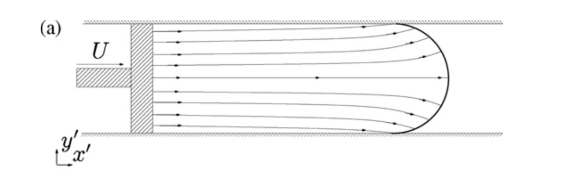
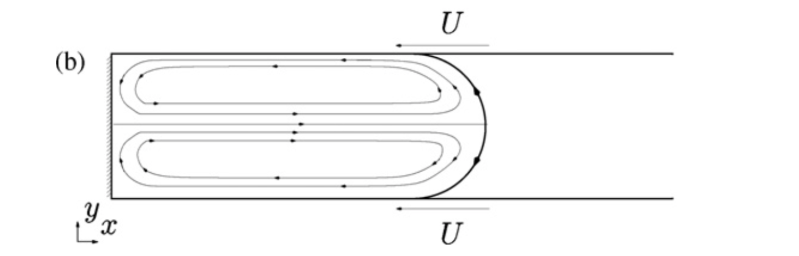
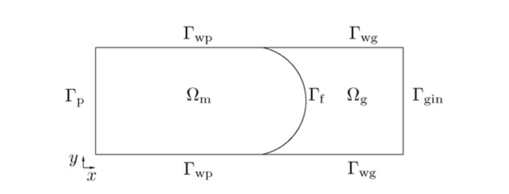
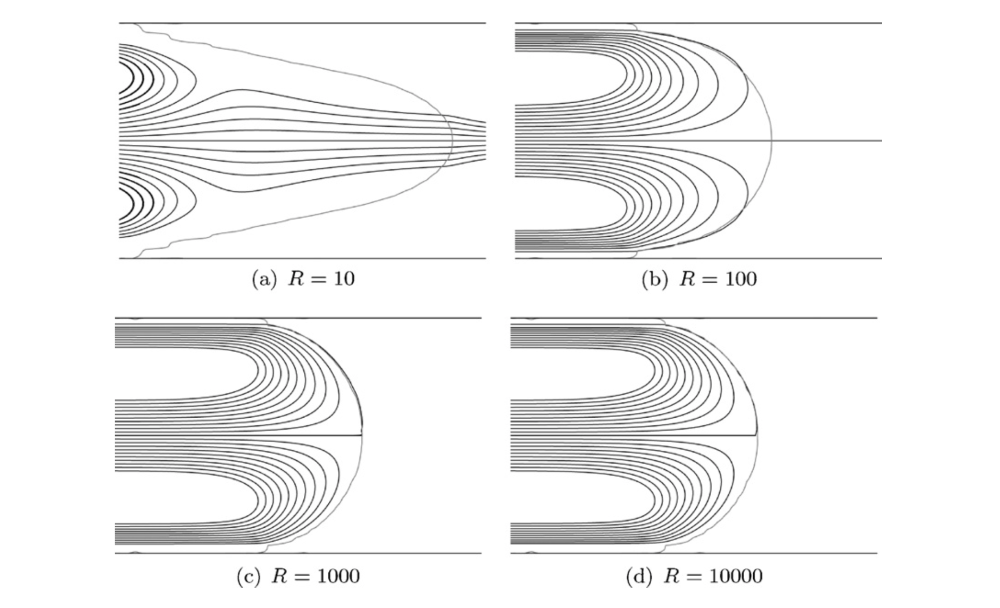
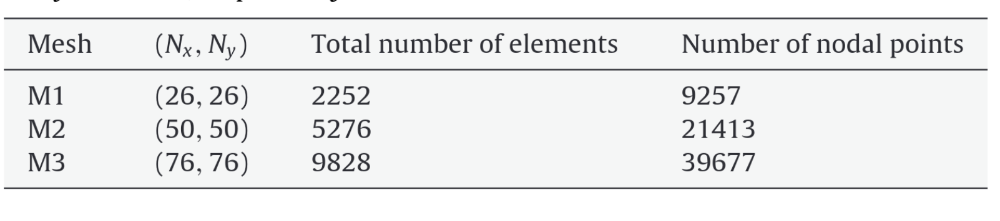
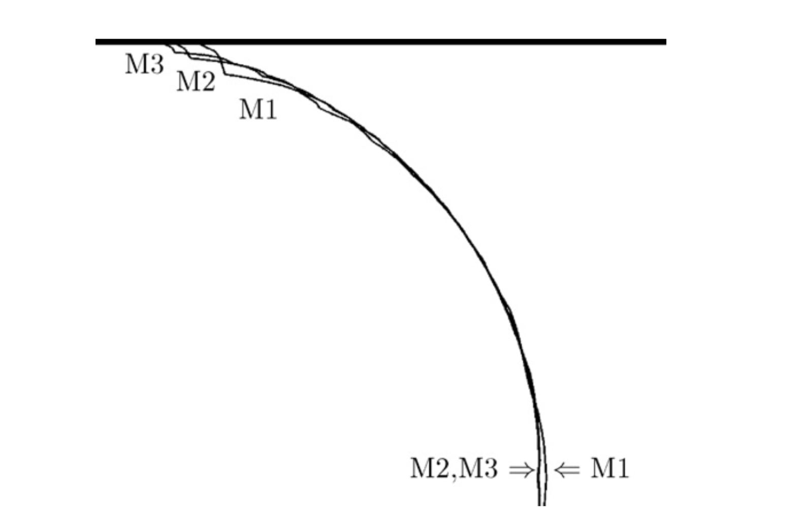
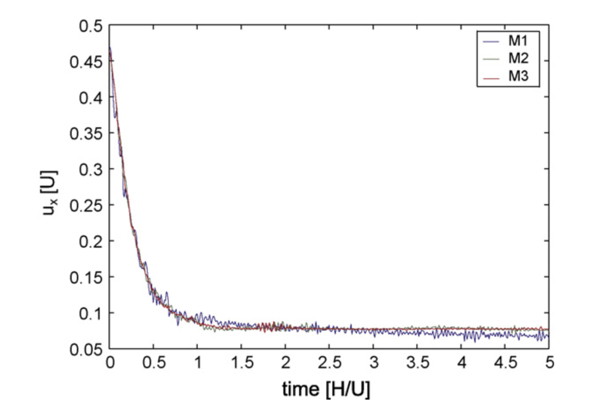
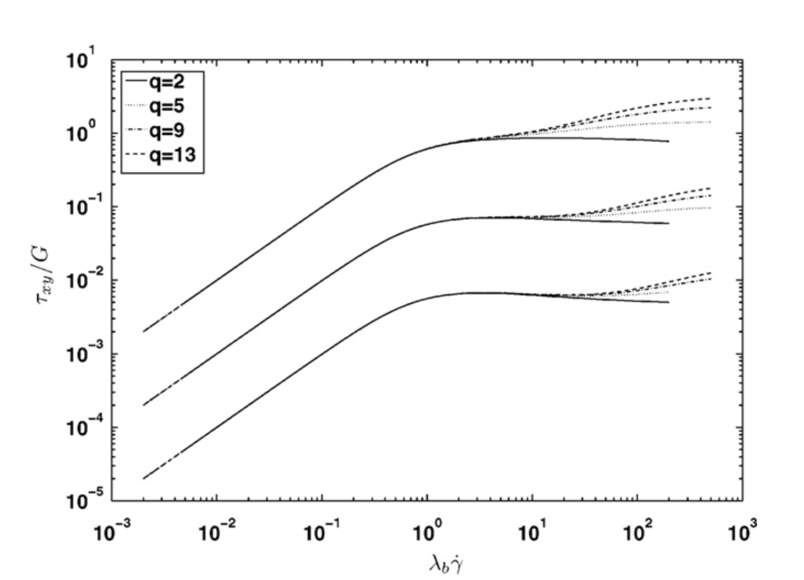

# 模型

## 几何区域

最初，通道部分地填充有矩形聚合物块，其被活塞移动到通道的空部分中

    	 

为了避免建模运动流域的问题，将活塞速度从速度场中减去

    	 

给不同区域相应的符号，注意，由于活塞和墙壁之间的速度跳跃，在活塞的拐角处的流场中引入了两个奇点。

    	 

- $\Omega_m$ ：融熔物区域，建模为恒温不可压缩粘弹性液体，且由于粘性力占主导，惯性和引力忽略，
- $\Omega_g$ ：气体区域，建模为可压缩低粘性流体
- $\Gamma_p$ ：活塞边界
- $\Gamma_{wp}$ ：融熔物区域的移动壁
- $\Gamma_{wg}$ ：气体区域的移动壁
- $\Gamma_{gin}$ ：气体区域流入边界
- $\Gamma_f$ ：流动前沿

## 控制方程

$$
\begin{aligned}
- \nabla \cdot \boldsymbol \sigma &= 0 \quad \text{in} \quad \Omega \\
\nabla \cdot \boldsymbol u &= 0  \quad \text{in} \quad \Omega_m
\end{aligned}
$$

其中 $\boldsymbol u$ 为速度向量，$\Omega = \Omega_m \cup \Omega_g$，  $\boldsymbol \sigma$ 为柯西应力张量，其气体域和融熔域表示分别为

$$
\begin{aligned}
\boldsymbol \sigma = -p \boldsymbol I + \boldsymbol \tau \quad \text{in} \quad \tau_m \\
\begin{cases}
\boldsymbol \sigma = -p \boldsymbol I + 2 \eta_g \boldsymbol D \\
 \eta_g \nabla \cdot \boldsymbol u + p =0   \\
\end{cases}
\quad \text{in} \quad \tau_g
\end{aligned}
$$

其中 $p$ 是压力， $\boldsymbol D$ 是形变率张量， $\boldsymbol \tau$ 是粘弹性外应力张量，其选用XPP模型来刻画

$$
\begin{aligned}
	\boldsymbol \tau  = G(\boldsymbol c - \boldsymbol I)\\
	\frac{\partial \boldsymbol c}{\partial t} + \boldsymbol u \cdot \nabla \boldsymbol c - (\nabla \boldsymbol u)^T \cdot \boldsymbol c
	- \boldsymbol c \cdot \nabla \boldsymbol u + \boldsymbol f_{rel}(\boldsymbol c) = 0 \\ 
		\boldsymbol f_{rel} = 2\frac{\exp(v(\sqrt{tr \boldsymbol c /3}-1))}{\lambda_s}(1-\frac{3}{tr \boldsymbol c})\boldsymbol c \\
		+ \frac{1}{\lambda_b}(\alpha \boldsymbol c \cdot \boldsymbol c + \frac{3}{tr \boldsymbol c}
		[1-\alpha -\frac{\alpha}{3}tr(\boldsymbol c \cdot \boldsymbol c)]\boldsymbol c+(\alpha-1)\boldsymbol I)
\end{aligned}
$$

参数说明：

- $\boldsymbol c$ : 构形张量
- $G$ ：弹性模量
- $ \boldsymbol f_{rel} : $是一个非线性松弛张量
- $q$ :悬臂的数量
- $v=\frac{2}{q}$ 
- $\lambda_s$ :方向松弛时间
- $\lambda_b$ :主干松弛时间
- $\alpha$ :各项异性的滑移参数，设置为0
- $r = \frac{\lambda_b}{\lambda_s}$ :用来衡量管段或者纠缠物的数量

简化：
$$
\begin{aligned}
	\boldsymbol \tau  = G(\boldsymbol c - \boldsymbol I)\\
	\frac{\partial \boldsymbol c}{\partial t} + \boldsymbol u \cdot \nabla \boldsymbol c - (\nabla \boldsymbol u)^T \cdot \boldsymbol c
	- \boldsymbol c \cdot \nabla \boldsymbol u + \boldsymbol f_{rel}(\boldsymbol c) = 0 \\ 
		\boldsymbol f_{rel} = 2\frac{\exp(v(\sqrt{tr \boldsymbol c /3}-1))}{\lambda_s}(1-\frac{3}{tr \boldsymbol c})\boldsymbol c \\
		+ \frac{1}{\lambda_b}(\alpha \boldsymbol c \cdot \boldsymbol c + \frac{3}{tr \boldsymbol c}
		[1-\alpha -\frac{\alpha}{3}tr(\boldsymbol c \cdot \boldsymbol c)]\boldsymbol c+(\alpha-1)\boldsymbol I)
\end{aligned}
$$

## 尺度

两个无量纲数字控制这个问题

第一个是气体和融熔物的粘度系数比值
$$
R = \frac{\lambda_b G}{\eta_g}
$$
第二是Weissenberg数
$$
Wi = \frac{\lambda_b U}{2H}
$$
$U$ 是墙壁移动速度，H是管道高度

所有的结果都是用无量纲的格式来展示，即速度都和 $U$ 成比例，长度都和 $H$ 成比例，时间都和 $\frac{H}{U}$ 成比例。

## 流动前沿刻画

用水平集方法来刻画融熔物和气体之间的交界面
$$
\frac{\partial \phi}{\partial t} + \boldsymbol u \cdot \nabla \phi = 0
$$
其中 $\phi$ 是水平集函数，其表示带符号到交界面的距离

-  $\phi=0$  代表交界面
-  $\phi > 0$  代表融熔物区域
-  $\phi<0$  代表气体区域

## 接触点

三相接触点即流动前沿与墙壁的交界面。

由于接触点的流动行为不能用本文所用的宏观物理来描述，因此整个流动前沿(包括接触点)被认为是一个半圆(作为一个未知量)
$$
x(y)-x_c = \sqrt{(\frac{H}{2})^2-(y-\frac{H}{2})^2} \approx \sqrt{H} \sqrt{y} \quad \text{for} \frac{y}{H} <<1
$$
其中 $x_c$ 是接触点的位置。

由于ｙ接近０时候，会出现non-attaching flow(接触点离开墙壁，会有气体层在融熔物和墙壁之间)。因此需要把墙壁也用水平集，令其 $\phi=0$ ，由于双线性形函数，需要设置水平集函数两个值为０，另一个就是垂直于墙壁

    	 

由于设置墙壁为水平集，因此会出现融熔物和气体的转换，为了保持融体和气体的质量守恒，融体可以流出区域，容易泄漏建模在活塞与墙壁接触的地方，采取二次外流剖面，来保持速度平滑。其他角点处也是类似的操作。

    	 

# 参数选择

基本设置

-  $L = 6H$
- 初始界面位于 $x = 3.5H$ 
- 时间步长设置为 $10^{-2}\frac{H}{U}$

## 融熔物是牛顿流

目的：用来寻找适当的粘度比和检查网格收敛性

- R = 1000 当Ｒ>1000时流动前沿为半圆

    	 

- 网格选取Ｍ２

    	 
         
         

## 融熔物是非牛顿流

目的：确定参数，使得没有剪切变薄，或者切应力增长率保持不变。

xpp参数设置

- r = 2
- q = 5

    	 

- Wi=10　的时候有不对称的流动前沿，因此选择10　

## 不稳定流动前沿

从四个方面来测试

中线上y轴上速度分量的值，来观测对称性。分析出虚拟气体气泡不是引起不稳定行为的原因

    	 

更进一步展现在中心点出$u_x,u_y$的变化,的出活塞位置对流动前沿的动态影响可以忽略

    	 

第三个是功率谱

    	 

最后从流动前沿上下速度的差别,来观察涡流的运动，以及非线性的震荡运动

    	 

