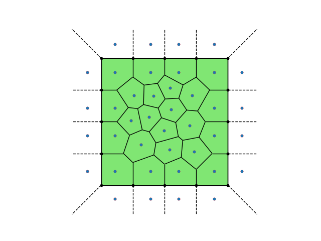

# 网格介绍

<!--
介绍voronoi网格和CVT网格的一些性质，说明Fealpy中的CVT多边形网格基于CVTPMesher
生成，以正方形为例给出一个基本的例子。
-->

Voronoi网格剖分是一种多边形网格剖分. 设 $\Omega\subset\mathbb{R}^d$ 是一个开区
域, 并且 $\mathcal{Z} =\{\boldsymbol{z_i}\}_{i=0}^{N-1}\subset\Omega$ 是一组给定的点. 一个 
Voronoi 剖分 $\mathcal{V} = \{V_i\}_{i=0}^{N-1}$ 是 $\Omega$ 的一种多边形网格剖分, 它的
每个区域 $V_i$ 定义为
$$    
    V_i=\{\boldsymbol{x}\in\Omega:|\boldsymbol{x}-\boldsymbol{z_i}|<|\boldsymbol{x}-\boldsymbol{z_j}|,\text{其中}j\neq i\}
$$

称 $V_i$ 为一个 Voronoi 单元, 点集 $\mathcal{Z}$ 中的点被称为生成子(Generator),  CVT 是
Vorionoi 剖分的一种特殊剖分, 当每个 Voronoi 单元的生成子也是其质心时, 该 Voronoi 剖
分称为一个 CVT.

在Fealpy中，我们可以通过mesh中的CVTPMesher来生成CVT多边形网格，首先需要利用HalfEdgeMesh2d中的
from_edges建立初始网格区域，再利用CVTPMesher生成初始Voronoi网格区域，再利用VoroAlgorithm中的方法
进行优化得到最终的CVT网格。

```python
import numpy as np
import matplotlib.pyplot as plt
from fealpy.mesh import HalfEdgeMesh2d, CVTPMesher,VoroAlgorithm

from scipy.spatial import Voronoi, voronoi_plot_2d

nodes = np.array([
    ( 0.0, 0.0),( 1.0, 0.0),( 1.0, 1.0),( 0.0, 1.0)],dtype=np.float)
facets = np.array([
    (0, 1),(1, 2),(2, 3),(3, 0)], dtype=np.int)
subdomain = np.array([
    (1, 0),(1, 0),(1, 0),(1, 0)], dtype=np.int)
mesh = HalfEdgeMesh2d.from_edges(nodes, facets, subdomain)
voromesher = CVTPMesher(mesh)
vor = voromesher.voronoi_meshing(nb=2)

i =0
avoro = VoroAlgorithm(voromesher)
while i<100:
    vor = avoro.lloyd_opt(vor)
    i+=1

fig = plt.figure()
axes = fig.gca()
mesh.add_plot(axes)
mesh.find_node(axes, color='k', showindex=False)
mesh.find_node(axes, node=vor.points, showindex=False)
voronoi_plot_2d(vor, ax=axes,show_vertices = False,point_size = 0.3)
plt.show()
```



<!--
简单介绍一下生成网格所需的数据结构以及各个步骤的作用
-->

# 规范边长度


网格重分，包括单元边的分解，合并，边的互换以及节点的重定位等。有时我们需要将网格的边长
进行分解产生新的节点和单元，有时需要将边长进行合并处理。这里我们引入规范边长的概念。

所谓规范边长，就是依据单元边的两端的尺寸值计算出来的一个长度，因此先引入网格尺寸值的概念。
## 网格尺寸值
计算网格尺寸值的方法如下:
1. 求出每个单元的三边的平均长度将其作为这个单元的网格尺寸值$h_{old}$.
2. 为所有的网格单元引入一个平均的单元容许误差$E_p$，其计算表达式为: 
    $$ E_p =\eta\sqrt{(\||u_h|\|^2_{E(\Omega)} + \|e_h\|^2_{L^2(\Omega)})/N}$$
    其中N是整个网格区域上的单元数目，$\eta$是可调整的参数，$\||u_h|\|^2_{E(\Omega)}$
    是有限元解$u_h$的能量范数，$e_h$定义为 $G_hu_h-\nabla u_h$，即后验误差，其中$G_h$
    为梯度重构算子。由调节参数$\eta$，我们可以控制容许误差$E_p$
3. 现在我们可以通过容许误差和先前的网格单元尺寸"$h_{old}$ "
   来得到基于误差估计的新的网格单元尺寸值 $h_{new}$:
   $$ 
   h_{new} = h_{old}*E(i)/E_p 
   $$

   其中$E(i)$是由$\||G_hu_h-\nabla u_h|\|_{E(\tau)}$计算得到的每个网格单元$\tau$
   上的误差。
4. 得到了每个单元的尺寸值，我们可以通过围绕任何节点 $z_j$
   的网格单元集合来获得该点的尺寸值:
   $$ h(z_j)=\frac{1}{m}\sum_{i=1}^mh_{new}(i) $$
5. 最后我们对所有节点的尺寸值进行分级，使得相邻节点尺寸值合理过度，不至于产生相邻网
   格单元尺寸相差很大的单元。

## 规范边长度
规范边长的具体计算如下: 设单元某边的两端点为p和q，其尺寸值分别为 $h_p$ 和
$h_q$，则线段 $pq$ 上的任意一点尺寸为:
$$ h(t)=h_p(h_q/h_p)^t,t\in[0,1]$$
于是线段 $pq$ 的规范长度 $(l_{pq}^*)$，对于 $h_p\neq h_q$，有
$$ 
l_{pq}^* = l_{pq}\int_0^1\frac{1}{h(t)}dt = l_{pq}\int\frac{1}{h_p}(\frac{h_p}{h_q}^t)dt
 = l_{pq}\frac{h_p-h_q}{h_ph_q\ln(\frac{h_p}{h_q})}
$$

对于 $h_p\approx h_q$则有
$$ l_{pq}^* = l_{pq}\frac{1}{h_p}$$

通常，我们取一个参考的规范边长 $C_s = \sqrt{2}$
作为分裂边长的标准，如果单元的边长大于这个标准值，就进行分解操作。另外，我们还取定
一个合并边的参考值 $C_c =frac{1}{\sqrt{2}}$，如果边的规范边长长度小于这个标准值，
那么就进行边的合并操作。


# 网格生成
引入密度函数，密度函数的区间为(0,1]，越接近0密度越小，当为1时密度最大。若给定的
密度区间不为(0,1]，则需要先手动做等价的替换，将区间变换到(0,1]再进行传入。

网格生成由三部分组成:边界加密，生成初始voronoi网格，优化为CVT网格


## 边界加密与重构边界
采用一致加密，但对于不同边长不同密度可以自适应加密。方法是先将边界进行初步的一致
加密，然后选定当前的$h$值作为 $h_{max}$，并以 $h_{max}$ 为基准选定
$h_{min}$，之后在每条边的中点处计算密度值$\rho$，并计算
$$
h_r = \min(\{h_{max},\frac{h_{min}}{\rho}\})
$$
若对应边的$h$大于$h_r$，则加密该条边，然后再次进行上述计算，直到没有边的$h$大于$h_r$

采用VoroCrust算法——一种采用镜像原理的方法重构边界
## 生成初始voronoi网格
### 随机布点
采用随机布点方法，在区域内随机生成一组点，判断离边界点的距离，当大于一定值时则留下，否则抛弃。

同时还可引入密度影响，对于随机生成的点，再在(0,1)间随机生成一组随机数，算出该随机点的密度，
将密度将对应的随机数进行比较，若大于随机数则留下来，若小于则丢掉。
### 其他布点方法
除随机布点外，其他还有背景网格布点法等，待算法成熟再介绍加进去

## 优化为CVT网格
将初始的voronoi网格优化为CVT网格
### Lloyd's优化方法
Lloyd's 算法是生成CVT网格的常用方法, 即先固定生成子集 $\boldsymbol{z}$, 然后对区域进行
Voronoi 剖分, 生成 Voronoi 网格剖分 $\mathcal{V}(\boldsymbol{z})$, 再固定 
$\mathcal{V}$, 然后将 $\boldsymbol{z}$ 中的点移动到各自区域的质心.

给定区域 $V_i$, 定义其上的密度函数 $\rho$, 则 $V_i$ 的质心 $z_i^{*}$ 定义为:
$$
z_i^{*} = \left(\int_{V_i}\rho(x)\text{d}x\right)^{-1}\int_{V_i}x\rho(x)\text{d}x
$$

对于积分的近似，我们可以在多边形区域的中心找一点(可以取多边形各点的平均值)，并将
此点与各顶点连接，分成若干个三角形，如图所示:

之后，在各个三角形区域上近似积分，取每个三角形各点的平均值作为近似并求和，则质心为
$$
    \frac{\sum_{i=0}^{n}\rho(\boldsymbol{x_i})\boldsymbol{x_i}S_i}{\sum_{i=0}^n\rho(\boldsymbol{x_i})S_i}
$$

其中 $S_i$ 是各个三角形的面积。
### 其他优化方法
Lloyd's迭代是局部算法，我们还可以采用全局优化算法，写完密度函数后会编写全局优化算法的函数

# 网格示例

给出各种网格区域的示例。


