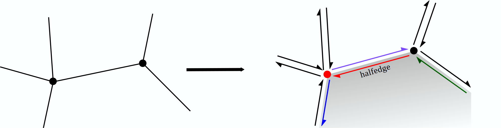

## 一、 简介
本文简单介绍半边数据结构网格及在 FEALPy 中的使用方法.

## 二、 半边数据结构
在介绍半边数据结构之前， 我们首先考虑一个问题: 
<div align='center'>

**如何描述一个二维网格?**
</div>

在二维网格中, 有三种对象: 
- **节点** : 0 维对象. 
- **边**: 1 维对象.
- **单元**: 2 维对象.

有两种信息
- **几何信息**: 每个对象的几何位置与几何形状.
- **拓扑信息**: 每种对象之间的相邻关系.

当我们可以回答这两种信息时, 就算是可以描述了这个网格,
**描述网格的方法就叫网格数据结构.**

### 线性网格
本文只讨论 **二维线性网格**, 对于线性网格当我们知道边和单元与相邻节点的邻接关系,
就可以得到他们的位置与形状. 如: 如果我们知道一个单元的顶点是:
$$
(0, 1), (0, 0), (1, 0)
$$
我们很容易知道它的形状是:

<div align='center'>

</div>

所以对于线性网格, 我们只需要知道网格的 **拓扑信息** 和 **节点位置** 即可.
### 以单元为中心的数据结构
在前面已经介绍过的三角形网格和四边形网格中, 使用的方法是
1. 记录节点位置
2. 记录单元的顶点
3. 以单元为中介, 找到各对象之间的邻接关系. 

这样的数据结构叫以单元为中心的数据结构。

### 半边数据结构
对于以单元为中心的数据结构, 不同单元类型的网格在第二步, 第三部不同, 所以不同网
格需要不同的数据结构. 但是任一网格的边是相同的, 若是把第二步,
第三部中的单元换成边, 那么这样的数据结构就 **可以描述任意的二维网格.**
半边数据结构就是这样的一种数据结构.

在半边数据结构中, 每条边被分成了两条半边, 每条半边有不同的方向,
不同的顶点和不同的相邻单元, 他们互为对边. 网格中每条半边还有有下一条半边,
上一条半边这样的邻接半边. 用这些邻接关系去描述一个半边. 

<div align='center'>

</div>

对于每个单元, 每个节点, 记录一个与之相邻的半边.

所以半边数据结构描述网格的方法是:
1. 记录节点位置
2. 记录每条半边的顶点, 相邻单元, 相邻半边并记录每个节点, 单元的一个相邻半边.
3. 以半边为中介, 可以找到点, 边, 面之间的邻接关系.

## 三、FEALPy 中的半边数据结构网格
FEALPy 中半边数据结构网格在 `fealpy/mesh/HalfEdgeMesh2d.py` 下, FEALPy
中构建半边网格的方法是:

```python
from fealpy.mesh import TriangleMesh, HalfEdgeMesh2d

node = np.array([[0, 0], [1, 0], [1, 1], [0, 1]], dtype=np.float_)
cell = np.array([[0, 1, 2], [0, 2, 3]], dtype=np.int_)
trimesh = TriangleMesh(node, cell)

# 构建半边数据结构网格, 其中的trimesh可以使任意类型的二维网格.
hmesh = HalfEdgeMesh2d.from_mesh(trimesh) 
```

上面的代码块中的三角形网格可以换成任意类型的二维网格.


