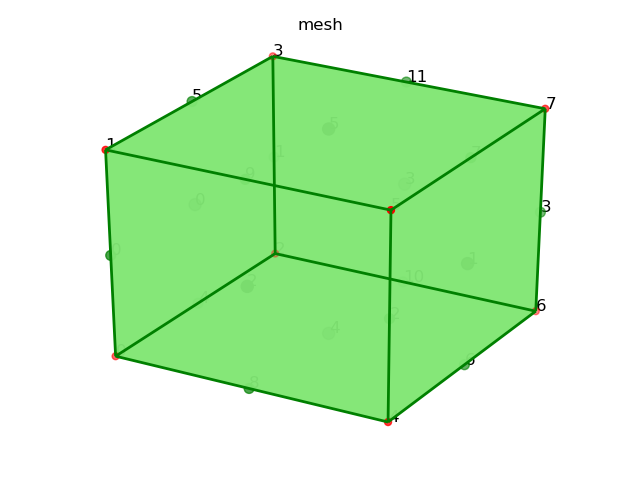
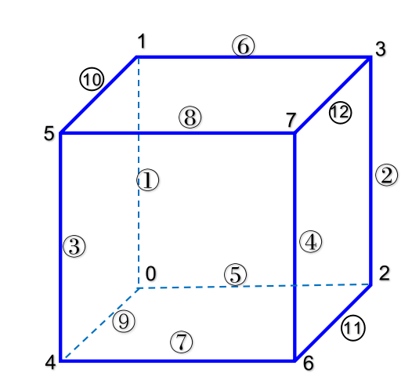
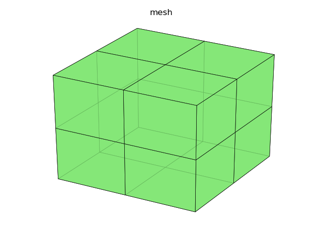
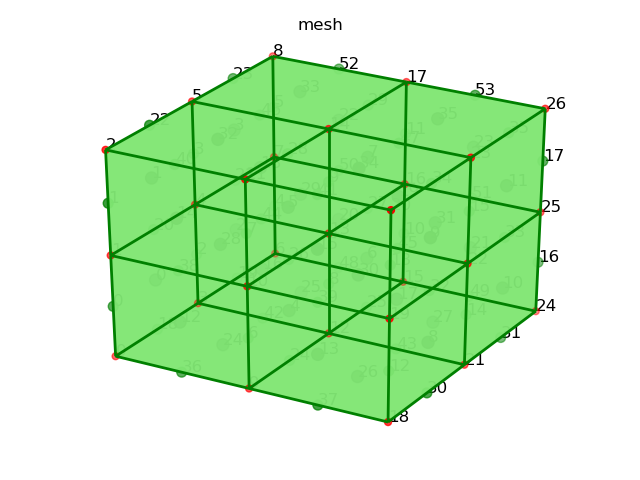
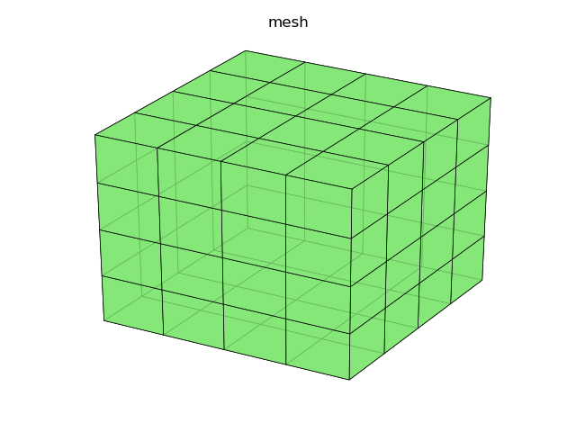

## 基本结构
$\quad$ 在 FEALPy 中可以通过 StructureHexMesh 建立三维结构六面体网格对象,
只需要给出每个方向的剖分段数以及剖分区域, 如下述代码所示:

```python
import numpy as np
from fealpy.mesh import StructureHexMesh
nx = 1 # x 方向剖分段数
ny = 1 # y 方向剖分段数
nz = 1 # z 方向剖分段数
box = np.array([0, 1, 0, 1, 0, 1]) # 剖分区域
mesh = StructureHexMesh(box, nx, ny, nz) # 建立网格
```

生成的网格图像代码为

```python
fig = plt.figure()
axes = Axes3D(fig)
mesh.add_plot(axes,facecolor=[0.5, 0.9, 0.45])
mesh.find_node(axes, showindex=True, markersize=25, fontsize=12) # 显示节点信息
mesh.find_edge(axes, showindex=True, markersize=50, fontsize=12) # 显示边的信息
mesh.find_face(axes, showindex=True, markersize=75, fontsize=12) # 显示面的信息
axes.set_title('mesh')
```

图像如下图所示




## 基本约定:

在介绍六面体时, 使用一个单位正六面体来说明用到的基本约定. 
<!--以 $(0, 0, 0)$
为原点引入笛卡尔直角坐标系, 其他七个点的坐标分别为 $(0, 0, 1)$, $(0, 1, 0)$,
$(0, 1, 1)$, $(1, 0, 0)$, $(1, 0, 1)$, $(1, 1, 0)$, $(1, 1, 1)$.
-->
下图是一个单元 `node` 和 `edge` 的 编号




[//]: 画图更容易看一些

$\quad$ 建立网格对象后, 可以访问网格的常用成员函数, 例如:

```python
NN = mesh.number_of_nodes() # 节点 node 个数
NE = mesh.number_of_edges() # 边 edge 个数
NF = mesh.number_of_faces() # 面 face 个数
NC = mesh.number_of_cells() # 单元 cell 个数
```

可以访问网格中的 entity 成员函数:

```python
node = mesh.entity('node') # 节点数组, 规模为 (NN, 3), 储存每个节点的坐标信息
edge = mesh.entity('edge') # 边数组，规模为(NE,2), 储存每条边的两个节点的编号
face = mesh.entity('face') # 面数组, 规模为(NF,4), 储存每个面的四个节点的编号
cell = mesh.entity('cell') # 单元数组, 规模为(NC,8), 储存构成六面体的八个节点编号
```

### 全局编号与局部编号


#### 节点编号约定

节点的全局编号按照 $z \to y \to x$ 的顺序编号, 且按照值从小到大的方向排列,
以上面的网格为例:

```python
node = mesh.entity('node') # 节点数组，规模为(NN,3), 储存节点坐标
node [[0. 0. 0.]
 [0. 0. 1.]
 [0. 1. 0.]
 [0. 1. 1.]
 [1. 0. 0.]
 [1. 0. 1.]
 [1. 1. 0.]
 [1. 1. 1.]]
```

#### 边的编号约定

边的全局编号: 按照 $z \to y \to x$ 的顺序编号,
与点的编号规则类似，且从小的节点编号指向大的节点编号(先排 $z$ 方向的边, 再排 $y$
方向的边, 最后是 $x$ 方向的边).

 每条边由两个节点构成, 因此边的**局部编号**为 $0$, $1$, `edge[I, 0]` 为第 $I$ 
 条边的第 $0$ 个节点编号, `edge[I, 1]` 为第 $I$ 条边的第 $1$ 个节点编号 ($I$ 为边的全局
 编号, 且 $I = 0, 1, \cdots, NE-1$).

```python
edge [[0 1]
 [2 3]
 [4 5]
 [6 7]
 [0 2]
 [1 3]
 [4 6]
 [5 7]
 [0 4]
 [1 5]
 [2 6]
 [3 7]]
ec:[[0.  0.  0.5]
 [0.  1.  0.5]
 [1.  0.  0.5]
 [1.  1.  0.5]
 [0.  0.5 0. ]
 [0.  0.5 1. ]
 [1.  0.5 0. ]
 [1.  0.5 1. ]
 [0.5 0.  0. ]
 [0.5 0.  1. ]
 [0.5 1.  0. ]
 [0.5 1.  1. ]] # 边的中点坐标
 ```

 **注:** 先按照 $z \to y \to x$ 的顺序, 排与 z 轴平行的边, 再按照 $ y \to z \to x$ 的顺序, 排与 y 轴平行的边, 最后, 按照 $ x \to z \to y$ 的顺序, 排与 x 轴平行的边.


#### 面的编号约定

$\quad$ 在 Fealpy 中, 对于边界面来说, 要求右单元为内部单元.
以 0 号面为例, 站在 0 号点位置, 面朝 1 号点, 此时, 左手边为外部区域,
右手边的单元为左单元, 同时也是内部单元.
这样约定的好处是**可以明确边界面的法方向**.

$\quad$ 面的全局编号: 按照 $z \to y \to x$ 的顺序编号(先排 $z$ 方向的面, 再排 $y$
方向的面, 最后是 $x$ 方向的面). 对于每个面的的全局编号来说, 例如, 第 $I$ 个面.
站在第 $I$ 个面的左边单元, 面向这个面, 按照逆时针方向排序.

$\quad$ 每个面由四个节点构成, 因此面的局部编号为 $0$, $1$, $2$, $3$. 
`face[I, 0]` 为第 $I$ 个面的第 $0$ 个节点编号,
`face[I, 1]` 为第 $I$ 个面的第 $1$ 个节点编号,
`face[I, 2]` 为第 $I$ 个面的第 $2$ 个节点编号,
`face[I, 3]` 为第 $I$ 个面的第 $3$ 个节点编号,
 ($I$ 为面的全局编号, 且 $I = 0, 1, \cdots, NF-1$).

 **注:** 由于网格中的 `face` 来说, 对于与 x 轴垂直的面来说, 第 $0$ 个节点编号是 x
 最小点为起点, 从左单元看向这个面, 逆时针方向排序. 
 与 y 轴垂直的面, 从左单元看向这个面,
 逆时针方向排序. 其他类似.

```python
face [[0 1 3 2]
 [4 6 7 5]
 [0 4 5 1]
 [6 2 3 7]
 [0 2 6 4]
 [1 5 7 3]]
```

 **注:** 先按照 $z \to y \to x$ 的顺序, 排与 x 轴垂直的面, 再按照 $ x \to z \to y$ 的顺序, 排与 y 轴垂直的面, 最后, 按照 $ y \to x \to z$ 的顺序, 排与 z 轴垂直的面.


#### 单元编号约定

单元的全局编号: 按照 $z\to y \to x$ 的顺序编号;

## 网格加密

$\quad$ 生成网格后, 可以通过改变剖分段数对 StructureHexMesh 中的网格进行加密:

```python
nx = 2*nx
ny = 2*ny
nz = 2*nz
mesh = StructureHexMesh(box, nx, ny, nz)
```

加密一次, 结果如下:



## 常用成员函数

$\quad$ 建立网格对象后, 可以访问网格的常用成员函数:

```python
ec = mesh.entity_barycenter('edge') # (NE,3), 储存各边的重心坐标
fc = mesh.entity_barycenter('face') # (NF,3), 储存各面的重心坐标
bc = mesh.entity_barycenter('cell') # (NC,3), 储存各单元的重心坐标
```

$\quad$ 除此之外, 还可以获得 `node`, `edge`, `face`, `cell` 等实体间的邻接关系,
以上面加密的网格单元剖分为例结合输出进行说明

#### cell 与 node, edge, face, cell 间的关系

**cell 与 node 的关系**

```python
cell2node = mesh.ds.cell_to_node() #稀疏矩阵, (NC,NN), 判断单元中的节点, 若单元中有这个节点为 True, 否则为 False
print('cell2node:\n', cell2node)
```

输出为

```python
cell2node:
   (0, 0)	True
  (0, 1)	True
  (0, 3)	True
  (0, 4)	True
  (0, 9)	True
  (0, 10)	True
  (0, 12)	True
  (0, 13)	True
  (1, 1)	True
  (1, 2)	True
  (1, 4)	True
  (1, 5)	True
  (1, 10)	True
  (1, 11)	True
  (1, 13)	True
  (1, 14)	True
  (2, 3)	True
  (2, 4)	True
  (2, 6)	True
  (2, 7)	True
  (2, 12)	True
  (2, 13)	True
  (2, 15)	True
  (2, 16)	True
  (3, 4)	True
  :	:
  (4, 22)	True
  (5, 10)	True
  (5, 11)	True
  (5, 13)	True
  (5, 14)	True
  (5, 19)	True
  (5, 20)	True
  (5, 22)	True
  (5, 23)	True
  (6, 12)	True
  (6, 13)	True
  (6, 15)	True
  (6, 16)	True
  (6, 21)	True
  (6, 22)	True
  (6, 24)	True
  (6, 25)	True
  (7, 13)	True
  (7, 14)	True
  (7, 16)	True
  (7, 17)	True
  (7, 22)	True
  (7, 23)	True
  (7, 25)	True
  (7, 26)	True
```

**cell 与 edge 的关系**

```python
cell2edge = mesh.ds.cell_to_edge() 
#(NC,12), 单元和边的邻接关系, 储存每个单元相邻的十二条边的编号, 实际也就是构成六面体单元的十二条边的编号
print('cell2edge:\n', cell2edge)
```

输出为

```python
cell2edge:
 [[36 24 42 18  0  6  8  2 38 26 44 20]
 [38 26 44 20  1  7  9  3 40 28 46 22]
 [42 25 48 19  2  8 10  4 44 27 50 21]
 [44 27 50 21  3  9 11  5 46 29 52 23]
 [37 30 43 24  6 12 14  8 39 32 45 26]
 [39 32 45 26  7 13 15  9 41 34 47 28]
 [43 31 49 25  8 14 16 10 45 33 51 27]
 [45 33 51 27  9 15 17 11 47 35 53 29]]
```

$\quad$ 在上面的网格剖分中, 共有 54 条边, 
记为 0 到 53 号边, 这是它们的全局编号, 而在每个单元中, 每条边又标记为 0 到11 号
边, 例如, 通过 cell2edge 可以看出，对于 0 号单元, 0~11
号局部编号的边所对应的全局编号分别为 36 24 42 18  0  6  8  2 38 26 44 20.
cell2edge 的排序为 

1) 与 z 轴垂直, z 值较小的面的边, 按照 `cell[:, :4]`
的节点排序连成的四条边的编号

2) 与 z 轴平行, 按照 `cell[:, :4]`-`cell[:, 4:]`
一一对应的节点连成的四条边的编号

3) 与 z 轴垂直, z 值较大的面的边, 按照 `cell[:, 4:]`
的节点排序连成的四条边的编号

**cell 与 face 关系**

```python
cell2face = mesh.ds.cell_to_face()  #(NC,6), 单元和面的邻接关系, 储存每个单元相邻的六个面的编号
print('cell2face:\n', cell2face)
```

输出为

```python
cell2face:
 [[24 28  0  4 12 16]
 [28 32  1  5 14 18]
 [25 29  2  6 16 20]
 [29 33  3  7 18 22]
 [26 30  4  8 13 17]
 [30 34  5  9 15 19]
 [27 31  6 10 17 21]
 [31 35  7 11 19 23]]
```

`cell2face` 先排与 y 轴垂直的面, 再排与 x 轴垂直的面, 最后排与 z 轴垂直的面.

**cell 与 cell 关系**

```python
cell2cell = mesh.ds.cell_to_cell() #(NC,6), 单元和单元的邻接关系, 储存每个单元相邻的六个单元的编号
print('cell2cell:\n', cell2cell)
```

输出为

```python
 cell2cell:
 [[0 1 0 4 0 2]
 [0 1 1 5 1 3]
 [2 3 2 6 0 2]
 [2 3 3 7 1 3]
 [4 5 0 4 4 6]
 [4 5 1 5 5 7]
 [6 7 2 6 4 6]
 [6 7 3 7 5 7]]
```

`cell2cell` 先排与 z 垂直的面所对应的非自身单元, 再排与 x 轴垂直的面所对应的非自身单元, 最后排与 y 轴垂直的面所对应的非自身单元, 若该单元为边界单元, 即边界边所对应的另一个单元也是自身单元.

#### face 与 node, edge, cell 间的关系

**face 与 node 关系**

```python
face2node = mesh.ds.face_to_node() #(NC,4), 面和节点的邻接关系, 储存每个面相邻的四个节点的编号
print('face2node:\n', face2node)
```

输出为

```python
face2node:
 [[ 0  1  4  3]
 [ 1  2  5  4]
 [ 3  4  7  6]
 [ 4  5  8  7]
 [ 9 12 13 10]
 [10 13 14 11]
 [12 15 16 13]
 [13 16 17 14]
 [18 21 22 19]
 [19 22 23 20]
 [21 24 25 22]
 [22 25 26 23]
 [ 0  9 10  1]
 [ 9 18 19 10]
 [ 1 10 11  2]
 [10 19 20 11]
 [ 3 12 13  4]
 [12 21 22 13]
 [ 4 13 14  5]
 [13 22 23 14]
 [15  6  7 16]
 [24 15 16 25]
 [16  7  8 17]
 [25 16 17 26]
 [ 0  3 12  9]
 [ 3  6 15 12]
 [ 9 12 21 18]
 [12 15 24 21]
 [ 1 10 13  4]
 [ 4 13 16  7]
 [10 19 22 13]
 [13 22 25 16]
 [ 2 11 14  5]
 [ 5 14 17  8]
 [11 20 23 14]
 [14 23 26 17]]
```

**face 与 edge 关系**

```python
face2edge = mesh.ds.face_to_edge() #(NC,4), 面和边的邻接关系, 储存每个面相邻的四个边的编号
print('face2edge:\n', face2edge)
```

输出为

```python
face2edge:
 [[ 0 20  2 18]
 [ 1 22  3 20]
 [ 2 21  4 19]
 [ 3 23  5 21]
 [24  8 26  6]
 [26  9 28  7]
 [25 10 27  8]
 [27 11 29  9]
 [30 14 32 12]
 [32 15 34 13]
 [31 16 33 14]
 [33 17 35 15]
 [36  6 38  0]
 [37 12 39  6]
 [38  7 40  1]
 [39 13 41  7]
 [42  2 44  8]
 [43  8 45 14]
 [44  3 46  9]
 [45  9 47 15]
 [48  4 50 10]
 [49 10 51 16]
 [50  5 52 11]
 [51 11 53 17]
 [36 24 42 18]
 [42 25 48 19]
 [37 30 43 24]
 [43 31 49 25]
 [38 26 44 20]
 [44 27 50 21]
 [39 32 45 26]
 [45 33 51 27]
 [40 28 46 22]
 [46 29 52 23]
 [41 34 47 28]
 [47 35 53 29]]
```
按照 `face` 中的节点排序, 依次首尾相连得到的四条边.

**face 与 cell 关系**

```python
face2cell = mesh.ds.face_to_cell() #(NC,4), 面和单元的邻接关系, 储存每个面相邻的两个单元的编号
print('face2cell:\n', face2cell)
```

输出为

```python
face2cell:
 [[0 0 2 2]
 [1 1 2 2]
 [2 2 2 2]
 [3 3 2 2]
 [0 4 3 2]
 [1 5 3 2]
 [2 6 3 2]
 [3 7 3 2]
 [4 4 3 3]
 [5 5 3 3]
 [6 6 3 3]
 [7 7 3 3]
 [0 0 4 4]
 [4 4 4 4]
 [1 1 4 4]
 [5 5 4 4]
 [0 2 5 4]
 [4 6 5 4]
 [1 3 5 4]
 [5 7 5 4]
 [2 2 5 5]
 [6 6 5 5]
 [3 3 5 5]
 [7 7 5 5]
 [0 0 0 0]
 [2 2 0 0]
 [4 4 0 0]
 [6 6 0 0]
 [0 1 1 0]
 [2 3 1 0]
 [4 5 1 0]
 [6 7 1 0]
 [1 1 1 1]
 [3 3 1 1]
 [5 5 1 1]
 [7 7 1 1]]
```

$\quad$ face2cell 中存储了与每个面相邻的两个单元信息, 前两列为单元的编号,
后两列代表该面在对应单元中的局部编号. 若该面为边界面, 则前两列的信息相同,
后两列的信息也相同. 

#### 其他

```python
edge2node = mesh.ds.edge_to_node() # (NE, 2) 
edge2edge = mesh.ds.edge_to_edge() # 需要修改程序
edge2face = mesh.ds.edge_to_face() # 稀疏矩阵, (NE, NF)
edge2cell = mesh.ds.edge_to_cell() # 稀疏矩阵, (NE, NC)
#node2node = mesh.ds.node_to_node()
#node2edge = mesh.ds.node_to_edge()
#node2face = mesh.ds.node_to_face()
#node2cell = mesh.ds.node_to_cell() 
```

```python
isBdNode = mesh.ds.boundary_node_flag() # (NN, ), bool, 判断是否为边界点
isBdEdge = mesh.ds.boundary_edge_flag() # (NE, ), bool, 判断是否为边界边
isBdFace = mesh.ds.boundary_face_flag() # (NF, ), bool, 判断是否为边界面
isBdCell = mesh.ds.boundary_cell_flag() # (NC, ), bool，判断是否为边界单元
```

## 网格展示




