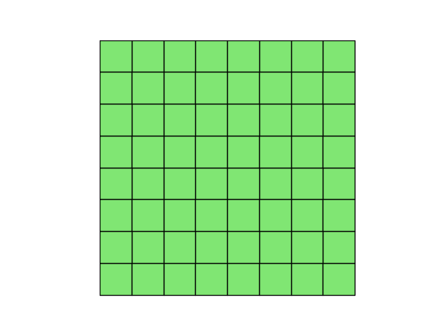
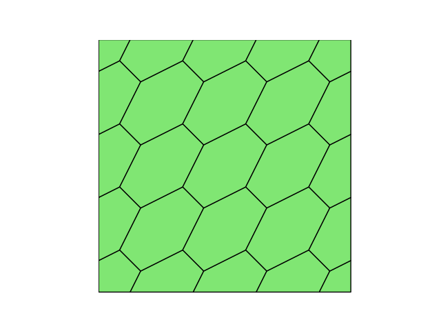
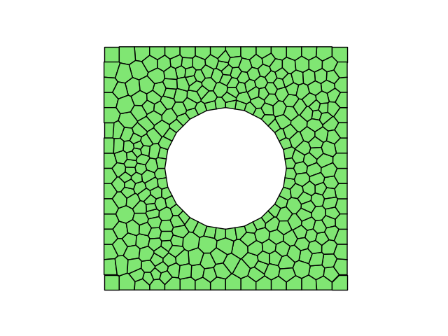
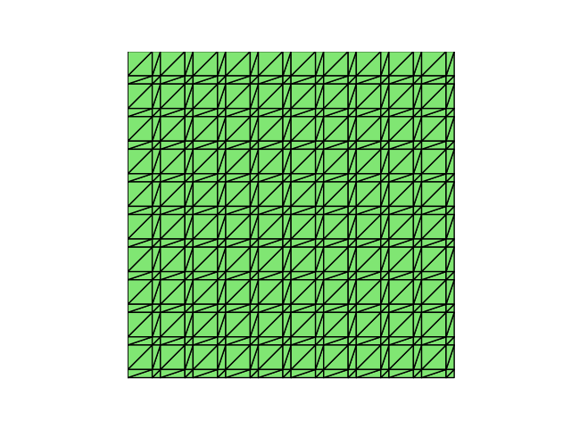
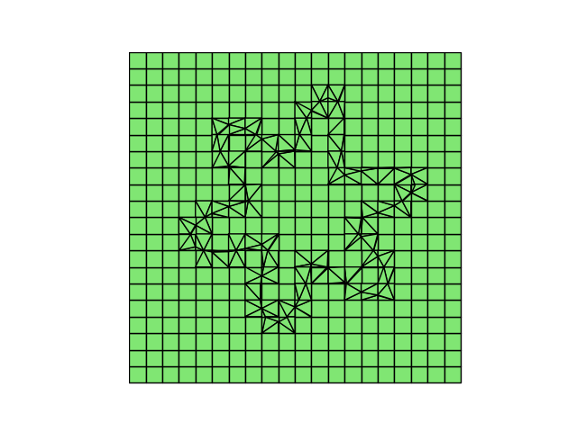
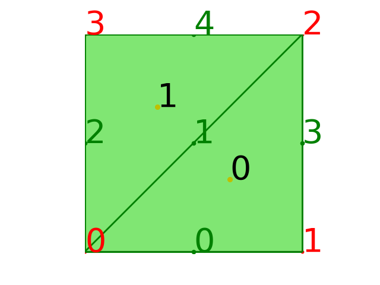

# 网格介绍
$\quad$有限元分析可以用来建立现实世界场景的预测计算模型，
而建立这些模型需要不少相关的信息，为了能够高效合理的使用这些信息，
我们需要用到网格。所谓有限元网格，即将模型分割为很多较小的域，
把复杂的连续物理区域离散为很多简单形状单元的集合，称其为 **网格单元**。
之后利用变分原理把连续的偏微分方程的求解问题转化为代数方程的求解，
并基于这些网格单元得到数值解。随着网格的不断细化，这些单元变得越来越小，
从而使求解的结果越来越接近真实解。

$\quad$网格可以分为不同的类型，
根据网格点之间的邻接关系可分分为结构网格和非结构网格，
根据网格形状的不同，可以分为三角形网格，四边形网格，多边形网格。
同时，我们还可以发挥不同网格类型的优点，构造混合网格。

$\quad$ 下面，我们基于Fealpy生成了几类不同的网格:

 
  
 
 
 


$\quad$根据不同的情况，选择合适的网格，往往可以取得事半功倍的效果。

# Fealpy中的网格

$\quad$ 在偏微分方程数值计算程序设计中， **网格(mesh)** 是最核心的数据结构， 
是下一步实现数值离散方法的基础. FEALPy 中核心网格数据结构是用**数组**表示的.

$\quad$ 常见的三角形、四边形、四面体和六面体网格，因为每个单元顶点的个数固定，因此可以
用 **节点坐标数组(node)** 和 **单元顶点数组(cell)** 来表示，这是一种以 **单元为中心的数据结构**.

$\quad$ 如可以用下面的两个 Numpy 数组表示一个包含 4 个节点和 2 个单元的三角形网格.

```python
import numpy as np
node = np.array([
        [0.0, 0.0],
        [1.0, 0.0],
        [1.0, 1.0],
        [0.0, 1.0]],dtype=np.float64)
cell = np.array([
        [1,2,0],
        [3,0,2]],dtype=np.int_)

fig = plt.figure()
axes = fig.gca()
mesh.add_plot(axes)
mesh.find_node(axes,showindex=True,fontsize=40)
mesh.find_edge(axes, showindex=True,fontsize=40)
mesh.find_cell(axes, showindex=True,fontsize=40)
plt.show()
```

网格图像为



$\quad$在上述算例中，`cell` 包含的两个单元为 `[1,2,0]` 与 `[3,0,2]`，
它存储的是构成网格单元的节点的编号，
`[1,2,0]` 即由 1 号点，2 号点，0 号点三个节点构成的三角形网格单元。

$\quad$ 很多时候，我们还需要获得 **边数组(edge)** 和 **面数组(face)**, 其实它们都可以由
`cell` 数组快速生成. 下面我们以三角形网格为例, 来分段详细介绍 `edge` 数组的生成算法.

```python
    NEC = 3# 网格中每个cell包含的边的个数，三角形单元，故为3
    localEdge = np.array(
    [(1, 2), (2, 0), (0, 1)],dtype=np.int_)#各单元边的局部信息
```
$\quad$所谓边的局部信息，指在各网格单元中边的信息，
对于三角形就只有三条边的信息，用 0,1,2 三个编号即可记录; 
边的全局信息指在整个网格中各边的信息，
网格中总共有多少条边，就有多少边的信息，编号就记录到多少。

```python
    totalEdge = cell[:, localEdge].reshape(-1, 2)#边的全局信息
    stotalEdge = np.sort(totalEdge, axis=1)
    _, i0, j = np.unique(stotalEdge, return_index=True, return_inverse=True, axis=0)
    # i0返回新数组元素在旧数组中的位置，j返回旧数组元素在新数组中的位置
```
$\quad$在上述代码中，我们通过 `localEdge` 获得了 `totalEdge`，
但由于网格单元存在共用边，故得到的 `totalEdge` 多于实际边的信息。
因此我们通过 `np.sort()`和 `np.unique()`来获得 `i0`，
即实际边的编号信息，之后由此得到 `edge`。

```python
    edge = totalEdge[i0] # 去除重复边
    NE = i0.shape[0] # 边的数目

    i1 = np.zeros(NE, dtype=np.int)
    NC = cell.shape[0]#单元数组
    i1[j] = np.arange(3*NC)

    # 边与单元的拓扑关系数组
    edge2cell = np.zeros((NE, 4), dtype=np.int)
    t0 = i0//3 # 全局编号
    t1 = i1//3 # 全局编号
    k0 = i0%3 # 局部编号
    k1 = i1%3 # 局部编号
    edge2cell[:, 0] = t0
    edge2cell[:, 1] = t1
    edge2cell[:, 2] = k0
    edge2cell[:, 3] = k1
```

$\quad$最后我们得到数组 `edge2cell`，它存储的是边与单元的拓扑信息，
`edge2cell[:,0]` 和 `edge2cell[:,1]` 存储与每条边相邻的两个单元的编号，
`edge2cell[:,2]` 和 `edge2cell[:,3]` 存储相邻两个单元中边的局部编号。

$\quad$从代码中发现，我们是通过 `i0`,`i1` 来获得这些数据，
这是因为 `i0` 存储的是 `totalEdge` 中边的编号信息，
而 `totalEdge` 中各边就是按照 `cell` 顺序来排列的，
前三条边是 0 号单元的，之后三条边是 1 号单元的，
依次类推，因此用 `i0//3` 和 `i0%3` 就可以获得边与其中一个单元的相关信息。

$\quad$不过 `i0` 由于去除了重复边信息，也就丢失了共用边中其中一个单元的相关信息，
故我们通过 `j` 获得 `i1`，获得丢失的信息。
因此 `i1//3` 和 `i1%3` 获得的是边与另一个单元的相关信息。

$\quad$对于边界边来说，其只与一个单元相邻，因此并不会丢失信息，
故对于边界边来说，其两个单元的信息相同，
也就是说，`edge2cell[:,0]`与 `edge2cell[:,1]` 相同，
`edge2cell[:,2]` 与 `edge2cell[:,1]` 相同。

$\quad$注意, 三维网格的 `face` 数组的生成算法和上面 `edge` 数组的生成算法本质上
是完全一样的。

$\quad$ FEALPy 把 `node`,`edge`,`face` 和 `cell` 统称为网格中的 **实体(entity)**。
FEALPy 约定 `node` 和 `cell` 分别是网格中的 **最低维** 和 **最高维** 实体, 
另外还约定

* 对于一维网格，`edge`,`face` 和 `cell` 的意义是相同的.
* 对于二维网格， `edge` 和 `face` 意义是相同的.

## 网格信息与网格拓扑关系

$\quad$ FEALPy 除了上面的约定外，还约定了一些常用变量名称的意义，如 

|变量名 | 含义 |
|:--- | :----|
|GD	| 网格的几何维数 |
|TD	| 网格的拓扑维数 |
|NN	| 网格中 `node` 的个数 |
|NE	| 网格中 `edge` 的个数 |
|NF	| 网格中 `face` 的个数 |
|NC	| 网格中 `cell` 的个数 |
|NVC | 网格中每个 `cell` 包含的点的个数 |
|NEC | 网格中每个 `cell` 包含的边的个数 |
|NVF | 网格中每个 `face` 包含的点的个数 |
|NEF | 网格中每个 `face` 包含的边的个数 |
|node| 节点数组，形状为 (NN, GD) |
|edge| 边数组，形状为 (NE, 2) |
|face| 面数组，形状为 (NF, NVF) |
|cell| 单元数组，形状为 (NC, NVC) |
|node2cell | 节点与单元的相邻关系 |
|edge2cell | 边与单元的相邻关系 |
|cell2edge | 单元与边的相邻关系 |

$\quad$大多数情况下，一个网格的几何维数和拓扑维数是相同的，但也可以不一样，
如三维空间中的一条曲线离散的一维网格，它
* `GD == 3`
* `TD == 1`

$\quad$可以通过以下方法来获取网格对象的各种信息

|成员函数名 | 功能 |
|:--- | :----|
|mesh.geo\_dimension() | 获得网格的几何维数 |
|mesh.top\_dimension() | 获得网格的拓扑维数 |
|mesh.number\_of\_nodes() |	获得网格的节点个数 |
|mesh.number\_of\_cells() |	获得网格的单元个数 |
|mesh.number\_of\_edges() |	获得网格的边个数 |
|mesh.number\_of\_faces() |	获得网格的面的个数 |
|mesh.number\_of\_entities(etype) |	获得 etype 类型实体的个数 |
|mesh.entity(etype) | 获得 etype 类型的实体 |
|mesh.entity\_measure(etype) | 获得 etype 类型的实体的测度 |
|mesh.entity\_barycenter(etype) | 获得 etype 类型的实体的重心 |
|mesh.integrator(i) | 获得该网格上的第 i 个积分公式 |

网格对象的常用方法成员（属性）列表。
表格中 `etype` 值可以是 0,1,2,3 或者字符串 `'cell'`,`'node'`,`'edge'`,`'face'`。
对于二维网格，`etype` 的值取 `'face'` 和 `'edge'` 是等价的，但不能取 3。

$\quad$`ds` 中的方法成员也有一些网格对象的信息

|成员函数名 | 功能 |
|:--- | :----|
|cell2cell = mesh.ds.cell\_to\_cell(...) | 单元与单元的邻接关系 |
|cell2face = mesh.ds.cell\_to\_face(...) | 单元与面的邻接关系 |
|cell2edge = mesh.ds.cell\_to\_edge(...) | 单元与边的邻接关系 |
|cell2node = mesh.ds.cell\_to\_node(...) | 单元与节点的邻接关系 |
|face2cell = mesh.ds.face\_to\_cell(...) | 面与单元的邻接关系 |
|face2face = mesh.ds.face\_to\_face(...) | 面与面的邻接关系 |
|face2edge = mesh.ds.face\_to\_edge(...) | 面与边的邻接关系 |
|face2node = mesh.ds.face\_to\_node(...) | 面与节点的邻接关系 |
|edge2cell = mesh.ds.edge\_to\_cell(...) | 边与单元的邻接关系 |
|edge2face = mesh.ds.edge\_to\_face(...) | 边与面的邻接关系 |
|edge2edge = mesh.ds.edge\_to\_edge(...) | 边与边的邻接关系 |
|edge2node = mesh.ds.edge\_to\_node(...) | 边与节点的邻接关系 |
|node2cell = mesh.ds.node\_to\_cell(...) | 节点与单元的邻接关 |
|node2face = mesh.ds.node\_to\_face(...) | 节点与面的邻接关系 |
|node2edge = mesh.ds.node\_to\_edge(...) | 节点与边的邻接关系 |
|node2node = mesh.ds.node\_to\_node(...) | 节点与节点的邻接关系 |

|成员函数名 | 功能 |
|:--- | :----|
|isBdNode = mesh.ds.boundary\_node\_flag() | 一维逻辑数组，标记边界节点 |
|isBdEdge = mesh.ds.boundary\_edge\_flag() | 一维逻辑数组，标记边界边 |
|isBdFace = mesh.ds.boundary\_face\_flag() | 一维逻辑数组，标记边界面 |
|isBdCell = mesh.ds.boundary\_cell\_flag() | 一维逻辑数组，标记边界单元 |
|bdNodeIdx = mesh.ds.boundary\_node\_index() | 一维整数数组，边界节点全局编号 |
|bdEdgeIdx = mesh.ds.boundary\_edge\_index() | 一维整数数组，边界边全局编号 |
|bdFaceIdx = mesh.ds.boundary\_face\_index() | 一维整数数组，边界面全局编号 |
|bdCellIdx = mesh.ds.boundary\_cell\_index() | 一维整数数组，边界单元全局编号 |


