​		FEALPy中的网格工厂模块是用来快速生成各种类型的常用网格，方便用户学习和使用FEALPy
# one_triangle_mesh
​		用来快速生成单个三角形网格

参数说明:

- meshtype：网格形状，包括直角三角形`(iso)`，等边三角形`(equ)`

使用方法：

```python
from fealpy.mesh import MeshFactory as MF
import numpy as np
import matplotlib.pyplot as plt

mesh = MF.one_triangle_mesh(meshtype='iso') 
#mesh = MF.one_triangle_mesh(meshtype='equ') 

fig = plt.figure()
axes = fig.gca()
mesh.add_plot(axes)
plt.show()

```

<div align="center">
    	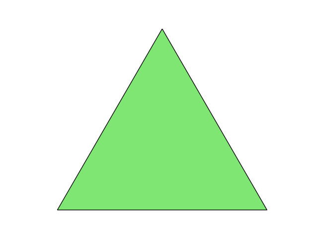 
    	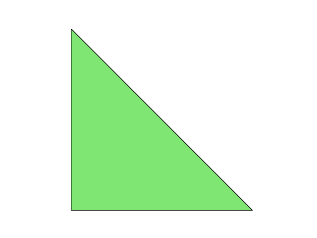 
</div>

<center style="text-decoration:underline">one_triangle_mesh生成的网格</center>

# one_quad_mesh

​		用来快速生成单个方形网格

参数说明:

- meshtype：网格形状，包括正方形`(square)`，长方形`(rectangle)`，菱形`(rhombus)`。

使用方法：

```python
from fealpy.mesh import MeshFactory as MF
import numpy as np
import matplotlib.pyplot as plt

#mesh = MF.one_quad_mesh(meshtype='square')
#mesh = MF.one_quad_mesh(meshtype='rectangle')
mesh = MF.one_quad_mesh(meshtype='rhombus')
# 画图
fig = plt.figure()
axes = fig.gca()
mesh.add_plot(axes)
plt.show()


```

<div align="center">
    	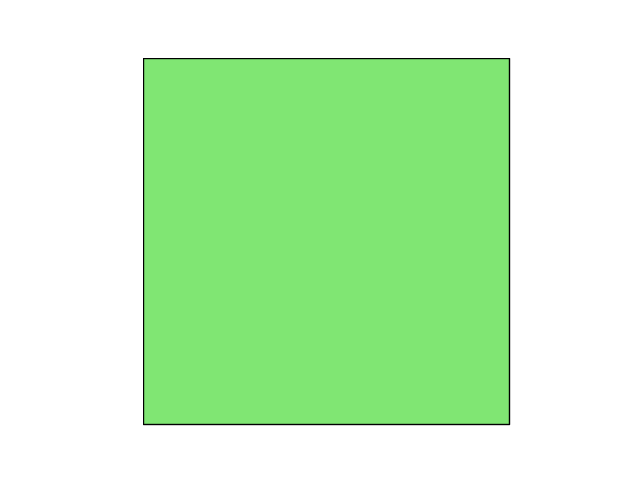 
    	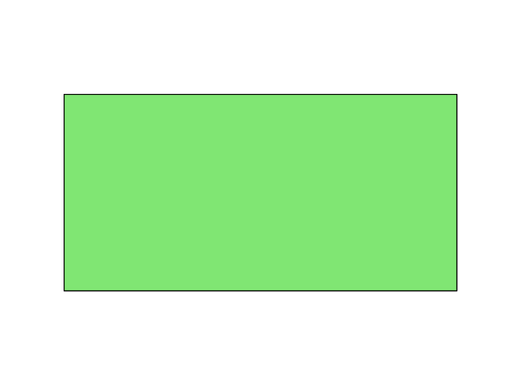 
    	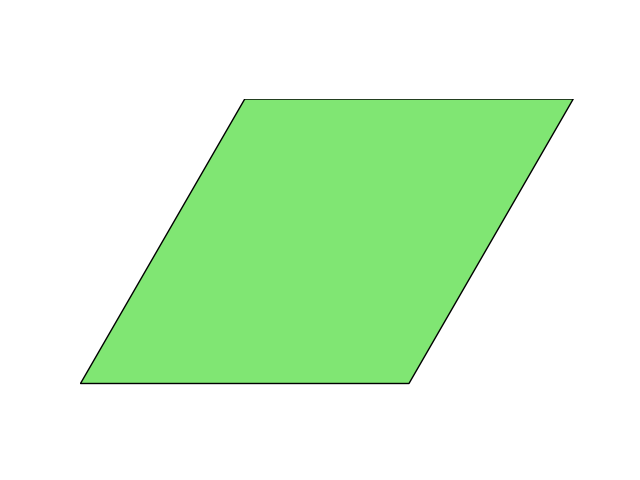 
</div>

<center style="text-decoration:underline">one_quad_mesh生成的网格</center>

# one_tetrahedron_mesh

​		用来快速生成单四面体网格

参数说明:

- meshtype：网格形状，包括正四面体`(equ)`，直角四面体`(iso)`。

使用方法：

```python
from fealpy.mesh import MeshFactory as MF
import numpy as np
import matplotlib.pyplot as plt

#mesh = MF.one_tetrahedron_mesh(meshtype='equ')
mesh = MF.one_tetrahedron_mesh(meshtype='iso')

# 画图
fig = plt.figure()
#axes = fig.gca()
axes = fig.gca(projection='3d')
mesh.add_plot(axes)
plt.show()

```

<div align="center">
    	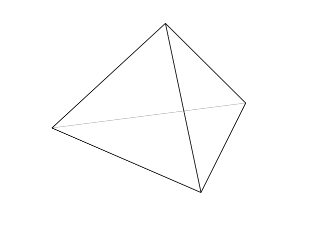 
    	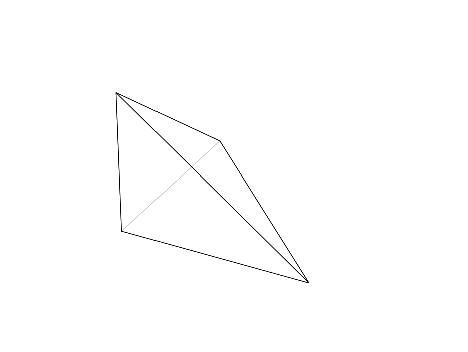  
</div>


<center style="text-decoration:underline">one_tetrahedron_mesh生成的网格</center>

# interval_mesh

​		用来快速生成一维线网格
参数说明:

- interval：线的位置
- nx：x方向剖分段数

使用方法：
```python
from fealpy.mesh import MeshFactory as MF
import numpy as np
import matplotlib.pyplot as plt

mesh = MF.interval_mesh(interval=[0,1],nx=2)

# 画图
fig = plt.figure()
axes = fig.gca()
mesh.add_plot(axes)
plt.show()
```

<div align="center">
    	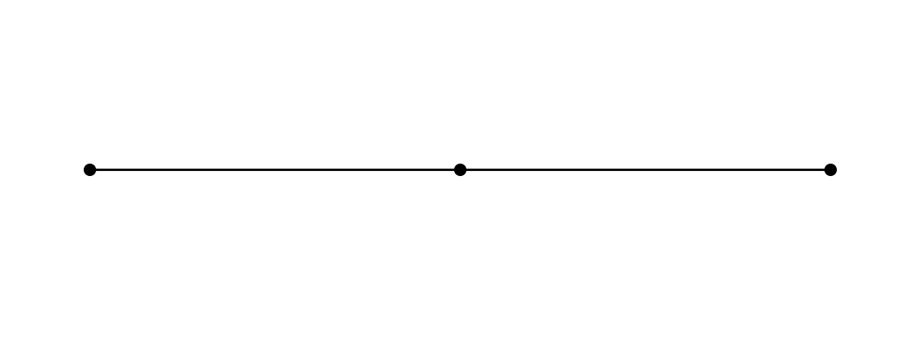 </div>
<center style="text-decoration:underline">interval_mesh生成的网格</center>

# boxmesh2d

​		用来快速生成二维矩形结构网格

参数说明:

- box：矩形网格的位置
- nx：x方向剖分段数
- ny：y方向剖分段数
- meshtype：网格剖分类型，包含三角形`('tri')`，四边形`('quad')`，三角形对偶的多边形`('poly')`。
- thershold: 以单元的重心为输入参数，返回一个逻辑数组，需要删除的单元标记为真.
- returnnc: bool型，True为返回节点和单元的数组，False为返回网格类型
- p：网格次数

使用方法：

```python
from fealpy.mesh import MeshFactory as MF
import numpy as np
import matplotlib.pyplot as plt

box = [0,1,0,1]
#mesh = MF.boxmesh2d(box=box,nx=2,ny=2,meshtype='tri')
#mesh = MF.boxmesh2d(box=box,nx=2,ny=2,meshtype='quad')
mesh = MF.boxmesh2d(box=box,nx=2,ny=2,meshtype='poly')
# 画图
fig = plt.figure()
axes = fig.gca()
mesh.add_plot(axes)
plt.show()
```

<div align="center">
    	 
    	
		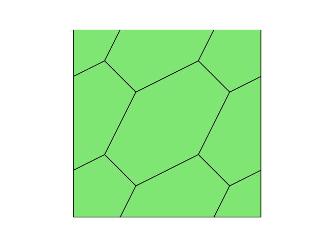 
</div>

<center style="text-decoration:underline">boxmesh2d生成的网格</center>

# boxmesh3d

​		用来快速生成三维矩形结构网格
参数说明:

- box：矩形网格的位置
- nx：x方向剖分段数
- ny：y方向剖分段数
- nz：z方向剖分段数
- meshtype：网格剖分类型，包含四面体`('tet')`，六面体`('hex')`。

使用方法如下

```python
from fealpy.mesh import MeshFactory as MF
import numpy as np
import matplotlib.pyplot as plt

box = [0,1,0,1,0,1]
#mesh = MF.boxmesh3d(box=box,nx=2,ny=2,nz=2,meshtype='tet')
mesh = MF.boxmesh3d(box=box,nx=2,ny=2,nz=2,meshtype='hex')

# 画图
fig = plt.figure()
axes = fig.gca(projection='3d')
mesh.add_plot(axes)
plt.show()
```
<div align="center">
    	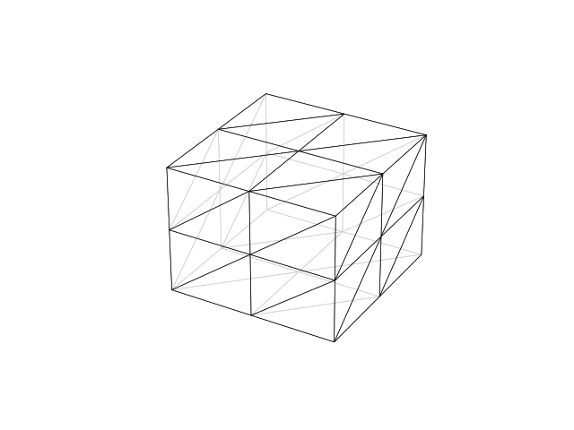 
    	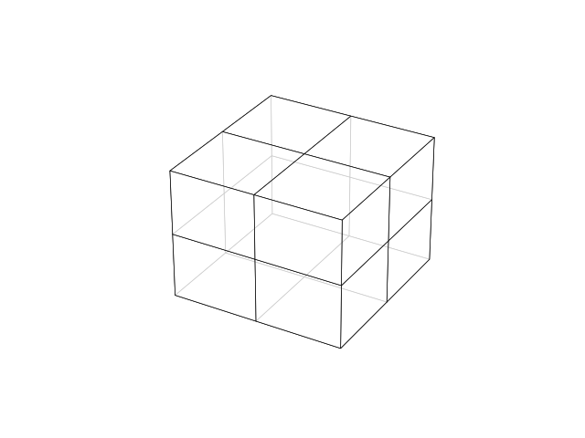
</div>

<center style="text-decoration:underline">boxmesh3d生成的网格</center>

# spcial_boxmesh2d

​		用来快速生成二维矩形特殊网格
参数说明:

- box：矩形网格的位置
- n ：两个方向上的剖分段数
- meshtype：网格剖分类型，包含鱼骨形`('fishbone')`，十字形`('cross')`，米字形`('rice')`，非一致网格`('nonuniform')`。

```python
from fealpy.mesh import MeshFactory as MF
import numpy as np
import matplotlib.pyplot as plt

box = [0,1,0,1]
#mesh = MF.special_boxmesh2d(box=box,n=2,meshtype='fishbone')
#mesh = MF.special_boxmesh2d(box=box,n=2,meshtype='cross')
#mesh = MF.special_boxmesh2d(box=box,n=2,meshtype='rice')
mesh = MF.special_boxmesh2d(box=box,n=2,meshtype='nonuniform')

# 画图
fig = plt.figure()
axes = fig.gca()
mesh.add_plot(axes)
plt.show()
```
<div align="center">
    	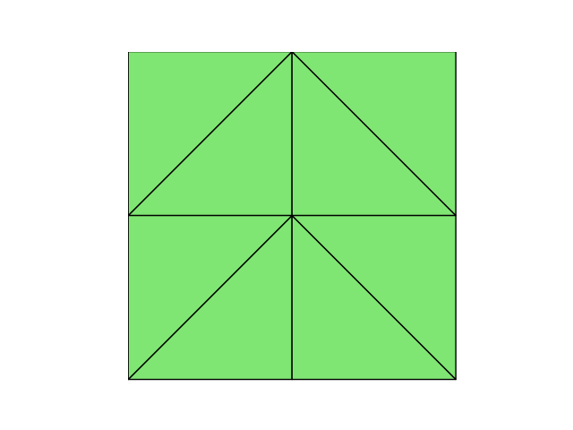 
    	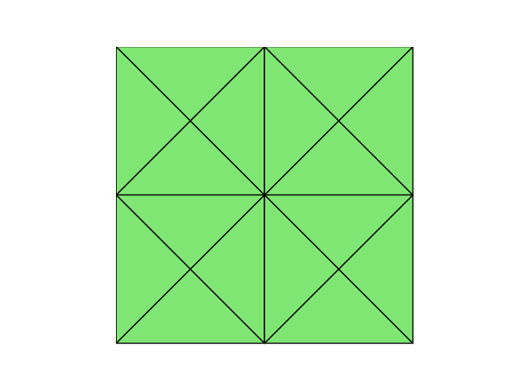
        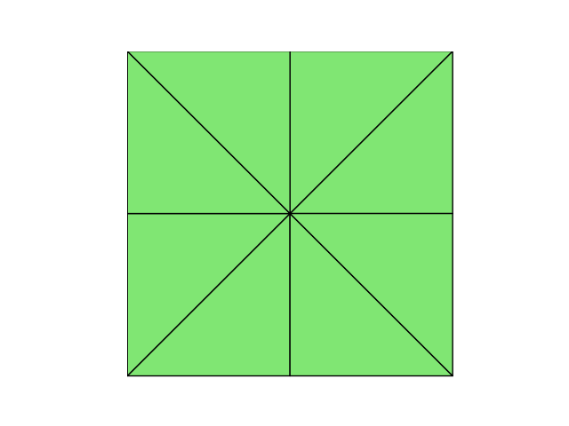 
        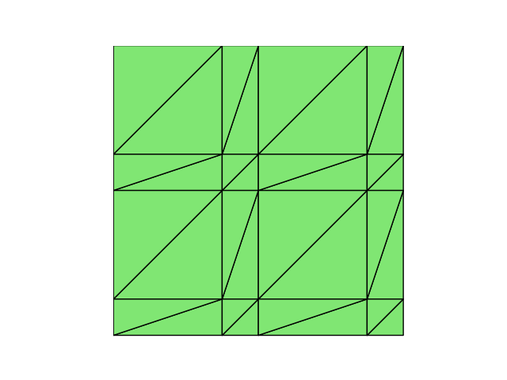 
</div>

<center style="text-decoration:underline">spcial_boxmesh2d生成的网格</center>

# lshape_mesh

​	快速生成L形区域的三角形网格

参数说明:

- n ：加密次数

使用方法：

```python
from fealpy.mesh import MeshFactory as MF
import numpy as np
import matplotlib.pyplot as plt

mesh = MF.lshape_mesh(n=2)

# 画图
fig = plt.figure()
axes = fig.gca()
mesh.add_plot(axes)
plt.show()
```

<div align="center">
    	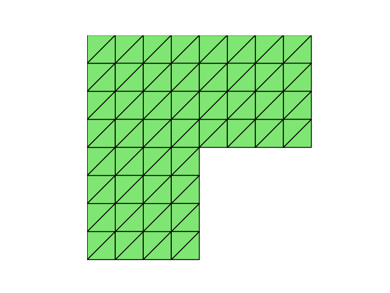 
</div>

<center style="text-decoration:underline">lshape_mesh生成的网格</center>

# unitcirclemesh

​		利用 distmesh 算法生成单位圆上的非结构三角形或多边形网格

参数说明:

- h：网格尺寸
- meshtype:网格剖分类型，包含三角形`('tri')`，多边形`('poly')`。
- p:   网格次数

使用方法：

```python
from fealpy.mesh import MeshFactory as MF
import numpy as np
import matplotlib.pyplot as plt

mesh = MF.unitcirclemesh(h=0.2,meshtype='tri',p=None)

# 画图
fig = plt.figure()
axes = fig.gca()
mesh.add_plot(axes)
plt.show()
```

<div align="center">
    	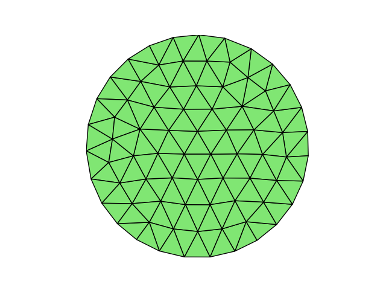 
        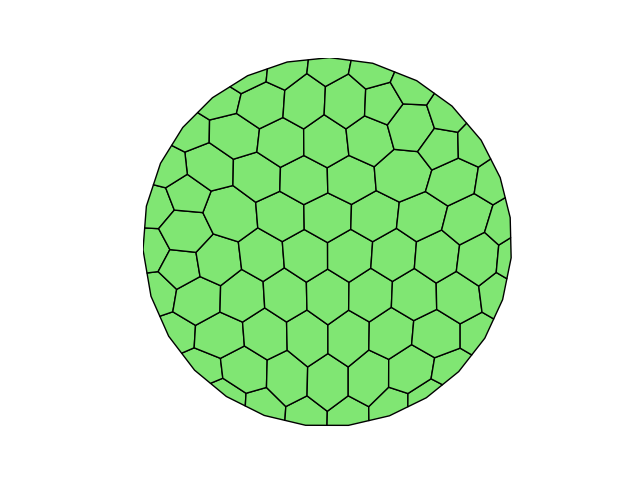 
</div>

<center style="text-decoration:underline">unitcirclemesh生成的网格</center>

# triangle

​		快速生成矩形区域上的非结构网格网格

参数说明:

- box：网格位置

- h：网格尺寸
- meshtype:网格剖分类型，包含三角形`('tri')`，多边形`('poly')`。

使用方法：

```python
from fealpy.mesh import MeshFactory as MF
import numpy as np
import matplotlib.pyplot as plt

box = [0,1,0,1]
mesh = MF.triangle(box=box,h=0.1,meshtype='poly')

# 画图
fig = plt.figure()
axes = fig.gca()
mesh.add_plot(axes)
plt.show()
```

<div align="center">
    	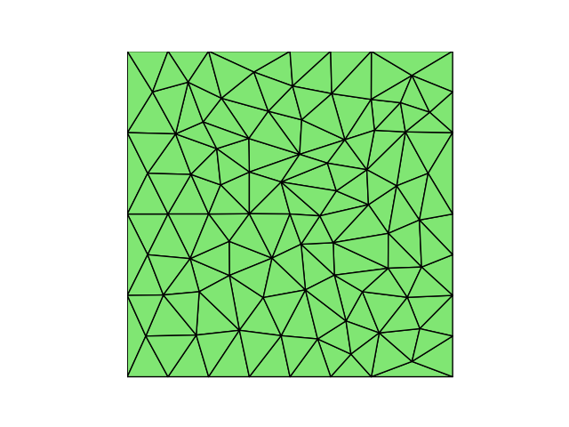 
        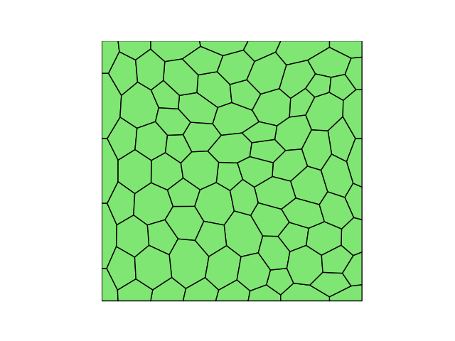 
</div>

<center style="text-decoration:underline">triangle生成的网格</center>

# delete_cell

利用 threshhold 来删除一部分网格单元。
threshold 以单元的重心为输入参数，返回一个逻辑数组，需要删除的单元标记为真。

参数说明:

- node ：
- cell：
- threshold：


# distmesh2d
$\quad$distmesh 是 Matlab 中的一个网格生成器，我们在 Fealpy 中实现了其部分功能，
MeshFactory 里给出了单位圆的示例，可以直接调用
```python
from fealpy.mesh import MeshFactory as mf
import numpy as np
import matplotlib.pyplot as plt

mesh = mf.unitcirclemesh()

# 画图
fig = plt.figure()
axes = fig.gca()
mesh.add_plot(axes)
plt.show()
```
<div align="center">
    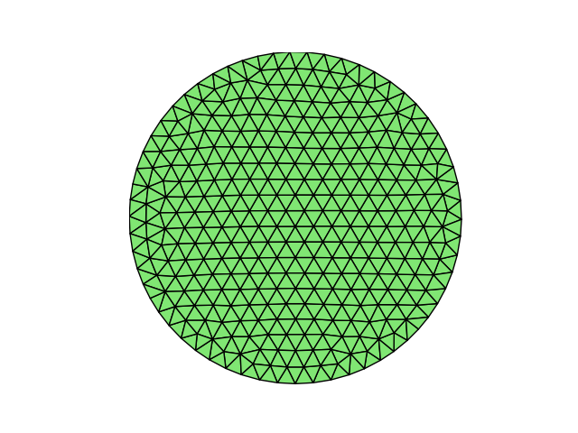 
</div>
<center style="text-decoration:underline">利用distmesh生成三角形网格</center>

$\quad$除了已经写好的示例，我们还可以给定所需的参数，调用函数`distmesh2d`生成网格，
其中所需的参数和 Matlab 中 `distmesh2d` 函数相同。

```python
import numpy as np

import matplotlib.pyplot as plt

from fealpy.geometry import huniform
from fealpy.geometry import dcircle,drectangle,ddiff,dmin
from fealpy.mesh import MeshFactory as mf

fd = lambda p: dcircle(p,[0,0],1)
fh = huniform            
bbox = [-1,1,-1,1]       
h0 = 0.1
mesh = mf.distmesh2d(fd,fh,h0,bbox,pfix=None)

fig = plt.figure()
axes = fig.gca()
mesh.add_plot(axes)
plt.show()
```
上述代码得到的网格图像也为圆形区域的三角形网格，即和上面的网格图像一样。

```python
import numpy as np

import matplotlib.pyplot as plt

from fealpy.geometry import huniform
from fealpy.geometry import dcircle,drectangle,ddiff,dmin
from fealpy.mesh import MeshFactory as mf


fd = lambda p:ddiff(dcircle(p,cxy=[0,0],r=1),dcircle(p,cxy=[0,0],r=0.4))
fh = huniform
h0 = 0.1
bbox = [-1,1,-1,1]
mesh = mf.distmesh2d(fd,fh,h0,bbox,pfix=None)

fig = plt.figure()
axes = fig.gca()
mesh.add_plot(axes)
plt.show()

```
上述代码生成一个带洞的圆形区域，其网格图像如下:

<div align="center">
    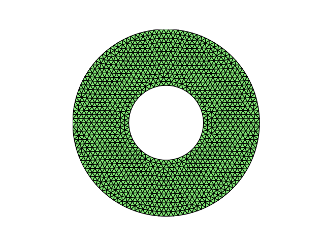 
</div>
<center style="text-decoration:underline">利用distmesh生成带洞网格</center>

```python
import numpy as np

import matplotlib.pyplot as plt

from fealpy.geometry import huniform
from fealpy.geometry import dcircle,drectangle,ddiff,dmin
from fealpy.mesh import MeshFactory as mf

fd1 = lambda p: dcircle(p,[0,0],1)
fd2 = lambda p: dcircle(p,[-0.4,0],0.55)
fd = lambda p: ddiff(ddiff(fd1(p),fd2(p)),p[:,1])
fh1 = lambda p: 0.15-0.2*fd1(p)
fh2 = lambda p: 0.06+0.2*fd2(p)
fh3 = lambda p: (fd2(p)-fd1(p))/3
fh = lambda p: dmin(dmin(fh1(p),fh2(p)),fh3(p))
h0 = 0.013
bbox = [-1,1,0,1]
pfix = np.array([(-1.0,0.0),(-0.95,0.0),(0.15,0.0),(1.0,0.0)],dtype = np.float64)

mesh = mf.distmesh2d(fd,fh,h0,bbox,pfix=None)

fig = plt.figure()
axes = fig.gca()
mesh.add_plot(axes)
plt.show()
```
上述代码生成的网格图像如下:

<div align="center">
    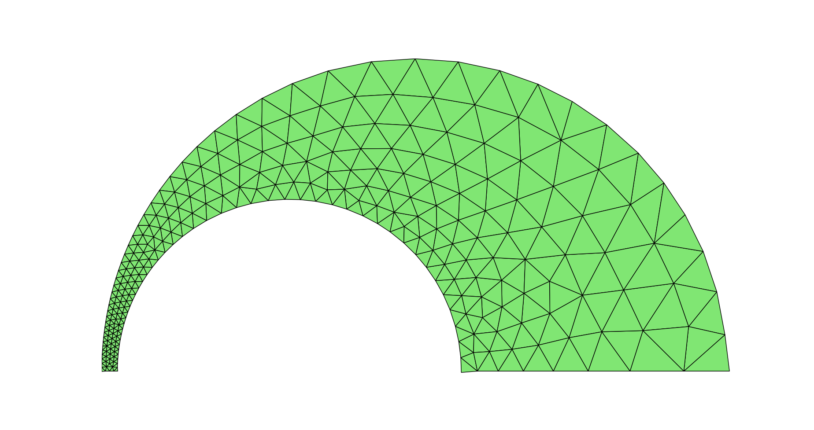 
</div>
<center style="text-decoration:underline">利用distmesh生成自适应网格</center>

# polygon_mesh

# interfacemesh2d

