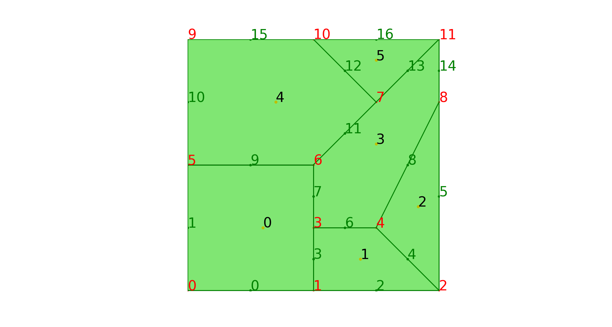

在`FEALPy`中可以通过 `PolygonMesh` 来建立二维多边形网格对象，只需要给出节点 `node` 和单元 `cell`，单元偏移量`cellLocation`， 如下面代码所示。

```python                                                                       
import numpy as np                                                          
import matplotlib.pyplot as plt
from fealpy.mesh import PolygonMesh # 从Fealpy导入PolygonMesh                                      
node = np.array([                                                               
    (0, 0), (2, 0), (4, 0), (2, 1),
    (3, 1), (0, 2), (2, 2), (3, 3),                                             
    (4, 3), (0, 4), (2, 4), (4, 4)], dtype=np.float) #节点信息
cell = np.array(
    [0, 1, 3, 6, 5, 2, 4, 3, 1, 8, 4, 2, 11, 7, 6, 3, 4, 8, 10, 9, 5,  
    6, 7, 10, 7, 11], dtype=np.int)
    #单元信息，按逆时针方向组成单元的所有节点编号的集合
cellLocation = np.array(
    [0, 5, 9, 12, 18, 23, 26], dtype=np.int) 
    #(NC+1, )每个单元起始节点的编号，最后一个元素是cell所有元素之后加1
mesh = PolygonMesh(node, cell, cellLocation) #建立多边形网格
#画图                                                              
fig = plt.figure()                                                              
axes = fig.gca()                                                                
mesh.add_plot(axes)                                                            
mesh.find_node(axes, showindex=True, fontsize=30) #展示节点的编号
mesh.find_edge(axes, showindex=True, fontsize=30) #展示边的编号
mesh.find_cell(axes, showindex=True, fontsize=30) #展示单元的编号
plt.show()                                                                      
                                                               
```
生成的网格图像如下:

其中，`node` 给出了节点的坐标，`cell` 和 `cellLocation` 两者结合给出所有单元的数据。

在上述算例中，`cell` 存储的是构成所有网格单元的节点的编号，通过 `cellLocation` 可以得到具体的单元。
例如，`cellLocation`第一个元素为 `0` , 第一个元素为`5`，代表 `0` 号单元从 `cell` 的第`0`个元素开始，`1`号单元从 `cell`的第`5`个元素开始，故组成`0`号单元的节点是`cell`的第`0`到`4`个节点，即 `[0,1,3,6,5]`。

值得说明的是，在 `FealPy` 中，我们约定逆时针方向为正方向。

建立网格后，我们可以通过`entity`来得到边的数据:
```python                                                                       
edge = mesh.entity('edge')
print("edge:\n", edge)
```
```python
edge: #单元信息，给出构成每个边的两个点的编号，形状为(NE, 2)
 [[ 0  1] #0号边
 [ 5  0]  #1号边
 [ 1  2]  #2号边
 [ 3  1]  #3号边
 [ 2  4]  #4号边
 [ 2  8]  #5号边
 [ 4  3]  #6号边
 [ 6  3]  #7号边
 [ 8  4]  #8号边
 [ 6  5]  #9号边
 [ 9  5]  #10号边
 [ 7  6]  #11号边
 [ 7 10]  #12号边
 [11  7]  #13号边
 [ 8 11]  #14号边
 [10  9]  #15号边
 [11 10]] #16号边

```
上面边的编号和图中的编号一一对应，这些编号称为边的全局编号，除此以外，在每个单元上还有各边的局部编号，记录每个单元内各边的顺序，可以通过 `cell_to_edge` 得到。
## 网格的属性函数
```python                                                                       
NN = mesh.number_of_nodes() # 节点node个数                                  
NE = mesh.number_of_edges() # 边edge个数                                    
NC = mesh.number_of_cells() # 单元cell个数                                  
                                                                            
node = mesh.entity('node') # 节点数组，形状为(NN,2)，储存节点坐标           
edge = mesh.entity('edge') # 边数组，形状为(NE,2), 储存每条边的两个节点的编号
cell = mesh.entity('cell') # 单元数组，形状为(NC,4),储存构成四边形的四个节点编号
                                                                            
ebc = mesh.entity_barycenter('edge') # (NE,2)，储存各边的重心坐标           
cbc = mesh.entity_barycenter('cell') # (NC,2), 储存各单元的重心坐标         
                                                                            
eh = mesh.entity_measure('edge') # (NE,1), 每条边的长度                     
```

## cell 与 edge,node,cell之间的关系

- `cell2edge`判断单元和边是否相邻，相邻为`True`，否则为`False`。

```python
cell2edge = mesh.ds.cell_to_edge()                                
#(NC,NE), 稀疏矩阵，判断单元和边是否相邻，相邻为True，否则为False
print('cell2edge:\n',cell2edge)                                             
```
```python
cell2edge:
  (0, 0)	True
  (0, 1)	True
  (0, 3)	True
  (0, 7)	True
  (0, 9)	True
  (1, 2)	True
  (1, 3)	True
  (1, 4)	True
  (1, 6)	True
  (2, 4)	True
  (2, 5)	True
  (2, 8)	True
  (3, 6)	True
  (3, 7)	True
  (3, 8)	True
  (3, 11)	True
  (3, 13)	True
  (3, 14)	True
  (4, 9)	True
  (4, 10)	True
  (4, 11)	True
  (4, 12)	True
  (4, 15)	True
  (5, 12)	True
  (5, 13)	True
  (5, 16)	True
```

- `cell2node` 判断单元和节点是否相邻，相邻为`True`，否则为`False`。
```python
cell2node = mesh.ds.cell_to_node()                                          
#(NC,NN), 稀疏矩阵，判断单元和节点是否相邻，相邻为True，否则为False
print('cell2node:\n',cell2node)                                             
```
```python                                                                       
cell2node:   
  (0, 0)	True
  (0, 1)	True
  (0, 3)	True
  (0, 5)	True
  (0, 6)	True
  (1, 1)	True
  (1, 2)	True
  (1, 3)	True
  (1, 4)	True
  (2, 2)	True
  (2, 4)	True
  (2, 8)	True
  (3, 3)	True
  (3, 4)	True
  (3, 6)	True
  (3, 7)	True
  (3, 8)	True
  (3, 11)	True
  (4, 5)	True
  (4, 6)	True
  (4, 7)	True
  (4, 9)	True
  (4, 10)	True
  (5, 7)	True
  (5, 10)	True
  (5, 11)	True
```
- `cell2cell`判断单元和单元是否相邻，相邻为`True`，否则为`False`。

```python
cell2cell = mesh.ds.cell_to_cell()                            
# (NC,NC), 稀疏矩阵，判断单元和单元是否相邻，相邻为True，否则为False
print('cell2cell:\n',cell2cell)                                             
```
```python
cell2cell:                                                                      
  (0, 1)	True
  (0, 3)	True
  (0, 4)	True
  (1, 0)	True
  (1, 2)	True
  (1, 3)	True
  (2, 1)	True
  (2, 3)	True
  (3, 0)	True
  (3, 1)	True
  (3, 2)	True
  (3, 4)	True
  (3, 5)	True
  (4, 0)	True
  (4, 3)	True
  (4, 5)	True
  (5, 3)	True
  (5, 4)	True
```
## edge 与 cell,node,edge之间的关系

- `edge2cell`边与单元的邻接关系，储存与每条边相邻的两个单元的信息。 
```python                                                                       
edge2cell = mesh.ds.edge_to_cell()                                              
# (NE, 4),边与单元的邻接关系，储存与每条边相邻的两个单元的信息                  
print('edge2cell\n:',edge2cell)                                                 
```
输出为

```python
edge2cell:
 [[0 0 0 0]
 [0 0 4 4]
 [1 1 3 3]
 [0 1 1 2]
 [1 2 0 1]
 [2 2 2 2]
 [1 3 1 3]
 [0 3 2 2]
 [2 3 0 4]
 [0 4 3 2]
 [4 4 1 1]
 [3 4 1 3]
 [4 5 4 0]
 [3 5 0 1]
 [3 3 5 5]
 [4 4 0 0]
 [5 5 2 2]]
```
`edge2cell` 存储了与每条边相邻的两个单元的信息，前两项为单元的编号，后两项为该边在对应单元中的局部编号，若该边为边界边，则前两项的编号相同。
以 `0` 号边为例，因其与 `0` 号单元和无界区域相邻，故前两项均为 `0`，又因在 `0` 号单元中，其为 `0` 号边，故后两项均为 `0`；
再以 `9` 号边为例，因其与 `0` 号单元和 `4` 号单元相邻，故前两项为 `0`, `4`，又因为其在 `0` 号单元中为 `3` 号边，`4` 号单元中为 `2` 号边，故后两项为 `3`, `2`。

- `edge2node` 边与节点的邻接关系，储存每条边的两个端点的节点编号, 实际也就是构成边的两个顶点编号。 
```python                                                                       
edge2node = mesh.ds.edge_to_node()                                              
# (NE,2),边与节点的邻接关系，储存每条边的两个端点的节点编号, 实际也就是构成边的两个顶点编号             
print('edge2node:\n',edge2node)                                                 
```

```python                                                                       
edge2node:
 [[ 0  1]
 [ 5  0]
 [ 1  2]
 [ 1  3]
 [ 2  4]
 [ 2  8]
 [ 4  3]
 [ 3  6]
 [ 8  4]
 [ 6  5]
 [ 9  5]
 [ 7  6]
 [ 7 10]
 [11  7]
 [ 8 11]
 [10  9]
 [11 10]]
```
- `edge2edge` 判断两条边是否相邻，相邻为`True`,否则为`False`。 
```python                                                                       
edge2edge = mesh.ds.edge_to_edge()                           
# (NE,NE),稀疏矩阵，判断两条边是否相邻，相邻为True,否则为False                  
print('edge2edge:\n',edge2edge)                                                 
```

```python                                                                       
edge2edge:
   (0, 9)	True
  (0, 6)	True
  (0, 3)	True
  (0, 2)	True
  (0, 0)	True
  (1, 6)	True
  (1, 8)	True
  (1, 4)	True
  (1, 5)	True
  (1, 1)	True
  (2, 11)	True
  (2, 4)	True
  (2, 8)	True
  (2, 3)	True
  (2, 2)	True
  (2, 0)	True
  (3, 7)	True
  (3, 5)	True
  (3, 8)	True
  (3, 3)	True
  (3, 2)	True
  (3, 0)	True
  (4, 11)	True
  (4, 2)	True
  (4, 6)	True
  :	:
  (8, 10)	True
  (8, 7)	True
  (8, 3)	True
  (8, 2)	True
  (8, 8)	True
  (8, 4)	True
  (8, 1)	True
  (9, 11)	True
  (9, 7)	True
  (9, 9)	True
  (9, 6)	True
  (9, 0)	True
  (10, 8)	True
  (10, 7)	True
  (10, 5)	True
  (10, 11)	True
  (10, 10)	True
  (10, 6)	True
  (11, 9)	True
  (11, 7)	True
  (11, 4)	True
  (11, 2)	True
  (11, 11)	True
  (11, 10)	True
  (11, 6)	True
 
```
`edge2edge` 为稀疏矩阵，它判断两条边是否相邻，如`0`号边与`9`号边相邻，故矩阵在 
`(0,9)`处为 `True`, 而未相邻的两条边在矩阵中的对应位置均为 `False`。
## node与 node,edge,cell 间的关系
- `node2cell`判断节点是否位于某单元中，位于则对应位置为`True`，否则为`False`。

```python                                                                       
node2cell = mesh.ds.node_to_cell()                                              
# 稀疏矩阵,(NN, NC),判断节点是否位于某单元中，位于则对应位置为True，否则为False
print('node2cell:\n',node2cell)
```
```python
node2cell:
  (0, 0)	True
  (1, 0)	True
  (1, 1)	True
  (2, 1)	True
  (2, 2)	True
  (3, 0)	True
  (3, 1)	True
  (3, 3)	True
  (4, 1)	True
  (4, 2)	True
  (4, 3)	True
  (5, 0)	True
  (5, 4)	True
  (6, 0)	True
  (6, 3)	True
  (6, 4)	True
  (7, 3)	True
  (7, 4)	True
  (7, 5)	True
  (8, 2)	True
  (8, 3)	True
  (9, 4)	True
  (10, 4)	True
  (10, 5)	True
  (11, 3)	True
  (11, 5)	True
```
`node2cell` 为稀疏矩阵，与`edge2edge`原理相同，以 `0` 号点为例，可以看出，由于 `0` 号点位于`0`号单元，所以矩阵 `(0,0)` 位置为 `True`。

下面的 `node2edge` 和 `node2node` 原理也相同，故不再输出。
- `node2edge` 判断节点是否为某边的端点，若是则对应位置为`True`, 否则为`False`。

```python                                                  
node2edge = mesh.ds.node_to_edge()                          
# 稀疏矩阵，(NN,NE),判断节点是否为某边的端点，若是则对应位置为True,否则为False  
```
- `node2node` 判断两个节点是否相邻，若是则对应位置为`True`, 否则为`False`。
```python                                                                       
node2node = mesh.ds.node_to_node()                           
# 稀疏矩阵，(NN,NN),判断某两个节点是否相邻，若是则对应位置为True,否则为False    
```
## node,edge,cell 与边界的关系

- `isBdNode` 判断节点是否为边界点。

```python
isBdNode = mesh.ds.boundary_node_flag()
# (NN, ), bool，判断是否为边界点
print('isBdNode:\n',isBdNode)
```
```python
isBdNode:
[ True  True  True False False  True False False  True  True  True  True]
```
`isBdNode` 是一组逻辑数据，用来判断节点是否为边界点。
下面的 `isBdEdge` 和 `isBdCell` 原理也相同，故不再输出。

- `isBdEdge` 判断边是否为边界边。

```python
isBdEdge = mesh.ds.boundary_edge_flag()
# (NE, ), bool，判断是否为边界边
```
- `isBdCell` 判断单元是否为边界单元。
```python
isBdCell = mesh.ds.boundary_cell_flag()
# (NC, ), bool，判断是否为边界单元
```
- 计算单元面积
```python                                                                       
area = mesh.area()                                                          
print('the area of mesh:', area)                                            
```
输出依次表示了每个单元的面积
```python                                                                       
the area of mesh: [4. 1.5 1.5  3. 5. 1.]                                             
```
