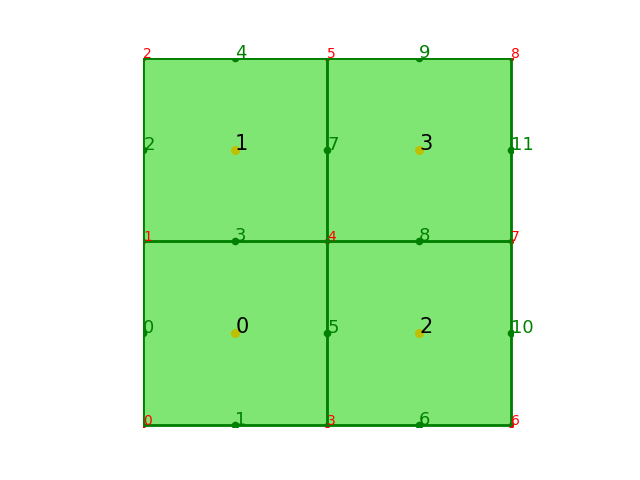
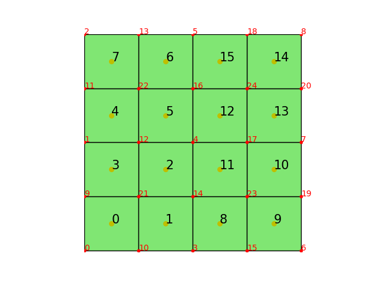
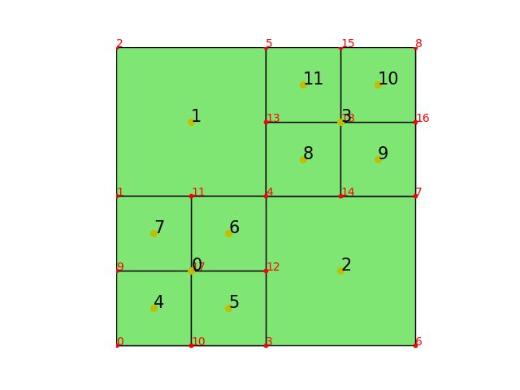
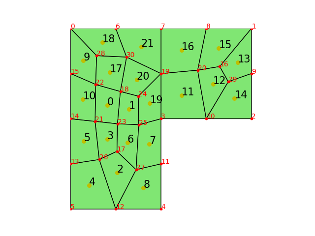

在`FealPy`中可以通过`QuadrangleMesh`、`Quadtree`来建立二维四边形网格对象，同时也可以导入`Gmsh`生成的非结构网格。值得说明的是，在 `FealPy` 中，我们约定逆时针方向为正方向。

# QuadrangleMesh                                                                
`QuadrangleMesh` 四边形网格对象的建立，只需要给出节点 `node` 和单元 `cell`，如下面代码所示   
```python                                                                       
import numpy as np                                                          
import matplotlib.pyplot as plt
from fealpy.mesh import QuadrangleMesh  # 从Fealpy导入QuadrangleMesh                                    
node = np.array([  #节点信息，给出点的坐标，形状为(NN, 2)
    (0.0, 0.0), # 0 号点                                                    
    (0.0, 1.0), # 1 号点                                                    
    (0.0, 2.0), # 2 号点                                                    
    (1.0, 0.0), # 3 号点                                                    
    (1.0, 1.0), # 4 号点                                                    
    (1.0, 2.0), # 5 号点                                                    
    (2.0, 0.0), # 6 号点                                                    
    (2.0, 1.0), # 7 号点                                                    
    (2.0, 2.0), # 8 号点                                                    
    ], dtype=np.float64)                                                    
cell = np.array([  #单元信息，给出构成每个单元的四个点的编号，形状为(NC, 4)
    (0, 3, 4, 1), # 0 号单元                                                
    (1, 4, 5, 2), # 1 号单元                                                
    (3, 6, 7, 4), # 2 号单元                                                
    (4, 7, 8, 5), # 3 号单元                                                
    ], dtype=np.int_)                                                       
                                                                            
mesh = QuadrangleMesh(node, cell)  #建立四边形网格                                         
#画图                                                              
fig = plt.figure()                                                          
axes = fig.gca()                                                            
mesh.add_plot(axes)                                                         
mesh.find_node(axes, showindex=True)#展示节点的编号                         
mesh.find_edge(axes, showindex=True)#展示边的编号                         
mesh.find_cell(axes, showindex=True)#展示单元的编号                         
plt.show()                                                                  
```
生成的网格图像如下:

其中，`node` 给出了节点的坐标，`cell` 给出了所有单元的数据。

在上述算例中，`cell` 包含 `4` 个单元，即 `[0,1,3,4]，[1,4,5,2]，[3,6,7,4]，[4,7,8,5]`， 这存储的是构成网格单元的节点的编号，`[0,1,3,4]` 是由 `0`号、`1`号、`3`号和`4`号四个节点构成的四边形网格单元。

建立网格后，我们可以通过`entity`来得到边的数据:
```python                                                                       
edge = mesh.entity('edge')
print("edge:\n", edge)
```
```python
edge: #单元信息，给出构成每个边的两个点的编号，形状为(NE, 2)
 [[1 0] #0号边
 [0 3]  #1号边
 [2 1]  #2号边
 [4 1]  #3号边
 [5 2]  #4号边
 [3 4]  #5号边
 [3 6]  #6号边
 [4 5]  #7号边
 [7 4]  #8号边
 [8 5]  #9号边
 [6 7]  #10号边
 [7 8]] #11号边

```
上面边的编号和图中的编号一一对应，这些编号称为边的全局编号，除此以外，在每个单元上还有各边的局部编号，记录每个单元内各边的顺序，可以通过网格类 `Mesh2dDataStructure` 中的函数 `cell_to_edge` 得到。
## 网格的一些属性函数
```python                                                                       
NN = mesh.number_of_nodes() # 节点node个数                                  
NE = mesh.number_of_edges() # 边edge个数                                    
NC = mesh.number_of_cells() # 单元cell个数                                  
                                                                            
node = mesh.entity('node') # 节点数组，形状为(NN,2)，储存节点坐标           
edge = mesh.entity('edge') # 边数组，形状为(NE,2), 储存每条边的两个节点的编号
cell = mesh.entity('cell') # 单元数组，形状为(NC,4),储存构成四边形的四个节点编号
                                                                            
ebc = mesh.entity_barycenter('edge') # (NE,2)，储存各边的重心坐标           
cbc = mesh.entity_barycenter('cell') # (NC,2), 储存各单元的重心坐标         
                                                                            
eh = mesh.entity_measure('edge') # (NE,1), 每条边的长度                     
```

## cell 与 edge,node,cell之间的关系

- `cell2edge`单元和边的邻接关系，储存每个单元相邻的4个边的编号，实际也为构成四边形四条边的编号。

```python
cell2edge = mesh.ds.cell_to_edge()                                
#(NC,4),单元和边的邻接关系，储存每个单元相邻的4个边的编号，实际也为构成四边形四条边的编号
print('cell2edge:\n',cell2edge)                                             
```
```python
cell2edge:                                                                      
 [[ 1  5  3  0]                                                                 
 [ 3  7  4  2]                                                                  
 [ 6 10  8  5]                                                                  
 [ 8 11  9  7]]      
```
通过 `cell2edge` 可以看出，对于`0`号单元，`1`号边为它的`0`号边，`5`号边为它的`1`号边，`3`
号边为它的`2`号边，`0`号边为它的`3`号边，这就是它们的局部编号。

- `cell2node`单元和节点的邻接关系，储存每个单元相邻的4个节点编号，实际也就是构成四边形单元的四个顶点编号。

```python
cell2node = mesh.ds.cell_to_node()                                          
#(NC,4),单元和节点的邻接关系，储存每个单元相邻的4个节点编号，实际也就是构成四边形单元的四个顶点编号
print('cell2node:\n',cell2node)                                             
```
```python                                                                       
cell2node:                                                                      
 [[0 3 4 1]                                                                     
 [1 4 5 2]                                                                      
 [3 6 7 4]                                                                      
 [4 7 8 5]]                                                                     
```
- `cell2cell`, 单元和单元的邻接关系，储存每个单元相邻的单元编号 。

```python
cell2cell = mesh.ds.cell_to_cell() # (NC, 4)                                
# (NC,4),单元和单元的邻接关系，储存每个单元相邻的单元编号                   
print('cell2cell:\n',cell2cell)                                             
```
```python
cell2cell:                                                                      
 [[0 2 1 0]                                                                     
 [0 3 1 1]                                                                      
 [2 2 3 0]                                                                      
 [2 3 3 1]]       
```
需要说明，`cell2cell` 存储的是该单元四条边相邻的单元编号，当相邻单元为无界区域时，存储的编号为该单元本身的编号。
例如 `0`号单元边的四条边是 `[1 5 3 0]`，其 `1` 号边与无界区域相邻，故 `cell2cell` 中储存本身单元编号 `0`，而 `5` 号边与 `2` 号单元相邻，故储存的单元编号为 `2`，`3` 号边与 `1` 号单元相邻，故储存的单元编号为 `1`，`0` 号边与无界区域相邻，故 `cell2cell` 中储存本身单元编号 `0`，所以 `0` 号单元的 `cell2cell` 是 `[0 2 1 0]`。

## edge 与 cell,node,edge之间的关系

- `edge2cell`边与单元的邻接关系，储存与每条边相邻的两个单元的信息。

```python                                                                       
edge2cell = mesh.ds.edge_to_cell()                                              
# (NE, 4),边与单元的邻接关系，储存与每条边相邻的两个单元的信息                  
print('edge2cell\n:',edge2cell)                                                 
```
输出为

```python
edge2cell:
 [[0 0 3 3]
 [0 0 0 0]
 [1 1 3 3]
 [0 1 2 0]
 [1 1 2 2]
 [0 2 1 3]
 [2 2 0 0]
 [1 3 1 3]
 [2 3 2 0]
 [3 3 2 2]
 [2 2 1 1]
 [3 3 1 1]]
```
`edge2cell` 存储了与每条边相邻的两个单元的信息，前两项为单元的编号，后两项为该边在对应单元中的局部编号，若该边为边界边，则前两项的编号相同。
以 `0` 号边为例，因其与 `0` 号单元和无界区域相邻，故前两项均为 `0`，又因在 `0` 号单元中，其为 `3` 号边，故后两项均为 `3`；
再以 `3` 号边为例，因其与 `0` 号单元和 `1` 号单元相邻，故前两项为 `0`,`1`，又因为其在 `0` 号单元中为 `2` 号边，`1` 号单元中为 `0` 号边，故后两项为 `2,0`。

- `edge2node`边与节点的邻接关系，储存每条边的两个端点的节点编号, 实际也就是构成边的两个顶点编号。

```python                                                                       
edge2node = mesh.ds.edge_to_node()                                              
# (NE,2),边与节点的邻接关系，储存每条边的两个端点的节点编号, 实际也就是构成边的两个顶点编号             
print('edge2node:\n',edge2node)                                                 
```

```python                                                                       
edge2node:
 [[1 0]
 [0 3]
 [2 1]
 [4 1]
 [5 2]
 [3 4]
 [3 6]
 [4 5]
 [7 4]
 [8 5]
 [6 7]
 [7 8]]
```

- `edge2edge `稀疏矩阵，判断两条边是否相邻，相邻为`True`，否则为`False`。

```python                                                                       
edge2edge = mesh.ds.edge_to_edge()                           
# (NE,NE),稀疏矩阵，判断两条边是否相邻，相邻为True,否则为False                  
print('edge2edge:\n',edge2edge)                                                 
```

```python                                                                       
edge2edge:
 (0, 3)	True
 (0, 2)	True
 (0, 1)	True
 (0, 0)	True
 (1, 6)	True
 (1, 5)	True
 (1, 1)	True
 (1, 0)	True
 (2, 4)	True
 (2, 3)	True
 (2, 2)	True
 (2, 0)	True
 (3, 8)	True
 (3, 7)	True
 (3, 5)	True
 (3, 3)	True
 (3, 2)	True
 (3, 0)	True
 (4, 9)	True
 (4, 7)	True
 (4, 4)	True
 (4, 2)	True
 (5, 8)	True
 (5, 7)	True
 (5, 3)	True
 :	:
 (6, 1)	True
 (7, 9)	True
 (7, 4)	True
 (7, 8)	True
 (7, 7)	True
 (7, 5)	True
 (7, 3)	True
 (8, 11) True
 (8, 10) True
 (8, 8)	True
 (8, 7)	True
 (8, 5)	True
 (8, 3)	True
 (9, 11) True
 (9, 9)	True
 (9, 7)	True
 (9, 4)	True
 (10, 11) True
 (10, 8) True
 (10, 10) True
 (10, 6) True
 (11, 9) True
 (11, 11) True
 (11, 10) True
 (11, 8) True   
```
`edge2edge`为稀疏矩阵，它判断两条边是否相邻，如`0`号边与`3`号边相邻，故矩阵在 
`(0,3)`处为 `True`, 而未相邻的两条边在矩阵中的对应位置均为 `False`。
## node与 node,edge,cell 间的关系                                               

- `node2cell` 判断节点是否位于某单元中，位于则对应位置为`True`，否则为`False`。

```python                                                                       
node2cell = mesh.ds.node_to_cell()                                              
# 稀疏矩阵,(NN, NC),判断节点是否位于某单元中，位于则对应位置为True，否则为False
print('node2cell:\n',node2cell)
```
```python
node2cell:
  (0, 0)	True
  (1, 0)	True
  (1, 1)	True
  (2, 1)	True
  (3, 0)	True
  (3, 2)	True
  (4, 0)	True
  (4, 1)	True
  (4, 2)	True
  (4, 3)	True
  (5, 1)	True
  (5, 3)	True
  (6, 2)	True
  (7, 2)	True
  (7, 3)	True
  (8, 3)	True

```
`node2cell` 为稀疏矩阵，与`edge2edge`原理相同，以 `0` 号点为例，可以看出，由于 `0` 号点位于`0`号单元，所以矩阵 `(0,0)` 位置为 `True`。

下面的 `node2edge` 和 `node2node` 原理也相同，故不再输出。

- `node2dege`判断节点是否为某边的端点，若是则对应位置为`True，`否则为`False`。

```python                                                  
node2edge = mesh.ds.node_to_edge()                          
# 稀疏矩阵，(NN,NE),判断节点是否为某边的端点，若是则对应位置为True,否则为False  
```
- `node2node` 判断某两个节点是否相邻，若是则对应位置为`True，`否则为`False`。

```python                                                                       
node2node = mesh.ds.node_to_node()                           
# 稀疏矩阵，(NN,NN),判断某两个节点是否相邻，若是则对应位置为True,否则为False    
```
## node,edge,cell 与边界的关系

- `isBdNode`判断是否为边界点。

```python
isBdNode = mesh.ds.boundary_node_flag()
# (NN, ), bool，判断是否为边界点
print('isBdNode:\n',isBdNode)
```
```python
isBdNode:
 [ True  True  True  True False  True  True  True  True]
```
`isBdNode` 是一组逻辑数据，用来判断节点是否为边界点，这里只有 `4` 号点不是边界点，所以为 `False`。
下面的 `isBdEdge` 和 `isBdCell` 原理也相同，故不再输出。

- `isBdEdge`判断边是否为边界边。
```python
isBdEdge = mesh.ds.boundary_edge_flag()
```

- `isBdCell`判断单元是否为边界单元。
```python
# (NE, ), bool，判断是否为边界边
isBdCell = mesh.ds.boundary_cell_flag()
# (NC, ), bool，判断是否为边界单元
```
- 计算单元面积
```python                                                                       
area = mesh.area()                                                          
print('the area of mesh:', area)                                            
```
输出依次表示了每个单元的面积
```python                                                                       
the area of mesh: [1. 1. 1. 1.]                                             
```

- 一致加密网格
```python                                                                       
mesh.uniform_refine()                                                        
```
一致加密是指每一个网格单元分割成同等大小的四个四边形小网格，一致加密一次的网格如下: 

# Quadtree                                                                      
`Quadtree` 是四叉树网格结构，我们可以通过`FealPy`来建立这样一个网格对象，与 `QuadrangleMesh` 不同的是数据结构不同更有利于做网格自适应。
四叉树索引的基本思想是将地理空间递归划分为不同层次的树结构。它将已知范围的空间等分成四个相等的子空间，如此递归下去，直至树的层次达到一定深度或者满足某种要求后停止分割。
 
这里 `A`、`B`、`C`、`D` 四个单元作为基础单元，对 `A` 单元进行加密得到 `E`、`F` 、`G`、`H` 单元，则 `E`、`F`、`G`、`H` 单元是 `A` 单元的叶子单元，进一步对 `H` 单元一分为四得到 `I`、`J`、`K`、`L` 四个单元，这样 `H`单元就是 `I`、`J`、`K`、`L` 单元的父单元，`I`、`J`、`K`、`L` 单元是 `H` 单元的叶子单元，依次递进。

因为 `Quadtree` 网格更适用于加密，所以这里给出 `Quadtree` 在 `FealPy` 中的加密示例，首先我们通过`Quadrangle` 网格的 `node` 和 `cell`来建立一个初始网格。
```python                                                                       
from fealpy.mesh import Quadtree
Quadtree = Quadtree(node,cell)   #建立 Quadtree 网格对象
isMarkedCell = [True,False,False,True] #标记需要加密的单元， 逻辑数组表示标记0号和3号单元
Quadtree.refine_1(isMarkedCell=isMarkedCell) # 加密标记单元                             
```
 
`Quadtree` 的基础属性函数和 `Quadrangle` 网格属性函数一致。         

# 非结构网格                                                                    

我们可以利用 `Gmsh` 构造各种网格来导入`FealPy`中，具体如下:                       
```python                                                                       
import meshio                                                               
from fealpy.mesh import QuadrangleMesh                                      
mesh = meshio.read(filename) # filename格式为*.msh, 读取gmsh文件                         
node = mesh.points                                                          
node = node[:,0:2] # 得到节点                     
cell = mesh.cells_dict['quad'] #得到单元               
'''                                                                         
去掉多余重复的点                                                            
'''                                                                         
isUsingNode = np.zeros(node.shape[0], dtype=np.bool)
isUsingNode[cell] = True
NN = isUsingNode.sum()
idxmap = np.zeros(node.shape[0], dtype=np.int32)
idxmap[isUsingNode] = range(NN)
cell = idxmap[cell]
node = node[isUsingNode] #得到所有有效点
mesh = QuadrangleMesh(node,cell)
```

对应的网格展示如下：



