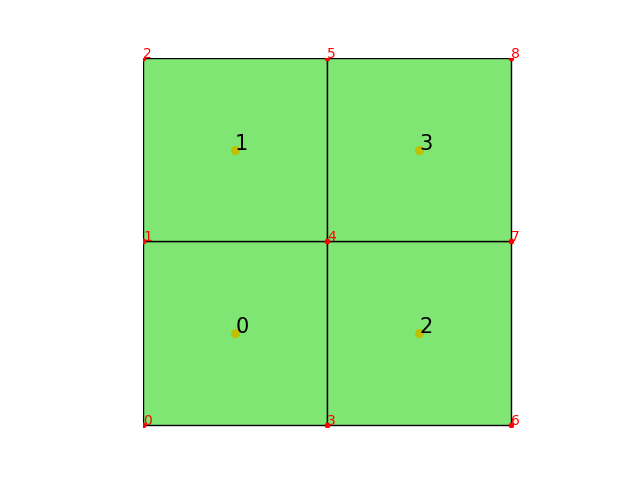

在FEALPy中可以通过QuadrangleMesh、Quadtree来生成二维四边形网格，同时也可以导入Gmsh生成的非结构网格.
# QuadrangleMesh                                                                
QuadrangleMesh 这种四边形网格结构的生成，只需要给出节点 node 和单元 cell，如下面代码所示   
```python                                                                       
    import numpy as np                                                          
    from fealpy.mesh import QuadrangleMesh                                      
    node = np.array([                                                           
        (0.0, 0.0), # 0 号点                                                    
        (0.0, 1.0), # 1 号点                                                    
        (0.0, 2.0), # 2 号点                                                    
        (1.0, 0.0), # 3 号点                                                    
        (1.0, 1.0), # 4 号点                                                    
        (1.0, 2.0), # 5 号点                                                    
        (2.0, 0.0), # 6 号点                                                    
        (2.0, 1.0), # 7 号点                                                    
        (2.0, 2.0), # 8 号点                                                    
        ], dtype=np.float64)                                                    
    cell = np.array([                                                           
        (0, 3, 4, 1), # 0 号单元                                                
        (1, 4, 5, 2), # 1 号单元                                                
        (3, 6, 7, 4), # 2 号单元                                                
        (4, 7, 8, 5), # 3 号单元                                                
        ], dtype=np.int_)                                                       
                                                                                
    mesh = QuadrangleMesh(node, cell)                                           
                                                                                
    #plot the mesh                                                              
    fig = plt.figure()                                                          
    axes = fig.gca()                                                            
    mesh.add_plot(axes)                                                         
    mesh.find_node(axes, showindex=True)#展示节点的编号                         
    mesh.find_cell(axes, showindex=True)#展示单元的编号                         
    plt.show()                                                                  
```
对应的网格如下:

其中，node 给出了节点的坐标，cell 给出了所有单元的数据。在上述算例中，cell 包含 4 个单元，
即 [0,1,3,4]，[1,4,5,2]，[3,6,7,4]，[4,7,8,5]， 这存储的是构成网格单元的节点的编号，[0,1,3,4] 是
由 node[0]，node[1]，node[3] 和 node[4] 四个节点构成的四边形网格单元。
在每个网格数据mesh下都有其对应的一些属性函数，下面一一展示
- 计算单元面积
```python                                                                       
    area = mesh.area()                                                          
    print('the area of mesh:', area)                                            
```
输出依次表示了每个单元的面积
```python                                                                       
    the area of mesh: [1. 1. 1. 1.]                                             
```
一些其他的属性
```python                                                                       
    NN = mesh.number_of_nodes() # 节点node个数                                  
    NE = mesh.number_of_edges() # 边edge个数                                    
    NC = mesh.number_of_cells() # 单元cell个数                                  
                                                                                
    node = mesh.entity('node') # 节点数组，形状为(NN,2)，储存节点坐标           
    edge = mesh.entity('edge') # 边数组，形状为(NE,2), 储存每条边的两个节点的编号
    cell = mesh.entity('cell') # 单元数组，形状为(NC,4),储存构成四边形的四个节点编号
                                                                                
    ebc = mesh.entity_barycenter('edge') # (NE,2)，储存各边的重心坐标           
    cbc = mesh.entity_barycenter('cell') # (NC,2), 储存各单元的重心坐标         
                                                                                
    area = mesh.entity_measure('cell') # (NC,1), 每个单元的面积，跟上面的area函数一致
    eh = mesh.entity_measure('edge') # (NE,1), 每条边的长度                     
```

除此以外，还可以获得node,edge,cell等实体间的关系，以如下网格单元剖分为例结合输出进行说明
 
```python                                                                       
    cell2node = mesh.ds.cell_to_node()                                          
    #(NC,4),单元和节点的邻接关系，储存每个单元相邻的4个节点编号，实际也就是构成四边形单元的四个顶点编号
    cell2edge = mesh.ds.cell_to_edge() # (NC, 4)                                
    #(NC,4),单元和边的邻接关系，储存每个单元相邻的4个边的编号，实际也为构成四边形四条边的编号
    cell2cell = mesh.ds.cell_to_cell() # (NC, 4)                                
    # (NC,4),单元和单元的邻接关系，储存每个单元相邻的单元编号                   
    print('cell2node:\n',cell2node)                                             
    print('cell2edge:\n',cell2edge)                                             
    print('cell2cell:\n',cell2cell)                                             
```
输出为
```python                                                                       
cell2node:                                                                      
 [[0 3 4 1]                                                                     
 [1 4 5 2]                                                                      
 [3 6 7 4]                                                                      
 [4 7 8 5]]                                                                     
cell2edge:                                                                      
 [[ 1  5  3  0]                                                                 
 [ 3  7  4  2]                                                                  
 [ 6 10  8  5]                                                                  
 [ 8 11  9  7]]                                                                 
cell2cell:                                                                      
 [[0 2 1 0]                                                                     
 [0 3 1 1]                                                                      
 [2 2 3 0]                                                                      
 [2 3 3 1]]       
```
需要说明，cell2cell存储的是四条边相邻的单元编号，当相邻单元为无界区域时，存储的编号为该单元本身的编号。
例如0号单元边[1 5 3 0]，其1号边与无界区域相邻，故cell2cell中储存本身单元编号0，而5号边与2号单元相邻，故储存的单元编号为2，3号边与1号单元相邻，故储存的单元编号为1，0号边与无界区域相邻，故cell2cell中储存本身单元编号0，所以0号单元的cell2cell是[0 2 1 0]。

 -edge与 node,edge,cell 间的关系
 ```python                                                                       
 edge2cell = mesh.ds.edge_to_cell()                                              
 # (NE, 4),边与单元的邻接关系，储存与每条边相邻的两个单元的信息                  
 edge2node = mesh.ds.edge_to_node()                                              
 # (NE,2),边与节点的邻接关系，储存每条边的两个端点的节点编号                     
 edge2edge = mesh.ds.edge_to_edge() # sparse, (NE, NE)                           
 # (NE,NE),稀疏矩阵，判断两条边是否相邻，相邻为True,否则为False                  
                                                                                 
 print('edge2cell\n:',edge2cell)                                                 
 print('edge2node:\n',edge2node)                                                 
 print('edge2edge:\n',edge2edge)                                                 
 
 ```
 输出为

 ```python
edge2cell:
 [[0 0 3 3]
 [0 0 0 0]
 [1 1 3 3]
 [0 1 2 0]
 [1 1 2 2]
 [0 2 1 3]
 [2 2 0 0]
 [1 3 1 3]
 [2 3 2 0]
 [3 3 2 2]
 [2 2 1 1]
 [3 3 1 1]]
edge2node:
 [[1 0]
 [0 3]
 [2 1]
 [4 1]
 [5 2]
 [3 4]
 [3 6]
 [4 5]
 [7 4]
 [8 5]
 [6 7]
 [7 8]]
edge2edge:
  (0, 3)	True
  (0, 2)	True
  (0, 1)	True
  (0, 0)	True
  (1, 6)	True
  (1, 5)	True
  (1, 1)	True
  (1, 0)	True
  (2, 4)	True
  (2, 3)	True
  (2, 2)	True
  (2, 0)	True
  (3, 8)	True
  (3, 7)	True
  (3, 5)	True
  (3, 3)	True
  (3, 2)	True
  (3, 0)	True
  (4, 9)	True
  (4, 7)	True
  (4, 4)	True
  (4, 2)	True
  (5, 8)	True
  (5, 7)	True
  (5, 3)	True
  :	:
  (6, 1)	True
  (7, 9)	True
  (7, 4)	True
  (7, 8)	True
  (7, 7)	True
  (7, 5)	True
  (7, 3)	True
  (8, 11)	True
  (8, 10)	True
  (8, 8)	True
  (8, 7)	True
  (8, 5)	True
  (8, 3)	True
  (9, 11)	True
  (9, 9)	True
  (9, 7)	True
  (9, 4)	True
  (10, 11)	True
  (10, 8)	True
  (10, 10)	True
  (10, 6)	True
  (11, 9)	True
  (11, 11)	True
  (11, 10)	True
  (11, 8)	True   
 ```
edge2cell 存储了与每条边相邻的两个单元的信息，前两项为单元的编号，后两项为
该边在对应单元中的局部编号，若该边为边界边，则前两项的编号相同。

edge2edge 为稀疏矩阵，它判断两条边是否相邻，如0号边与3号边相邻，故矩阵在 
(0,3)处为 True, 而未相邻的两条边在矩阵中的对应位置均为 False。
-node与 node,edge,cell 间的关系                                               
```python                                                                       
node2cell = mesh.ds.node_to_cell()                                              
# 稀疏矩阵,(NN, NC),判断节点是否位于某单元中，位于则对应位置为True，否则为False 
node2edge = mesh.ds.node_to_edge() # sparse, (NN, NE)                           
# 稀疏矩阵，(NN,NE),判断节点是否为某边的端点，若是则对应位置为True,否则为False  
node2node = mesh.ds.node_to_node() # sparse, (NN, NN)                           
# 稀疏矩阵，(NN,NN),判断某两个节点是否相邻，若是则对应位置为True,否则为False    
                                                                                
print('node2cell:\n',node2cell)                                                 
```
## node,edge,cell 与边界的关系
```python
isBdNode = mesh.ds.boundary_node_flag()
# (NN, ), bool，判断是否为边界点
isBdEdge = mesh.ds.boundary_edge_flag()
# (NE, ), bool，判断是否为边界边
isBdCell = mesh.ds.boundary_cell_flag()
# (NC, ), bool，判断是否为边界单元
```
- 一致加密网格
```python                                                                       
   mesh.uniform_refine()                                                        
```
    一致加密是指每一个网格单元分割成同等大小的四个四边形小网格，一致加密一次的网格如下: 
    
# Quadtree                                                                      
Quadtree 是四叉树网格结构，由 fealpy/fealpy/mesh/QuadTree.py 得，与 QuadrangleMesh 不同的是数据结构不同更有利于做网格自适应。
四叉树索引的基本思想是将地理空间递归划分为不同层次的树结构。它将已知范围的空间等分成四个相等的子空间，如此递归下去，直至树的层次达到一定深度或者满足某种要求后停止分割。
 
这里 A、B、C、D 四个单元作为基础单元，对 A 单元进行加密得到 E、F 、G、H 单元，则 E、F、G、H 单元是 A 单元的叶子单元，进一步对 H 单元一分为四得到 I、J、K、L 四个单元，这样 H 单元就是 I、J、K、L 单元的父
单元，I、J、K、L 单元是 H 单元的叶子单元，依次递进。
因为Quadtree网格更适用于加密，所以这里给出Quadtree在FealPy中的加密示例，首先我们这里给的基础网格是上面Quadrangle网格的 node 和 cell。
```python                                                                       
    from fealpy.mesh import Quadtree                                            
    Quadtree = Quadtree(node,cell)                                              
    isMarkedCell = [True,False,False,True] #逻辑语言表示加密0号和3号单元        
    Quadtree.refine_1(isMarkedCell=isMarkedCell)                                
```
 
值得注意的是Quadtree 网格的基础属性函数和 Quadrangle 网格属性函数一致。         
# 非结构网格                                                                    

我们可以利用Gmsh构造各种网格来导入fealpy中，具体流程如下:                       
```python                                                                       
    import meshio                                                               
    from fealpy.mesh import QuadrangleMesh                                      
    mesh = meshio.read(filename) # filename格式为*.msh                          
    node = mesh.points                                                          
    node = node[:,0:2] # 得到FealPy中的节点数据格式                             
    cell = mesh.cells_dict['quad'] #得到FealPy中的单元数据格式                  
    '''                                                                         
    去掉多余重复的点                                                            
    '''                                                                         
    isUsingNode = np.zeros(node.shape[0], dtype=np.bool)
    isUsingNode[cell] = True
    NN = isUsingNode.sum()
    idxmap = np.zeros(node.shape[0], dtype=np.int32)
    idxmap[isUsingNode] = range(NN)
    cell = idxmap[cell]
    node = node[isUsingNode] #得到所有有效点
    mesh = QuadrangleMesh(node,cell)
```

对应的网格展示如下：


