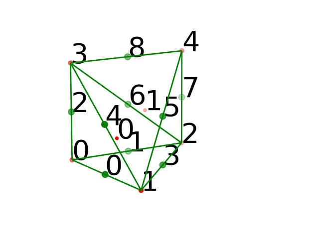
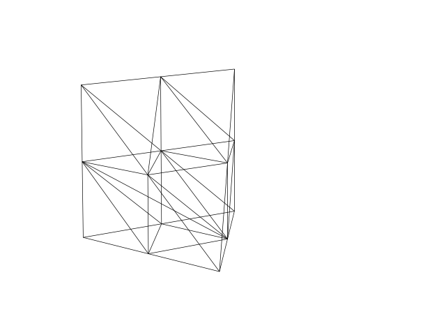

# 基本结构
在 FEALPy 中可以调用 TetrahedronMesh 来生成四面体网格，只需给出节点和单元，如下述代码所示
```python
import numpy as np
from fealpy.mesh import TetrahedronMesh

node = np.array([
    [0.0, 0.0, 0.0],
    [1.0, 0.0, 0.0],
    [0.0, 1.0, 0.0],
    [0.0, 0.0, 1.0],
    [0.0, 1.0, 1.0]], dtype=np.float) # (NN, 5)

cell = np.array([[1, 2, 0, 3], [2, 4, 3, 1]], dtype=np.int) # (NC, 3)

mesh = TetrahedronMesh(node, cell)
```

生成的网格图像为



其中，node 给出了节点的数据，cell 给出了单元的数据。在上述算例中，cell 包含两个单元，
即 [1, 2, 0, 3] 与 [2, 4, 3, 1]，存储的是构成网格单元的节点的编号，[1, 2, 0, 3] 即由 node[1], node[2], node[0]
和 node[3] 三个节点构成的三角形网格单元。

在 Fealpy 中，我们约定左手方向为正方向，对于边界边来说，左单元必须为内部单元，
而不能是外部。以上图为例，其 edge 的数据为 [[0 1], [0 2], [0 3], [1 2], [1 3],
[1 4], [2 3], [2 4], [3 4]]。


生成网格后，还可以通过 TetrahedronMesh 中的方法进行一致加密:
```python
mesh.uniform_refine(1)
```

加密一次，结果如下:



# 网格拓扑关系

生成网格后，可以访问网格的各种数据:
```python
NN = mesh.number_of_nodes() # 节点 node 个数
NE = mesh.number_of_edges() # 边 edge 个数
NF = mesh.number_of_faces() # 面 face 个数
NC = mesh.number_of_cells() # 单元 cell 个数

node = mesh.entity('node') # 节点数组，形状为 (NN,3)，储存节点坐标
edge = mesh.entity('edge') # 边数组，形状为 (NE, 2), 储存每条边的两个节点的编号
face = mesh.entity('face') # 面数组，形状为 (NF, 3), 储存构成三角形的三个节点编号
cell = mesh.entity('cell') # 单元数组，形状为 (NC,4),储存构成四边形的四个节点编号

ebc = mesh.entity_barycenter('edge') # (NE,3)，储存各边的重心坐标
fbc = mesh.entity_barycenter('face') # (NF,3)，储存各面的重心坐标
cbc = mesh.entity_barycenter('cell') # (NC,3), 储存各单元的重心坐标

area = mesh.entity_measure('cell') # (NC, 1), 每个单元的面积
face = mesh.entity_measure('face') # (NF, 1), 每个面的面积
eh = mesh.entity_measure('edge') # (NE, 1), 每条边的长度
```

除此以外，还可以获得 node, edge, cell 等实体间的关系，以如下网格单元剖分为例结合输
出进行说明


```python
cell2cell = mesh.ds.cell_to_cell() 
# (NC, 4), 单元和单元的邻接关系，储存每个单元相邻的单元编号
cell2face = mesh.ds.cell_to_face()
# (NC, 4), 单元和面的邻接关系，储存每个单元相邻的四个面编号，实际也就是构成三角形单元的三个顶点编号
cell2edge = mesh.ds.cell_to_edge()
# (NC, 6), 单元和边的邻接关系，储存每个单元相邻的三个边的编号，实际也为构成三角形三条边的编号
cell2node = mesh.ds.cell_to_node() # cell
# (NC, 4), 单元和单元的邻接关系，储存每个单元相邻的三个节点编号，实际也就是构成三角形单元的三个顶点编号
print('cell2cell:\n', cell2cell)
print('cell2face:\n', cell2face)
print('cell2edge:\n', cell2edge)
print('cell2node:\n', cell2node)
```
输出为
```python
cell2cell:
 [[0 0 1 0]
 [1 0 1 1]]
cell2face:
 [[2 1 3 0]
 [5 3 4 6]]
cell2edge:
 [[3 0 4 1 6 2]
 [7 6 3 8 5 4]]
cell2node:
 [[1 2 0 3]
 [2 4 3 1]]
```

全局编号与局部编号及 cell2cell 的说明可以参照三角形网格中，此处不做赘述。

```python
face2cell = mesh.ds.face_to_cell()
# (NE, 4), 面与单元的邻接关系，储存与每个面相邻的两个单元的信息
face2face = mesh.ds.face_to_face()
# (NF, NF), 稀疏矩阵，判断两条面是否相邻，相邻为 True, 否则为 False
face2edge = mesh.ds.face_to_edge() # (NF, 3)
# (NF, 3), 面与边的邻接关系，储存与每个面相邻的三个边的信息
face2node = mesh.ds.face_to_node() 
# (NE, 3), 面与节点的邻接关系，储存每条面的三个节点的节点编号
print('face2cell:\n', face2cell)
print('face2face:\n', face2face)
print("face2edge:\n", face2edge)
print('face2node:\n', face2node)
```
输出为
```python
face2cell:
 [[0 0 3 3]
 [0 0 1 1]
 [0 0 0 0]
 [0 1 2 1]
 [1 1 2 2]
 [1 1 0 0]
 [1 1 3 3]]
face2face:
   (0, 4)	True
  (0, 3)	True
  (0, 2)	True
  (0, 1)	True
  (0, 0)	True
  (1, 5)	True
  (1, 3)	True
  (1, 2)	True
  (1, 1)	True
  (1, 0)	True
  (2, 6)	True
  (2, 3)	True
  (2, 1)	True
  (2, 2)	True
  (2, 0)	True
  (3, 6)	True
  (3, 2)	True
  (3, 5)	True
  (3, 1)	True
  (3, 4)	True
  (3, 3)	True
  (3, 0)	True
  (4, 6)	True
  (4, 5)	True
  (4, 4)	True
  (4, 3)	True
  (4, 0)	True
  (5, 6)	True
  (5, 4)	True
  (5, 5)	True
  (5, 3)	True
  (5, 1)	True
  (6, 5)	True
  (6, 4)	True
  (6, 6)	True
  (6, 3)	True
  (6, 2)	True
face2edge:
 [[1 3 0]
 [2 0 4]
 [2 6 1]
 [6 4 3]
 [5 3 7]
 [4 5 8]
 [8 7 6]]
face2node:
 [[1 0 2]
 [1 3 0]
 [2 0 3]
 [1 2 3]
 [2 4 1]
 [4 3 1]
 [2 3 4]]
```

face2cell 存储了与每个面相邻的两个单元的信息，前两项为单元的编
号，后两项为该面在对应单元中的局部编号，若该面为边界面，则前两项的编号相同。

face2face 为稀疏矩阵，它判断两个面是否相邻，如 0 号面与 3 号面相邻，故矩阵在 (0, 3) 处为 True, 
而未相邻的两个面在矩阵中的对应位置均为 False。

```python
edge2cell = mesh.ds.edge_to_cell() # (NE, NC)
# 稀疏矩阵, (NE, NC), 判断边是否为某单元的边，位于则对应位置为 True，否则为False
edge2face = mesh.ds.edge_to_face() # (NE, NF)
# (NE, NF), 稀疏矩阵，判断边是否为某面的边，属于该面为 True, 否则为 False
edge2edge = mesh.ds.edge_to_edge() # sparse, (NE, NE)
# (NE, NE), 稀疏矩阵，判断两条边是否相邻，相邻为 True, 否则为 False
edge2node = mesh.ds.edge_to_node() # edge
# (NE, 3), 稀疏矩阵，边与节点的关系，节点为边的节点为 True, 否则为 False
print('edge2cell:\n',edge2cell)
print('edge2face:\n',edge2face)
print("edge2edge:\n",edge2edge)
print('edge2node:\n',edge2face)
```

输出为
```python
edge2cell:
   (0, 0)	True
  (1, 0)	True
  (2, 0)	True
  (3, 0)	True
  (3, 1)	True
  (4, 0)	True
  (4, 1)	True
  (5, 1)	True
  (6, 0)	True
  (6, 1)	True
  (7, 1)	True
  (8, 1)	True
edge2face:
   (0, 0)	True
  (0, 1)	True
  (1, 0)	True
  (1, 2)	True
  (2, 1)	True
  (2, 2)	True
  (3, 0)	True
  (3, 3)	True
  (3, 4)	True
  (4, 1)	True
  (4, 3)	True
  (4, 5)	True
  (5, 4)	True
  (5, 5)	True
  (6, 2)	True
  (6, 3)	True
  (6, 6)	True
  (7, 4)	True
  (7, 6)	True
  (8, 5)	True
  (8, 6)	True
edge2edge:
   (0, 5)	True
  (0, 4)	True
  (0, 3)	True
  (0, 2)	True
  (0, 1)	True
  (0, 0)	True
  (1, 7)	True
  (1, 6)	True
  (1, 3)	True
  (1, 2)	True
  (1, 1)	True
  (1, 0)	True
  (2, 8)	True
  (2, 6)	True
  (2, 4)	True
  (2, 2)	True
  (2, 1)	True
  (2, 0)	True
  (3, 7)	True
  (3, 6)	True
  (3, 1)	True
  (3, 5)	True
  (3, 4)	True
  (3, 3)	True
  (3, 0)	True
  :	:
  (5, 8)	True
  (5, 7)	True
  (5, 5)	True
  (5, 4)	True
  (5, 3)	True
  (5, 0)	True
  (6, 8)	True
  (6, 4)	True
  (6, 2)	True
  (6, 7)	True
  (6, 6)	True
  (6, 3)	True
  (6, 1)	True
  (7, 8)	True
  (7, 5)	True
  (7, 7)	True
  (7, 6)	True
  (7, 3)	True
  (7, 1)	True
  (8, 7)	True
  (8, 5)	True
  (8, 8)	True
  (8, 6)	True
  (8, 4)	True
  (8, 2)	True
edge2node:
   (0, 0)	True
  (0, 1)	True
  (1, 0)	True
  (1, 2)	True
  (2, 1)	True
  (2, 2)	True
  (3, 0)	True
  (3, 3)	True
  (3, 4)	True
  (4, 1)	True
  (4, 3)	True
  (4, 5)	True
  (5, 4)	True
  (5, 5)	True
  (6, 2)	True
  (6, 3)	True
  (6, 6)	True
  (7, 4)	True
  (7, 6)	True
  (8, 5)	True
  (8, 6)	True
```

```python
node2cell = mesh.ds.node_to_cell() # sparse, (NN, NC)
# 稀疏矩阵,(NN, NC),判断节点是否为某单元的端点，位于则对应位置为 True，否则为 False
node2face = mesh.ds.node_to_face() # sparse, (NN, NF)
# 稀疏矩阵,(NN, NC), 判断节点是否为某面的端点，位于则对应位置为 True，否则为 False
node2edge = mesh.ds.node_to_edge() # sparse, (NN, NE)
# 稀疏矩阵，(NN, NE), 判断节点是否为某边的端点，若是则对应位置为 True,否则为 False
node2node = mesh.ds.node_to_node() # sparse, (NN, NN)
# 稀疏矩阵，(NN, NN), 判断某两个节点是否相邻，若是则对应位置为 True,否则为 False

print('node2cell:\n',node2cell)
print('node2face:\n',node2face)
print('node2edge:\n',node2edge)
print("node2node:\n",node2node)
```
输出为
```python
node2cell:
   (0, 0)	True
  (1, 0)	True
  (1, 1)	True
  (2, 0)	True
  (2, 1)	True
  (3, 0)	True
  (3, 1)	True
  (4, 1)	True
node2face:
   (0, 0)	True
  (0, 1)	True
  (0, 2)	True
  (1, 0)	True
  (1, 1)	True
  (1, 3)	True
  (1, 4)	True
  (1, 5)	True
  (2, 0)	True
  (2, 2)	True
  (2, 3)	True
  (2, 4)	True
  (2, 6)	True
  (3, 1)	True
  (3, 2)	True
  (3, 3)	True
  (3, 5)	True
  (3, 6)	True
  (4, 4)	True
  (4, 5)	True
  (4, 6)	True
node2edge:
   (0, 0)	True
  (0, 1)	True
  (0, 2)	True
  (1, 0)	True
  (1, 3)	True
  (1, 4)	True
  (1, 5)	True
  (2, 1)	True
  (2, 3)	True
  (2, 6)	True
  (2, 7)	True
  (3, 2)	True
  (3, 4)	True
  (3, 6)	True
  (3, 8)	True
  (4, 5)	True
  (4, 7)	True
  (4, 8)	True
node2node:
   (0, 1)	True
  (0, 2)	True
  (0, 3)	True
  (1, 0)	True
  (1, 2)	True
  (1, 3)	True
  (1, 4)	True
  (2, 0)	True
  (2, 1)	True
  (2, 3)	True
  (2, 4)	True
  (3, 0)	True
  (3, 1)	True
  (3, 2)	True
  (3, 4)	True
  (4, 1)	True
  (4, 2)	True
  (4, 3)	True
```

```python
isBdNode = mesh.ds.boundary_node_flag() # (NN, ), bool
# (NN, ), bool，判断是否为边界点
isBdEdge = mesh.ds.boundary_edge_flag() # (NE, ), bool
# (NE, ), bool，判断是否为边界边
isBdFace = mesh.ds.boundary_face_flag() # (NC, ), bool
# (NF, ), bool，判断是否为边界面
isBdCell = mesh.ds.boundary_cell_flag() # (NC, ), bool
# (NC, ), bool，判断是否为边界单元

```

