## 基本结构
$\quad$在 FEALPy 中可以通过 TriangleMesh 来建立三角形网格对象，
只需给出节点数组 `node` 和单元数组 `cell`，如下述代码所示

```python
import numpy as np
from fealpy.mesh import TriangleMesh # 从Fealpy导入TriangleMesh

node = np.array([
    [0.0, 0.0],
    [1.0, 0.0],
    [1.0, 1.0],
    [0.0, 1.0]], dtype=np.float64) # 节点信息，给出点的坐标，形状为(NN, 2)

cell = np.array([
            [1, 2, 0], 
            [3, 0, 2]], dtype=np.int_) 
            #单元信息，给出构成每个单元的三个点的编号，形状为(NC, 3)，

mesh = TriangleMesh(node, cell) #建立三角形网格

# 画图
fig = plt.figure()
axes = fig.gca()
mesh.add_plot(axes)
mesh.find_node(axes,showindex=True,fontsize=40)
mesh.find_edge(axes, showindex=True,fontsize=40)
mesh.find_cell(axes, showindex=True,fontsize=40)
plt.show()
```

生成的网格图像为


$\quad$如代码所示，`node` 给出了节点的数据，`cell` 给出了单元的数据。
在上述算例中，`cell` 包含两个单元，即[1,2,0]与[3,0,2]，
存储的是构成网格单元的节点的编号，
[1,2,0]即由第 1 个节点，第 2 个节点和第 0 个节点三个节点构成的三角形网格单元。

$\quad$建立网格后，我们可以通过 `entity` 来得到边的数据:
```python
edge = mesh.entity('edge')
print(edge)
```
```python
edge:
 [[0 1]
 [2 0]
 [3 0]
 [1 2]
 [2 3]]
```
$\quad$`edge` 存储构成每条边的两个节点的编号。
另外，我们从图中也可以看出各边的编号，这些编号称为边的全局编号，
除此以外，在每个单元上还有各边的局部编号，记录每个单元内各边的顺序，
可以通过 `cell2edge` 或 `edge2cell` 来得知它。

$\quad$在 Fealpy 中，我们约定左手方向为正方向
，对于边界边来说，则要求左单元为内部单元，而不能是外部。
以0号边为例，想象你站在 0 号边，背朝 0 号点，面朝 1 号点，此时，你的左手边就是左单元，
同时也是内部区域，而右手边为外部区域。这样约定的好处在于，可以明确边界边的法线方向。
对于内部边，由于左右两侧都是内部单元，因此对边的方向一般也没有特殊要求。

$\quad$生成网格后，还可以通过 TriangMesh 中的方法进行一致加密:
```python
mesh.uniform_refine(1)
```

加密一次，结果如下:

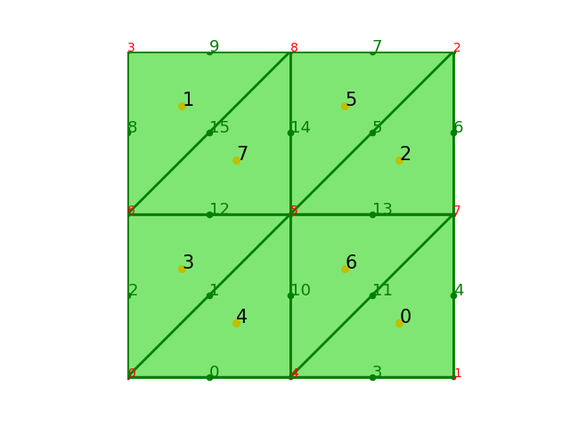

# 网格拓扑关系

$\quad$生成网格后，可以访问网格的各种数据:
```python
NN = mesh.number_of_nodes() # 节点node个数
NE = mesh.number_of_edges() # 边edge个数
NC = mesh.number_of_cells() # 单元cell个数

node = mesh.entity('node') # 节点数组，形状为(NN,2)，储存节点坐标
edge = mesh.entity('edge') # 边数组，形状为(NE,2), 储存每条边的两个节点的编号
cell = mesh.entity('cell') # 单元数组，形状为(NC,3),储存构成三角形的三个节点编号

ebc = mesh.entity_barycenter('edge') # (NE,2)，储存各边的重心坐标
cbc = mesh.entity_barycenter('cell') # (NC,2), 储存各单元的重心坐标

area = mesh.entity_measure('cell') # (NC,1), 每个单元的面积
eh = mesh.entity_measure('edge') # (NE,1), 每条边的长度
```

除此以外，还可以获得 `node`,`edge`,`cell` 等实体间的关系，
以如下网格单元剖分为例结合输出进行说明
## cell 与 node,edge,cell 间的关系


### cell 与 node 间的关系
```python
cell2node = mesh.ds.cell_to_node()
#(NC,3),单元和节点的邻接关系，储存每个单元相邻的三个节点编号，实际也就是构成三角形单元的三个顶点编号
print('cell2node:\n',cell2node)
```
```python
cell2node:
 [[1 2 0]
 [3 0 2]]
```
### cell 与 edge 间的关系
```python
cell2edge = mesh.ds.cell_to_edge() # (NC, 3)
#(NC,3),单元和边的邻接关系，储存每个单元相邻的三个边的编号，实际也为构成三角形三条边的编号
print('cell2edge:\n',cell2edge)
```
```python
cell2edge:
 [[1 0 3]
 [1 4 2]]
```
$\quad$通过 `cell2edge` 可以看出，对于 0 号单元，1 号边为它的 0 号边，
0 号边为它的1号边，3 号边为它的 2 号边，这就是它们的局部编号。

### cell 与 cell 间的关系
```python
cell2cell = mesh.ds.cell_to_cell() # (NC, 3)
# (NC,3),单元和单元的邻接关系，储存每个单元相邻的单元编号
print('cell2cell:\n',cell2cell)
```
```python
cell2cell:
 [[1 0 0]
 [0 1 1]]
```

$\quad$`cell2cell` 存储的是三条边相邻的单元编号，当相邻单元为无界区域时，
存储的编号为该单元本身的编号。例如 0 号单元，其 0 号边与 1 号单元相邻，故 `cell2cell` 中储
存其单元编号 1，而 1,2 号边均与无界区域相邻，故储存的单元编号为其本身，即 0。

## edge 与 node,edge,cell 间的关系

### edge 与 cell 间的关系
```python
edge2cell = mesh.ds.edge_to_cell() 
# (NE, 4),边与单元的邻接关系，储存与每条边相邻的两个单元的信息
print('edge2cell\n:',edge2cell)
```
```python
edge2cell:
 [[0 0 1 1],[0 1 0 0],[1 1 2 2],[0 0 2 2],[1 1 1 1]]
```
$\quad$`edge2cell` 存储了与每条边相邻的两个单元的信息，前两项为单元的编号，
后两项为该边在对应单元中的局部编号，若该边为边界边，则前两项的编号相同。
以 0 号边为例，因其与 0 号单元和无界区域相邻，故前两项均为 0，
又因在 0 号单元中，其为 1 号边，故后两项均为 1；再以 1 号边为例，
因其与 0 号单元和 1 号单元相邻，故前两项为 0,1，
又其在 0 号单元和 1 号单元中均为 0 号边，故后两项均为 0。

### edge 与 node 间的关系
```python
edge2node = mesh.ds.edge_to_node() 
# (NE,2),边与节点的邻接关系，储存每条边的两个端点的节点编号
print('edge2node:\n',edge2node)
```
```python
edge2node:
 [[0 1],[2 0],[3 0],[1 2],[2 3]]
```

### edge 与 edge 间的关系
```python
edge2edge = mesh.ds.edge_to_edge() # sparse, (NE, NE)
# (NE,NE),稀疏矩阵，判断两条边是否相邻，相邻为True,否则为False
print('edge2edge:\n',edge2edge)
```
```python
edge2edge:
  (0, 3)	True
  (0, 2)	True
  (0, 1)	True
  (0, 0)	True
  (1, 4)	True
  (1, 3)	True
  (1, 2)	True
  (1, 1)	True
  (1, 0)	True
  (2, 4)	True
  (2, 2)	True
  (2, 1)	True
  (2, 0)	True
  (3, 4)	True
  (3, 1)	True
  (3, 3)	True
  (3, 0)	True
  (4, 2)	True
  (4, 4)	True
  (4, 3)	True
  (4, 1)	True
```
$\quad$`edge2edge` 为稀疏矩阵，它判断两条边是否相邻，如 0 号边与3号边相邻，
故矩阵在 (0,3) 处为 `True`, 而未相邻的两条边在矩阵中的对应位置均为 `False`。
## node与 node,edge,cell 间的关系

### node 与 cell 间的关系
```python
node2cell = mesh.ds.node_to_cell() 
# 稀疏矩阵,(NN, NC),判断节点是否位于某单元中，位于则对应位置为True，否则为False
print('node2cell:\n',node2cell)
```
```python
node2cell:
  (0, 0)	True
  (0, 1)	True
  (1, 0)	True
  (2, 0)	True
  (2, 1)	True
  (3, 1)	True
```
$\quad$`node2cell` 为稀疏矩阵，与 `edge2edge` 原理相同，以 0 号点为例，
可以看出，由于 0 号点既位于 0 号单元，又位于 1 号单元，
故在矩阵中，(0,0),(0,1)均为 `True`。
下面的 `node2edge`和 `node2node` 原理也相同，故不再输出。

### node 与 edge 间的关系
```python
node2edge = mesh.ds.node_to_edge() # sparse, (NN, NE)
# 稀疏矩阵，(NN,NE),判断节点是否为某边的端点，若是则对应位置为True,否则为False
```

### node 与 node 间的关系
```python
node2node = mesh.ds.node_to_node() # sparse, (NN, NN)
# 稀疏矩阵，(NN,NN),判断某两个节点是否相邻，若是则对应位置为True,否则为False

```

## node,edge,cell 与边界的关系
```python
isBdNode = mesh.ds.boundary_node_flag()
# (NN, ), bool，判断是否为边界点
isBdEdge = mesh.ds.boundary_edge_flag()
# (NE, ), bool，判断是否为边界边
isBdCell = mesh.ds.boundary_cell_flag()
# (NC, ), bool，判断是否为边界单元
```

## 重心坐标函数

$\quad$三角形网格为单纯形网格，对于单纯形网格，存在重心坐标的表示方式，这里的重心坐标
不是某一网格单元重心的坐标，而是一种坐标的定义方式。

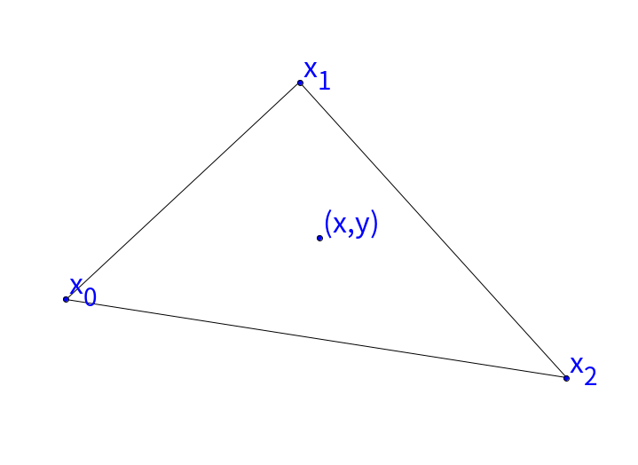

$\quad$给定三角形的三个顶点的坐标
$
\boldsymbol{x_0}=(x_0,y_0),
\boldsymbol{x_1}=(x_1,y_1),
\boldsymbol{x_2}=(x_2,y_2)$，
则三角形内任意一点(包含边界) $\boldsymbol{x} = (x,y)$ 
可以写成这三点坐标的线性组合形式，即 

$$
\boldsymbol{x} = 
\lambda_0\boldsymbol{x_0} + \lambda_1\boldsymbol{x_1} + \lambda_2\boldsymbol{x_2}
$$ 

且满足 

$$
\lambda_0 + \lambda_1 +\lambda_2=1
$$

以及 $\lambda_0,\lambda_1,\lambda_2$ 均大于等于 0。

满足以上三个条件，则称此时三个坐标
$\boldsymbol{x_0},\boldsymbol{x_1},\boldsymbol{x_2}$ 的权重, 
即 $\lambda_0,\lambda_1,\lambda_2$ 为点 $\boldsymbol{x}$ 的重心坐标，即为
$(\lambda_0,\lambda_1,\lambda_2)$。

$\quad$下面从几何的角度来解释

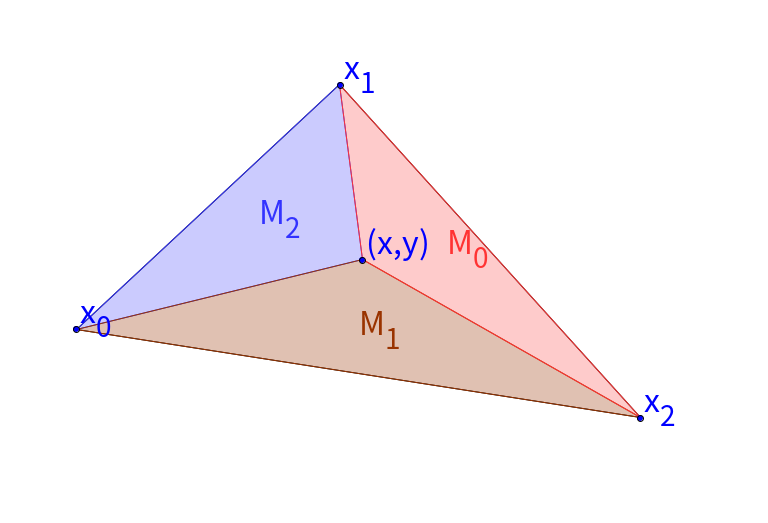

$\quad$如上图，将点 $\boldsymbol{x}$ 与 
$\boldsymbol{x_0},\boldsymbol{x_1},\boldsymbol{x_2}$ 三点相连，
构成三个三角形，面积分别为 $M_0,M_1,M_2$， 则有

$$
\begin{aligned}
  \lambda_0 &= \frac{M_0}{M_0+M_1+M_2} \\
  \lambda_1 &= \frac{M_1}{M_0+M_1+M_2} \\
  \lambda_2 &= \frac{M_2}{M_0+M_1+M_2}
\end{aligned}
$$

$\quad$显然可得，$\lambda_0,\lambda_1,\lambda_2$ 是关于 $\boldsymbol{x}$ 
的线性函数。并且，当点 $\boldsymbol{x}$ 位于三角形边界处时，
$\lambda_0,\lambda_1,\lambda_2$ 中必有一个为 0，
若点 $\boldsymbol{x}$ 位于顶点处，则 $\lambda_0,\lambda_1,\lambda_2$ 
中有两个为 0，有一个为 1。

因为 $\lambda_0, \lambda_1, \lambda_2$ 是关于 $\boldsymbol{x}$ 线性函数，
它们的梯度分别为:

$$
\begin{aligned}
\nabla\lambda_0 = \frac{1}{2|\tau|}(\boldsymbol{x_2} - \boldsymbol{x_1})\boldsymbol{W}\\
\nabla\lambda_1 = \frac{1}{2|\tau|}(\boldsymbol{x_0} - \boldsymbol{x_2})\boldsymbol{W}\\
\nabla\lambda_2 = \frac{1}{2|\tau|}(\boldsymbol{x_1} - \boldsymbol{x_0})\boldsymbol{W}\\
\end{aligned}
$$

其中

$$
\boldsymbol{W} = 
\begin{bmatrix}
0 & 1\\ -1 & 0
\end{bmatrix}
$$

注意这里的 $\boldsymbol{x_0}$,$\boldsymbol{x_1}$ 和 $\boldsymbol{x_2}$ 是行向量。

$\quad$给出三角形单元上的重心坐标函数的梯度计算代码
```python
import numpy as np
from fealpy.mesh import MeshFactory as MF
box = [0, 1, 0, 1]
mesh = MF.boxmesh2d(box, nx=1, ny=1, meshtype='tri')
NC = mesh.number_of_cells()

node = mesh.entity('node')
cell = mesh.entity('cell')
v0 = node[cell[:, 2], :] - node[cell[:, 1], :] # $x_2 - x_1$
v1 = node[cell[:, 0], :] - node[cell[:, 2], :] # $x_0 - x_2$
v2 = node[cell[:, 1], :] - node[cell[:, 0], :] # $x_1 - x_0$
nv = np.cross(v2, -v1)

Dlambda = np.zeros((NC, 3, 2), dtype=np.float64)
length = nv #
W = np.array([[0, 1], [-1, 0]], dtype=np.int_)
Dlambda[:,0,:] = v0@W/length.reshape(-1, 1)
Dlambda[:,1,:] = v1@W/length.reshape(-1, 1)
Dlambda[:,2,:] = v2@W/length.reshape(-1, 1)
```
## 三角形网格展示

$\quad$利用 TriangleMesh，可以生成在不同区域下不同类型的三角形结构网格。
```python
from fealpy.mesh import MeshFactory as mf 

mesh = mf.lshape_mesh(n=4)# L型区域下的结构三角形网格
```
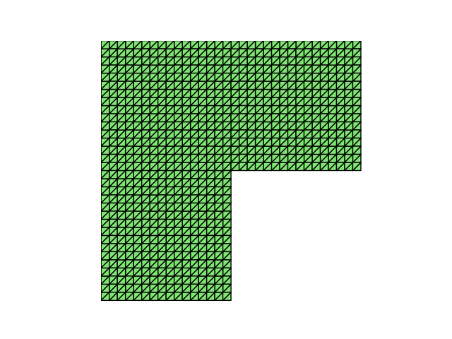

```python
box = [0,1,0,1]
mesh = mf.special_boxmesh2d(box, n=10, meshtype='fish')# 鱼型三角形网格
```

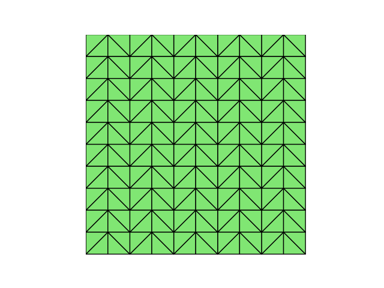

```python
box = [0,1,0,1]
mesh = mf.special_boxmesh2d(box, n=10, meshtype='rice')# 米字型三角形网格
```

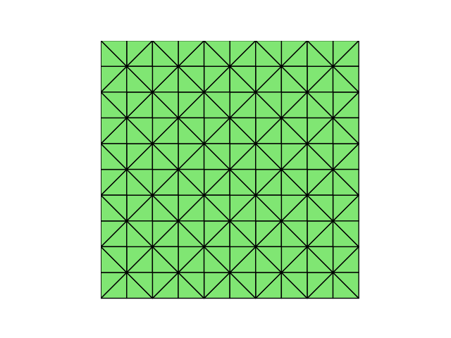


$\quad$也可以生成非结构网格
```python
mesh = mf.special_boxmesh2d(box,n=10,meshtype='nonuniform')
```


```python
mesh = mf.special_boxmesh2d(box,n=10,meshtype='nonuniform')
```


可以生成三角形网格的对偶多边形网格
```python
mesh = mf.triangle(box, h=0.1, meshtype='tri')#三角形非结构网格
mesh = mf.triangle(box, h=0.1, meshtype='poly')#三角形的对偶多边形网格
```

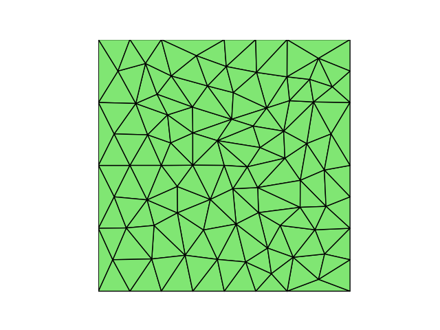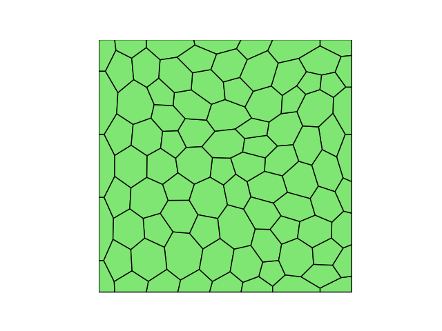  

在 MeshFactory 中可以看到这些代码的实现细节。

$\quad$除这些外，Fealpy 还实现了 Matlab 中 distmesh 工具箱中的部分功能，
可以利用distmesh算法生成非结构的三角形网格
```python
from fealpy.mesh.simple_mesh_generator import distmesh2d,unitcircledomainmesh
from fealpy.geometry import huniform
from fealpy.geometry import dcircle,drectangle,ddiff,dmin
from fealpy.geometry import DistDomain2d

from fealpy.mesh import DistMesh2d
from fealpy.mesh import PolygonMesh
from fealpy.mesh import TriangleMeshWithInfinityNode

fd = lambda p: dcircle(p,[0,0],1)
fh = huniform
bbox = [-1,1,-1,1]
domain = DistDomain2d(fd, fh, bbox)
distmesh2d = DistMesh2d(domain,h0)
distmesh2d.run()
```
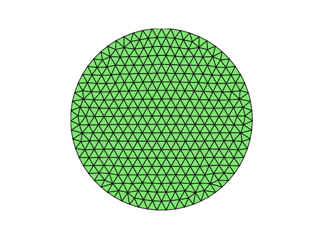

```python
fd = lambda p: ddiff(drectangle(p,[-1.0,1.0,-1.0,1.0]),dcircle(p,[0,0],0.4))
def fh(p):
    h = 4*np.sqrt(p[:,0]*p[:,0]+p[:,1]*p[:,1])-1
    h[h>2] = 2
    return h
bbox = [-1,1,-1,1]
pfix = np.array([(-1.0,-1.0),(1.0,-1.0),(1.0,-1.0),(1.0,1.0)],dtype=np.float)
domain = DistDomain2d(fd,fh,bbox,pfix)
distmesh2d = DistMesh2d(domain,h0)
distmesh2d.run()
```

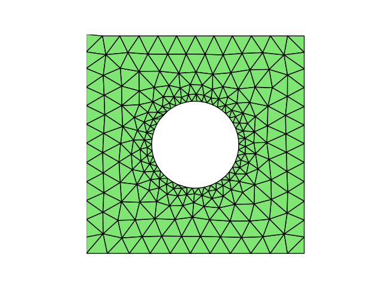

```python
fd1 = lambda p: dcircle(p,[0,0],1)
fd2 = lambda p: dcircle(p,[-0.4,0],0.55)
fd = lambda p: ddiff(ddiff(fd1(p),fd2(p)),p[:,1])
fh1 = lambda p: 0.15-0.2*fd1(p)
fh2 = lambda p: 0.06+0.2*fd2(p)
fh3 = lambda p: (fd2(p)-fd1(p))/3
fh = lambda p: dmin(dmin(fh1(p),fh2(p)),fh3(p))
bbox = [-1,1,0,1]
pfix = np.array([(-1.0,0.0),(-0.95,0.0),(0.15,0.0),(1.0,0.0)],dtype = np.float)
domain = DistDomain2d(fd,fh,bbox,pfix)
distmesh2d = DistMesh2d(domain,h0)
distmesh2d.run()
```
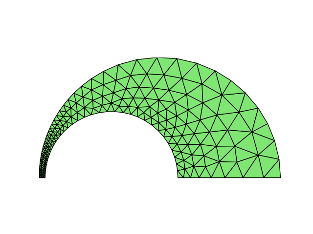

