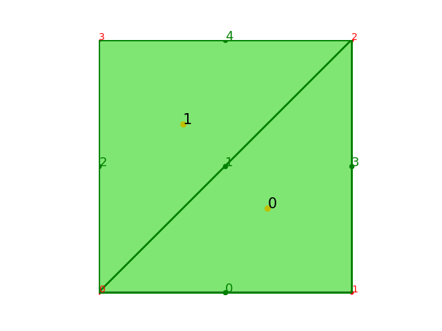
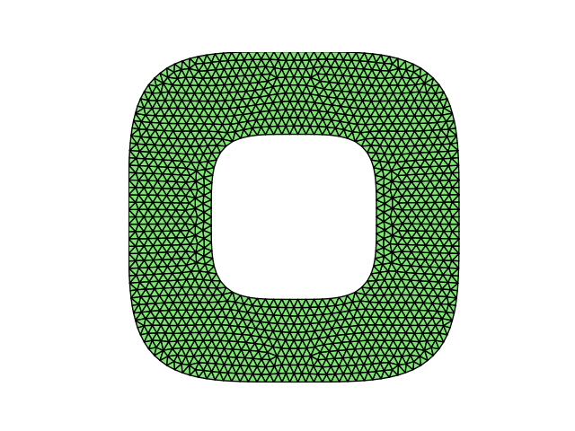

## 基本结构
$\quad$在FEALPy中可以通过TriangleMesh来生成二维三角形网格，只需给出节点和单元，如下述代码所示
```python
import numpy as np
from fealpy.mesh import TriangleMesh

node = np.array([
    [0.0, 0.0],
    [1.0, 0.0],
    [1.0, 1.0],
    [0.0, 1.0]], dtype=np.float) # (NN, 2)

cell = np.array([[1, 2, 0], [3, 0, 2]], dtype=np.int) # (NC, 3)

mesh = TriangleMesh(node, cell)
```

生成的网格图像为



$\quad$其中，node给出了节点的数据，cell给出了单元的数据。在上述算例中，cell包含两个单元，
即[1,2,0]与[3,0,2]，这存储的是构成网格单元的节点的编号，[1,2,0]即由node[1],node[2],
和node[0]三个节点构成的三角形网格单元。在FEALPy中，网格单元节点一般由逆时针方向给出，
因此给出节点的顺序为[1,2,0]，而不是[1,0,2]。

$\quad$生成网格后，可以通过TriangMesh中的方法进行一致加密:
```python
mesh.uniform_refine(1)
```

加密一次，结果如下:


## 访问数据

$\quad$生成网格后，可以访问网格的各种数据:
```python
NN = mesh.number_of_nodes() # 节点node个数
NE = mesh.number_of_edges() # 边edge个数
NC = mesh.number_of_cells() # 单元cell个数

node = mesh.entity('node') # 节点数组，形状为(NN,2)，储存节点坐标
edge = mesh.entity('edge') # 边数组，形状为(NE,2), 储存每条边的两个节点的编号
cell = mesh.entity('cell') # 单元数组，形状为(NC,3),储存构成三角形的三个节点编号

ebc = mesh.entity_barycenter('edge') # (NE,2)，储存各边的重心坐标
cbc = mesh.entity_barycenter('cell') # (NC,2), 储存各单元的重心坐标

area = mesh.entity_measure('cell') # (NC,1), 每个单元的面积
eh = mesh.entity_measure('edge') # (NE,1), 每条边的长度
```

除此以外，还可以获得node,edge,cell等实体间的关系，以如下网格单元剖分为例结合输
出进行说明


```python
cell2node = mesh.ds.cell_to_node()
#(NC,3),单元和节点的邻接关系，储存每个单元相邻的三个节点编号，实际也就是构成三角形单元的三个顶点编号
cell2edge = mesh.ds.cell_to_edge() # (NC, 3)
#(NC,3),单元和边的邻接关系，储存每个单元相邻的三个边的编号，实际也为构成三角形三条边的编号
cell2cell = mesh.ds.cell_to_cell() # (NC, 3)
# (NC,3),单元和单元的邻接关系，储存每个单元相邻的单元编号
print('cell2node:\n',cell2node)
print('cell2edge:\n',cell2edge)
print('cell2cell:\n',cell2cell)
```
输出为
```python
cell2node:
 [[1 2 0]
 [3 0 2]]
cell2edge:
 [[1 0 3]
 [1 4 2]]
cell2cell:
 [[1 0 0]
 [0 1 1]]
```
$\quad$首先需要说明全局编号与局部编号的不同。在上面的网格剖分中，共有5条边，记为0到4号边，这是它们的全局编号，
而在每个单元中，每条边又标记为0到2号边，例如，通过cell2edge可以看出，对于0号单元，1号边为它的0号边，0号边为它的
1号边，3号边为它的2号边，这是它们的局部编号。

$\quad$还需要说明，cell2cell存储的是三条边相邻的单元编号，当相邻单元为无界区域时，存储的编号为该单元本身的编号。
例如0号单元，其0号边与1号单元相邻，故cell2cell中储存其单元编号1，而1,2号边均与无界区域相邻，故储存的单元编号为其本身，即0。

```python
edge2cell = mesh.ds.edge_to_cell() 
# (NE, 4),边与单元的邻接关系，储存与每条边相邻的两个单元的信息
edge2node = mesh.ds.edge_to_node() 
# (NE,2),边与节点的邻接关系，储存每条边的两个端点的节点编号
edge2edge = mesh.ds.edge_to_edge() # sparse, (NE, NE)
# (NE,NE),稀疏矩阵，判断两条边是否相邻，相邻为True,否则为False

print('edge2cell\n:',edge2cell)
print('edge2node:\n',edge2node)
print('edge2edge:\n',edge2edge)
```
输出为
```python
edge2cell:
 [[0 0 1 1],[0 1 0 0],[1 1 2 2],[0 0 2 2],[1 1 1 1]]
edge2node:
 [[0 1],[2 0],[3 0],[1 2],[2 3]]
edge2edge:
  (0, 3)	True
  (0, 2)	True
  (0, 1)	True
  (0, 0)	True
  (1, 4)	True
  (1, 3)	True
  (1, 2)	True
  (1, 1)	True
  (1, 0)	True
  (2, 4)	True
  (2, 2)	True
  (2, 1)	True
  (2, 0)	True
  (3, 4)	True
  (3, 1)	True
  (3, 3)	True
  (3, 0)	True
  (4, 2)	True
  (4, 4)	True
  (4, 3)	True
  (4, 1)	True
\end{lstlisting}

edge2cell存储了与每条边相邻的两个单元的信息，前两项为单元的编
号，后两项为该边在对应单元中的局部编号，若该边为边界边，则前两项的编号相同。以0号边为例，
因其与0号单元和无界区域相邻，故前两项均为0，又因在0号单元中，其为1号边，故后两项均为1；
再以1号边为例，因其与0号单元和1号单元相邻，故前两项为0,1，又其在0号单元和1号单元中均为0号边，
故后两项均为0。

edge2edge为稀疏矩阵，它判断两条边是否相邻，如0号边与3号边相邻，故矩阵在(0,3)处为True, 
而未相邻的两条边在矩阵中的对应位置均为False。
```python
node2cell = mesh.ds.node_to_cell() 
# 稀疏矩阵,(NN, NC),判断节点是否位于某单元中，位于则对应位置为True，否则为False
node2edge = mesh.ds.node_to_edge() # sparse, (NN, NE)
# 稀疏矩阵，(NN,NE),判断节点是否为某边的端点，若是则对应位置为True,否则为False
node2node = mesh.ds.node_to_node() # sparse, (NN, NN)
# 稀疏矩阵，(NN,NN),判断某两个节点是否相邻，若是则对应位置为True,否则为False

print('node2cell:\n',node2cell)
```
输出为
```python
node2cell:
   (0, 0)	True
  (0, 1)	True
  (1, 0)	True
  (2, 0)	True
  (2, 1)	True
  (3, 1)	True
```

因为原理相同，故这里只输出了node2cell。以0号点为例，可以看出，由于0号点既位于0号
单元，又位于1号单元，故在矩阵中，(00),(0,1)均为True。

```python
isBdNode = mesh.ds.boundary_node_flag()
# (NN, ), bool，判断是否为边界点
isBdEdge = mesh.ds.boundary_edge_flag()
# (NE, ), bool，判断师傅为边界边
isBdCell = mesh.ds.boundary_cell_flag()
# (NC, ), bool，判断是否为边界单元
```

## 重心坐标函数

三角形网格为单纯形网格，对于单纯形网格，存在重心坐标的表示方式，这里的重心坐标
不是某一网格单元重心的坐标，而是一种坐标的定义方式。


给定三角形的三个顶点的坐标$\boldsymbol{x_0}=(x_0,y_0),\boldsymbol{x_1}=(x_1,y_1),
\boldsymbol{x_2}=(x_2,y_2)$，则三角形内任意一点(包含边界)$\boldsymbol{x} = (x,y)$
可以写成这三点坐标的线性组合形式，即 $\boldsymbol{x}=\lambda_0\boldsymbol{x_0} 
+ \lambda_1\boldsymbol{x_1} +\lambda_2\boldsymbol{x_2}$ 且满足 
$\lambda_0 + \lambda_1 +\lambda_2=1$和$\lambda_0,\lambda_1,\lambda_2$均大于等于0。
则称此时三个坐标$\boldsymbol{x_0},\boldsymbol{x_1},\boldsymbol{x_2}$ 的权重, 
$\lambda_0,\lambda_1,\lambda_2$ 为点$\boldsymbol{x}$的重心坐标，即为
$(\lambda_0,\lambda_1,\lambda_2)$。

下面从几何的角度来解释


如上图，将点$\boldsymbol{x}$与$\boldsymbol{x_0},\boldsymbol{x_1},\boldsymbol{x_2}$
三点相连，构成三个三角形，面积分别为$M_0,M_1,M_2$, 则有
$$
\begin{aligned}
  \lambda_0 &= \frac{M_0}{M_0+M_1+M_2} \\
  \lambda_1 &= \frac{M_1}{M_0+M_1+M_2} \\
  \lambda_2 &= \frac{M_2}{M_0+M_1+M_2}
\end{aligned}
$$
显然可得，$\lambda_0,\lambda_1,\lambda_2$是关于$\boldsymbol{x}$的线性函数。并且，
当点 $\boldsymbol{x}$ 位于三角形边界处时，$\lambda_0,\lambda_1,\lambda_2$ 中必有
一个为0，若点 $\boldsymbol{x}$ 位于顶点处，则$\lambda_0,\lambda_1,\lambda_2$中有
两个为0，有一个为1。

因为 $\lambda_0, \lambda_1, \lambda_2$ 是关于 $\boldsymbol{x}$ 线性函数，它们的梯度
分别为:
$$
\begin{aligned}
\nabla\lambda_0 = \frac{1}{2|\tau|}(\boldsymbol{x_2} - \boldsymbol{x_1})\boldsymbol{W}\\
\nabla\lambda_1 = \frac{1}{2|\tau|}(\boldsymbol{x_0} - \boldsymbol{x_2})\boldsymbol{W}\\
\nabla\lambda_2 = \frac{1}{2|\tau|}(\boldsymbol{x_1} - \boldsymbol{x_0})\boldsymbol{W}\\
\end{aligned}
$$
其中
$$
\boldsymbol{W} = 
\begin{bmatrix}
0 & 1\\ -1 & 0
\end{bmatrix}
$$
注意这里的 $\boldsymbol{x_0}$, $\boldsymbol{x_1}$, 和 $\boldsymbol{x_2}$ 是行向量。

给出三角形单元上的重心坐标函数的梯度计算代码
```python
import numpy as np
from fealpy.mesh import MeshFactory as MF
box = [0, 1, 0, 1]
mesh = MF.boxmesh2d(box, nx=1, ny=1, meshtype='tri')
NC = mesh.number_of_cells()

node = mesh.entity('node')
cell = mesh.entity('cell')
v0 = node[cell[:, 2], :] - node[cell[:, 1], :] # $x_2 - x_1$
v1 = node[cell[:, 0], :] - node[cell[:, 2], :] # $x_0 - x_2$
v2 = node[cell[:, 1], :] - node[cell[:, 0], :] # $x_1 - x_0$
nv = np.cross(v2, -v1)

Dlambda = np.zeros((NC, 3, 2), dtype=np.float64)
length = nv #
W = np.array([[0, 1], [-1, 0]], dtype=np.int_)
Dlambda[:,0,:] = v0@W/length.reshape(-1, 1)
Dlambda[:,1,:] = v1@W/length.reshape(-1, 1)
Dlambda[:,2,:] = v2@W/length.reshape(-1, 1)
```
## 三角形网格展示

利用TriangleMesh，可以生成在不同区域下不同类型的三角形结构网格。


也可以生成非结构网格


可以生成三角形网格的对偶多边形网格

  
除这些外，fealpy还实现了matlab中distmesh工具箱中的部分功能，可以利用distmesh算法
生成非结构的三角形网格





