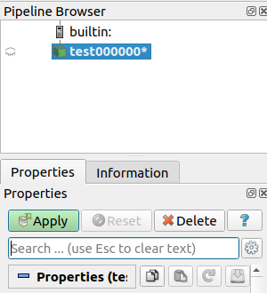
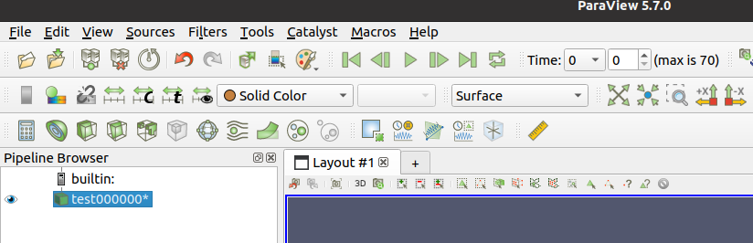
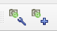
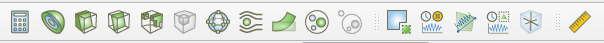
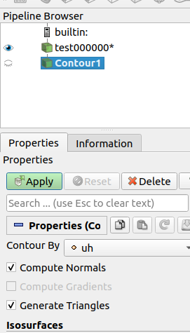

# 简介

[ParaView](https://www.paraview.org/) 是一个开源、多平台的数据分析和可视化应用程序。

# 安装

- 方式1: 用 apt 命令安装

  ```bash
  $ sudo apt install paraview
  ```

- 方式2: 下载安装 https://www.paraview.org/download/

# 使用
ParaView 的使用教程可以参考视频

https://www.youtube.com/watch?v=OxcU6Upz5ZA&list=PLvkU6i2iQ2fpcVsqaKXJT5Wjb9_ttR

B 站上也有带有中英文字母的搬运视频

https://www.bilibili.com/video/BV1Jt4y1Q7wW/?spm_id_from=333.788.recommend_more_video.1 

文件资料可以查看 

http://web.engr.oregonstate.edu/~mjb/paraview/ 

ParaView 官网也有一些使用说明的介绍，感兴趣的可以自行学习。

- 打开

    在终端内输入 paraview 即可打开软件

  ```bash
  $ paraview
  ```

- 输入数据

    对于 vtu 格式的数据，在同一工程下可以添加多组 vtu
    数据，对于具有相似名称的案例，ParaView 会自动将其识别为一组，
    一般被用来做动画 (例如 test0001.vtu, test0002.vtu, test0003.vtu,
    这就是一组)。

- 数据显示和处理

    首先，点击 Open 选择你想处理的数据。

    对于图像显示，可以看到输入的数据名旁边有一只小眼睛，点击小眼睛就是显示，可以只点击小眼睛对数据进行显示而不进行其他操作，如果想对数据进行处理，需要点击下面的 Apply。
    

    Solid Color 和 surface 可以选择需要显示的数据标签名以及样式。
    上面的播放栏可以用来播放动画，当有一组数据时，可以对这组数据进行同一种操作，然后播放整组的数据，从而形成动画。(图中的 max
    is 70 即为此组数据中有70个文件，点击 Time 可以跳转到想要显示的数据处)
    


    这个工具栏可以快速定位到各个坐标轴的正方向。
    

    这个工具栏可以将比较好的角度定位下来，以便于做数据分析当中获得整组的同样角度的数据图。

    

    点击 Apply
    以后可以看到如下的工具栏被开启，可以进行很多操作，不同的操作顺序会得到不同的结果。
    


- 等值面和等值线

    点击 Apply 以后在 Pipeline Broweser 栏中点击选取你想要处理的数据文件名，点击 Contour。
    
    


    在 Contor By 处选择需要显示等值面或等值线的数据标签，点击 Apply 即可显示。（下图中选择展示的数据标签为 $uh$）

    

    可以在 Properties
    栏中进行参数调整，添加坐标轴等操作，可以根据英文进行理解操作, 多加尝试。


