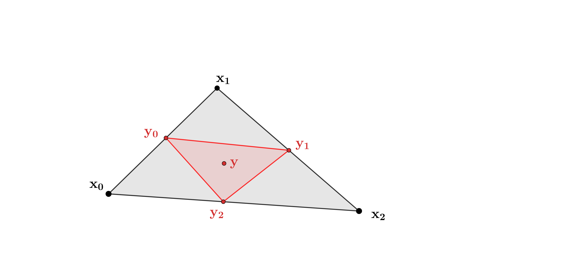
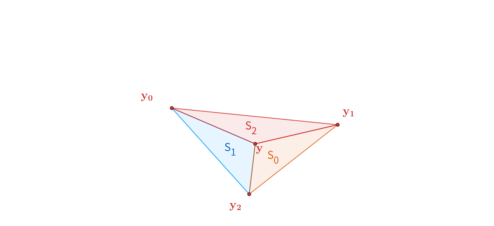
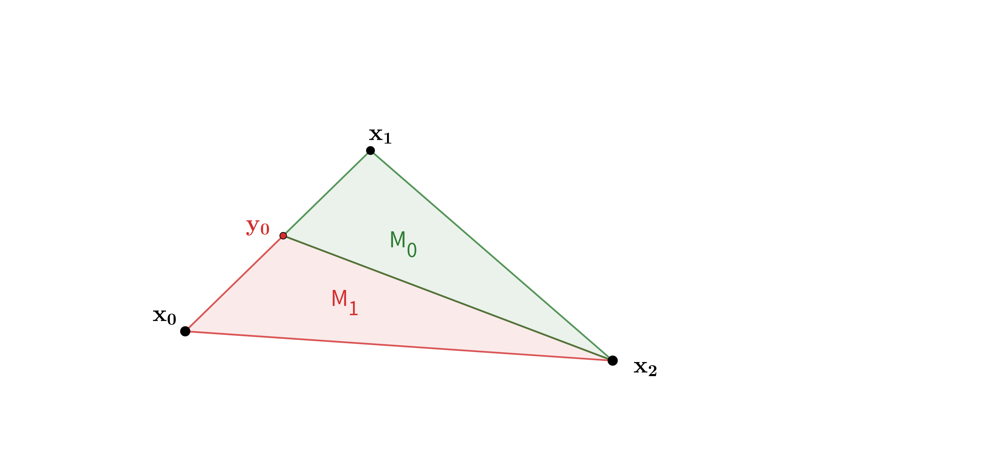
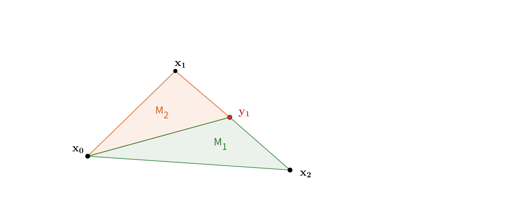

# 主旨
在数值计算中我们经常用到自适应加密，但是网格加密后插值(新)点位置的值怎么得到是一个问题，最简单的办法是将插值点周围的值做一个线性组合，但这个方法的精度无疑是差的。这里我们基于三角形加密和重心坐标的概念来说明如何得到任意次基函数下的插值点的值。

# 小单元内的点在大单元内的重心坐标表达
这里我们称加密前的单元`\triangle_{{\bf x_0}{\bf x_1}{\bf x_2}}`为大单元，加密后得到的大单元的一个子单元`\triangle_{{\bf y_0}{\bf y_1}{\bf y_2}}`为小单元，如下图所示.
我们目的是拿到小单元内部任意一点 `\bf y` 在大单元中的重心坐标.

- 首先小单元内`\bf y` 都可以写成小单元三个顶点的线性组合形式， 即
$$
\bf y = \lambda_0 \bf y_0 + \lambda_1 \bf y_1 + \lambda_2 \bf y_2,
$$
其中 `\lambda_0, \lambda_1, \lambda_2` 是点 `\bf y` 的重心坐标，且 `\lambda_0 + \lambda_1 + \lambda_2 = 1`， `\lambda_i \geq 0, i=0,1,2`。

几何角度上， 重心坐标可以写成面积的形式，即

$$
\begin{aligned}
 \lambda_0 &= \frac{S_0}{S_0+S_1+S_2} \\
\lambda_1 &= \frac{S_1}{S_0+S_1+S_2} \\
\lambda_2 &= \frac{S_2}{S_0+S_1+S_2}
\end{aligned}
$$
同理， 因为`\bf y_0, \bf y_1, \bf y_2` 是大单元即三角形`\triangle_{{\bf x_0}{\bf x_1}{\bf x_2}}`内的点，所以同样可以用重心坐标的形式得到
$$
\begin{aligned}
\bf y_0 &= \xi^0_0 \bf x_0 + \xi^0_1 \bf x_1 + \xi^0_2 \bf x_2,\\
\bf y_1 &= \xi^1_0 \bf x_0 + \xi^1_1 \bf x_1 + \xi^1_2 \bf x_2, \\
\bf y_2 &= \xi^2_0 \bf x_0 + \xi^2_1 \bf x_1 + \xi^2_2 \bf x_2,
\end{aligned}
$$
其中 `\xi^{j}_0, \xi^{j}_1, \xi^{j}_2` 是点 `\bf y_{j}` 的重心坐标，且 `\xi^{j}_0 + \xi^{j}_1 + \xi^{j}_2 = 1`， `\xi^{j}_i \geq 0, i, j= 0,1,2`。
重心坐标`\bf \xi`也可以写成面积的形式，

$$
\begin{aligned}
 \xi^0_0 &= \frac{M_0}{M_0+M_1+M_2} = \frac{M_0}{M_0+M_1} \\
\xi^0_1 &= \frac{M_1}{M_0+M_1+M_2}=\frac{M_1}{M_0+M_1} \\
\xi^0_2 &= \frac{M_2}{M_0+M_1+M_2} =0
\end{aligned}
$$

$$
\begin{aligned}
 \xi^1_0 &= \frac{M_0}{M_0+M_1+M_2} = \frac{M_0}{M_0+M_2} \\
\xi^1_1 &= \frac{M_1}{M_0+M_1+M_2}  = 0\\
\xi^1_2 &= \frac{M_2}{M_0+M_1+M_2} = \frac{M_0}{M_0+M_2}
\end{aligned}
$$

即

$$
\begin{aligned}
 \xi^2_0 &= \frac{M_0}{M_0+M_1+M_2} = 0 \\
\xi^2_1 &= \frac{M_1}{M_0+M_1+M_2}  = \frac{M_0}{M_1+M_2}\\
\xi^2_2 &= \frac{M_2}{M_0+M_1+M_2} = \frac{M_0}{M_1+M_2}
\end{aligned}
$$

结合上面各式可以得到

$$
\begin{aligned}
\bf y &= \lambda_0 \bf y_0 + \lambda_1 \bf y_1 + \lambda_2 \bf y_2 \\
      &= \lambda_0 \left(\xi^0_0 \bf x_0 + \xi^0_1 \bf x_1 + \xi^0_2 \bf
      x_2\right) + \lambda_1 \left(\xi^1_0 \bf x_0 + \xi^1_1 \bf x_1 + \xi^1_2 \bf
      x_2\right) + \lambda_2 \left(\xi^2_0 \bf x_0 + \xi^2_1 \bf x_1 + \xi^2_2 \bf
      x_2\right)\\
      &= \left(\lambda_0 \xi^0_0 + \lambda_1 \xi^1_0 + \lambda_2 \xi^2_0 \right)
      \bf x_0 + 
      \left(\lambda_0 \xi^0_1 + \lambda_1 \xi^1_0 + \lambda_2 \xi^2_1 \right)
      \bf x_1 +
      \left(\lambda_0 \xi^0_2 + \lambda_1 \xi^1_2 + \lambda_2 \xi^2_2 \right)
      \bf x_2\\
      &= \left(\lambda_0 \xi^0_0 + \lambda_1 \xi^1_0 \right) \bf x_0 + 
      \left(\lambda_0 \xi^0_1 + \lambda_2 \xi^2_1 \right) \bf x_1 +
      \left(\lambda_1 \xi^1_2 + \lambda_2 \xi^2_2 \right) \bf x_2
\end{aligned}
$$

已知三角形ABC的顶点分别为`A(a_0, a_1), B(b_0, b_1), C(c_1, c_2)`,
则该三角形的面积为 `\dfrac{|a_1b_2+b_1c_2+c_1a_2-a_1c_2-c_1b_2-b_1a_2|}{2}`

故加密后三角形内任意一点在大三角形中的重心坐标都可以计算.

最后，当已知某个点在一个单元的重心坐标时，我们就可以计算出这个点在这个单元中的值。
